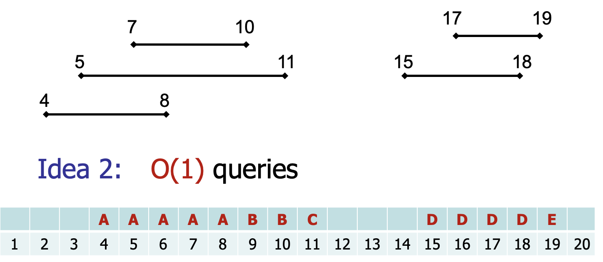
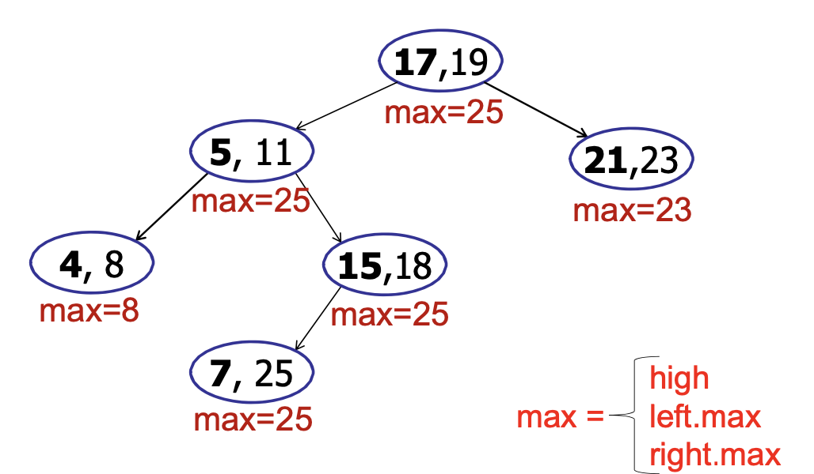
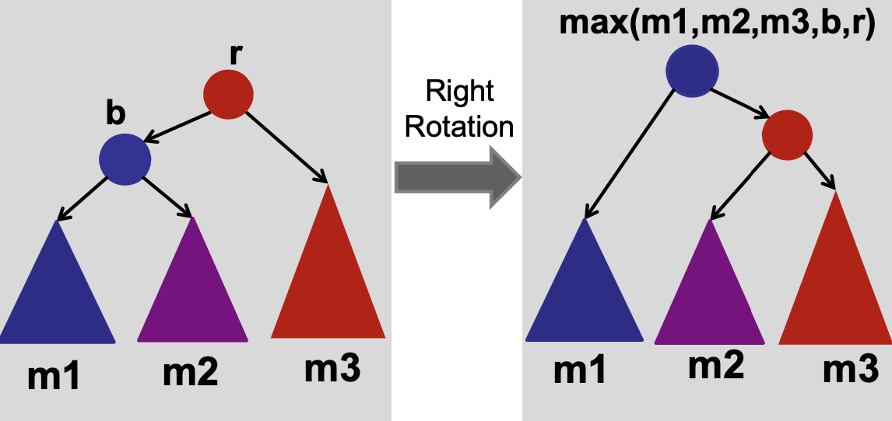

# Interval Searching

**Problem: Given an array of unsorted and possibly overlapping intervals, and a point, find an interval containing the point.**

An example of such a problem is cell tower coverage - given a location of where I am on the highway, and a list of cell-towers and their corresponding coverages, find a cell tower that covers my location.

## Idea 1

If there is only one query being made (i.e., only point to check for), there is no need to do any work in making a data structure to solve this problem - just use linear traversal and return the answer in $O(n)$ time. But if there are $m$ queries being made (and $m$ is large), then we need to do better than $O(nm)$.

## Idea 2

How about if we just have a long array (equal to the size of the maximum end point of an interval) and store which cell-tower covers which intervals?



This takes up a lot of space and moreover, insertion and deletion of intervals can take $O(n)$.

## Idea 3

We use a dynamic data structure to solve this problem! (Dynamic simply means that we can insert and delete intervals from the structure too!)

It should be no surprise that our basic underlying data structure is a balanced AVL tree. We augment it as follows:

Each node is an interval. The tree itself is sorted by the **left endpoint**.

Notice that if we just store the intervals sorted by left endpoint, it doesn’t really help us at all. We need some more information to decide whether to look in the left subtree or right subtree of any node. How do we do that?

**Key Insight: Store the maximum endpoint (right) in the subtree at the node too!!!**



The algorithm is as follows:

Observe that even though we keep the tree sorted by the left endpoint, we never really use this in the algorithm. But this is crucial to the correctness of the algorithm.

## Proof of correctness

```java
searchInterval(x)
	c = root;
	while (c != null and x not in c.interval) do
		if (c.left == null) c = c.right;
		else if (x > c.left.max) c = c.right;
		else c = c.left
	return (x in c) ? c : NOT_FOUND;
```

The logic of the algorithm is as follows: if `x` is in the interval, return the interval. Otherwise, if `x` is larger than the maximum endpoint in the subtree rooted at the left child of interval, then we can be sure that it is not in the left subtree. So, we search the right subtree. However, if `x` is less than the maximum of the left child, we search there.

**Claim 1**: If we ever go right, we are sure that there is no interval that contains the point `x` in the left subtree. (this is pretty obvious since `x` is greater than the maximum of any interval in the left subtree)

**Claim 2**: If we go left, and we do not find any interval overlapping with the point, then we can be sure that there is no interval containing the point even in the right subtree (and so we did not make any mistake by choosing to go to the left)

This is because of the fact that the tree is sorted by the left endpoint! (Take some examples to convince yourself)

**Conclusion**: the `searchInterval` finds an overlapping interval if it exists.

It should be pretty clear that the running time of the algorithm is $O(logn)$ (since you are traversing the root-to-leaf path of a balanced binary tree). Insertions and deletions also take $O(logn)$ and we need to update the max values of the nodes on the root-to-leaf path.

### Maintaining Max During Rotation?

How do we maintain the max values during rotation? (this is a very important question to ask yourself when augmenting a tree - does the additional information need to be recalculated from scratch every time the tree is rotated?)

This is really easy and is left an exercise to the reader. (Hint: it is clearly a local property)



### Finding ALL intervals

What if you wanted to find all the intervals that contained a point?

1. Find an interval, add it to a list, delete from the tree.
2. Repeat step 1 until no more correct intervals remain.
3. Add the intervals back to the tree (because no one told us we could go ahead and delete them in the first place)

If there are $k$ intervals that contain a point, the running time would be $O(klogn)$ (since our `searchInterval` algorithm would run $k + 1$ times (we only find out we are done in the last time it runs because it would return null)
