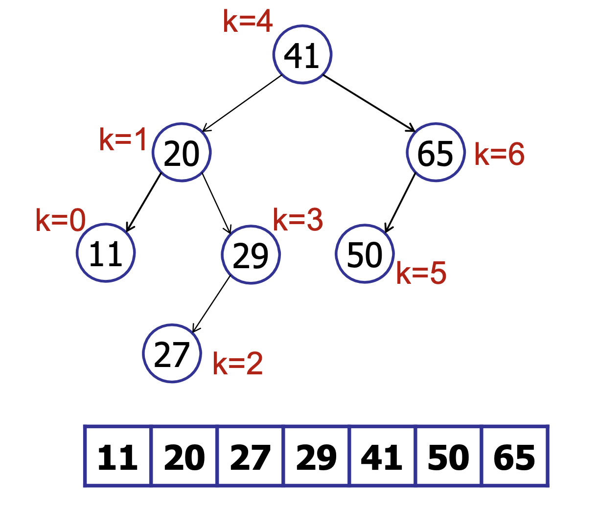
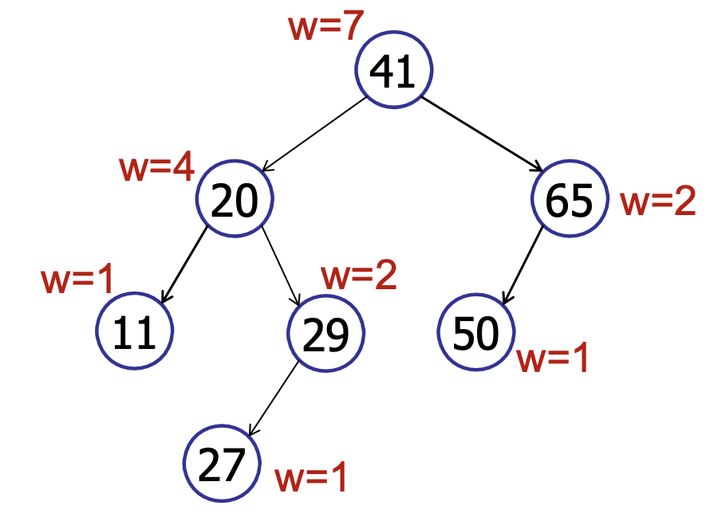
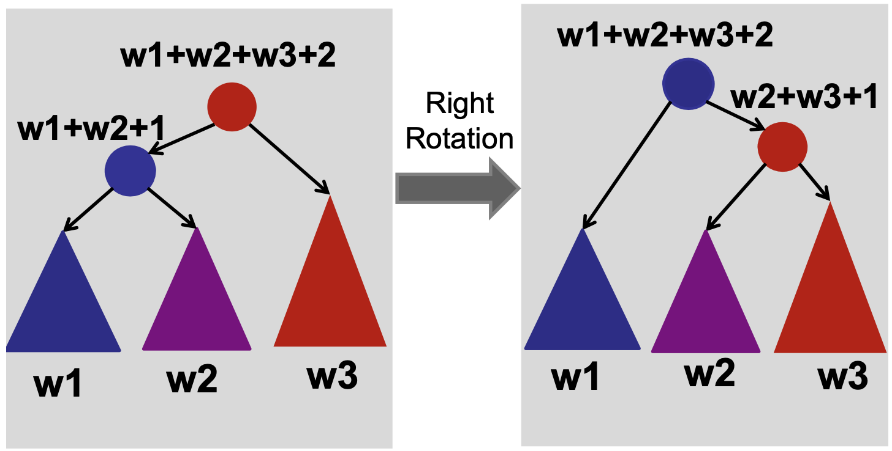

# Order Statistics

**Problem Statement:** Find the kth smallest element in an unsorted array

**Let length of the array be $n$ and the number of queries performed be $m$**

Naive approaches:

1. Sort the array in $O(n\log n)$ time. Answer queries in $O(1)$ time. Total running time: $O(n\log n + m)$. Good when the there is a large number of queries, bad when only 1 or 2 queries are being performed (because then you’re overcomputing stuff you’re not going to use)
2. Keep the array unsorted and run QuickSelect for each query. QuickSelect takes $O(n)$ time. So, total running time: $O(nm)$. Good when only a few number of queries need to be performed

## QuickSelect

`QuickSelect` is a randomised algorithm - its an adaptation of `QuickSort` that solves the order statistics problem.

The expected running time of `QuickSelect` is $O(n)$ but it can take $O(n^2)$ in the worst case (if the choice of pivot is bad).

```java
QuickSelect(A[1...n], n,k):
	if (n == 1) return A[1];
	else:
		// Choose a random pivot index pIndex
		p = partition(A[1..n], n, pIndex);
		if (k == p) return A[p];
		else if (k < p) return QuickSelect(A[1...p-1], k)
		else if (k > p) return QuickSelect(A[p+1...n], k - p) // find the k - p th element from the remaining elements since you
		// eliminated the smallest p elements
```

### Complexity Analysis

`QuickSelect` is a randomised algorithm and so its running time is a random variable. But we can find the expected running time. On average, we expect our pivot to be somwhere in the middle (such that it divides the array into 2 portions - even if it divides the array into 1/10 and 9/10, we can be confident with high probability that the pivot will be good. We will analyse a paranoid version of `QuickSelect` in which we keep repeating the selection of pivot and partitioning until we dont get a good pivot.

Let us assume that our good pivot divides the array into $\dfrac{1}{10}$ and $\dfrac{9}{10}$.

Then, $E[T(n)] \leq E[T(9n/10)] + E[\#partitions](n)$.

As we have shown in the complexity analysis for `QuickSort`, the number of times we need to partition to find a good pivot is less than 2. So,

$E[T(n)] \leq E[T(9n/10)] + 2n$. Solving this recurrence relation,

## Using Balanced BSTs

Use a balanced tree for dynamic order statistics (dynamic simply means that you can insert and delete elements too)!

Whenever you augment a tree to solve a problem, think about the following:

1. Will my invariant/data be maintained in order during insertion/deletion/rotation? If not, how can I ensure that it is maintained? Does this make the operations too expensive? (Anything more than $O(\log n)$ is considered expensive for a tree)
2. Is the property that I am trying to store local? (that is, does it only depend on the node’s children and/or parent? Or do I need to look at every other node in the tree?)

Local properties are great! Because they take $O(1)$ to compute and are easily maintainable during rotations.

We augment the AVL tree data structure to solve this problem - what extra information can we store at each node to help us?

**We will store the rank in every node** (the rank is the position of the element in the sorted array)

For example,



Then, if we are searching for an element $k$ and we are at the root node, when $k < node.rank$, we search in the left subtree. Else if $k > node.rank$, we search in the right subtree.

Bu there’s a problem with this approach - insertion requires the rank of **all** nodes to be updated accordingly - making it $O(n)$ operation. We want to do better than that! It is too expensive to store the rank at every node (rank of a node is not a local property!)

**Idea: Store the size of left and right subtree at each node**

We define weight of a node to be the size of the tree rooted at that node. It should be apparent that the weight of a leaf node is 1 and the weight of any other node is the sum of the weights of its children + 1, i.e., $w(v) = w(v.left) + w(v.right) + 1 ; \ w(leaf) = 1$.



Then, for insertion, we only need to update the weights on the root-to-leaf path. Hence, it becomes $O(\log n)$. Similarly for deletion, we only need to update the wights of the nodes on the root-to-leaf path and so it is also $O(\log n)$.

```java
select(k,v) // intially called with v = root
	rank = v.left.weight + 1
	if (k == rank) return v
	else if (k < rank) return select(k, v.left)
	else if (k > rank) return select(k - rank, v.right) // you eliminated k - rank nodes already
```

We define the `rank` of a node to be its position in the sorted array. It is the inverse function of `select`. That is, `rank(select(k)) = k`.

`rank(v)` computes the rank of the node `v`.

```java
rank(node)
	rank = node.left.weight + 1;
	while (node != null) do
		if node is left child then do nothing // nothing becomes before you since you are the left child
		else if node is right child then
			// add the number of nodes that came before you (basically add the weight of your left sibling and 1 for your parent)
			rank += node.parent.left.weight + 1;
		node = node.parent;
return rank;
```

A key invariant for the above `rank` algorithm is that after every iteration, the rank is equal to the its rank in the subtree rooted at `node`. At the end of the program, the rank would be equal to the rank of the subtree rooted at the `root`, which proves the correctness of our algorithm. In every node, the rank is either the same (if no nodes have come before me), or the rank is increased by the number of nodes that came before me)

Are we done?? No! we still need to show how we can maintain the weights during AVL rotations.



How long does it take to update the weights during rotation? $O(1)$ !!! Just look at the weights of the new children.

```java
rightRotate(v)
	w = v.left
	v.left = w.right
	w.weight = v.weight // since w is now the root
	w.right = v
	v.weight = v.left.weight + v.right.weight + 1 // O(1) time :)
```

Similarly, for `leftRotate(v)` too.

Notice how we followed the basic methodology for problem-solving here: Start with a naive basic implementation (usually just an array or list or tree).

Basic methodology:

1. Choose underlying data structure (tree, hash table, linked list, stack, etc.)
2. Determine additional info needed.
3. Verify that the additional info can be maintained as the data structure is modified. (subject to insert/delete/rotation/etc.)
4. Develop new operations using the new info. (select, rank, etc.)

---

:::tip Extra
There is also a deterministic $O(n)$ algorithm for finding the $k^{th}$ smallest element in an array. It is called [Median of Medians](../../design-and-analysis-of-algorithms/randomised-algorithms.md#median-of-medians).
:::
