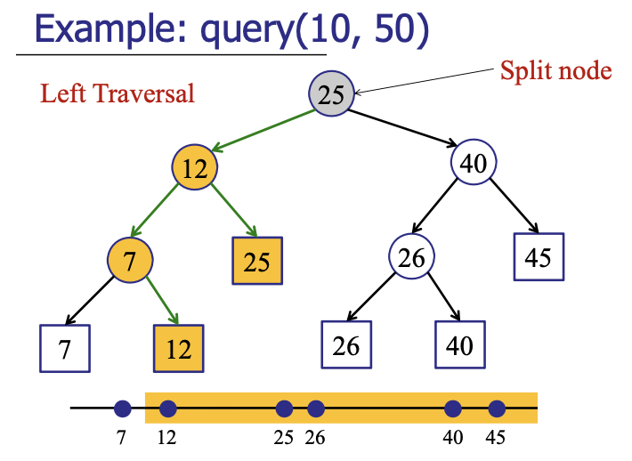

# Orthogonal Range Queries

**Problem (1-D Version): Given an array of points and an interval, find the points (not just the number of points) that are contained the interval.**

Example: Find the names of everyone aged between 22 and 27 (important in databases)

Firstly, you should be able to see how this is different from interval searching although in both the problems, there are points and intervals.

Moerover, this can be extended to d-dimensions (e.g. in the 2-D case, we would ask “find the points that lie within a given rectangle”, thus giving the name “orthogonal” range queries) but we only discuss the 1-D case here.

### Strategy

1. Use a Binary Search Tree in which all the nodes are sorted by the property we are going to query by. (Decide the underlying data structure)
2. Store all the points in the **leaves** of the tree. (Internal nodes only store copies of these) (**Invariant**: The tree would still have the BST property)
3. Each internal node `v` stores the **max of any leaf in its left subtree** (this is quite a common strategy to help you determine whether to go left or go right). (Augment the data structure to help you perform your operations)


### Algorithm

1. Find the split node (the highest node that falls between the interval bounds)
2. Perform `leftTraverasal`
3. Perform `rightTraversal`

Example of a left and right traversal:




### Pseudocode

```java
findSplit(low, high)
	v = root;
	done = false;
	while !done {
		if (high <= v.key) v = v.left;
		else if (low > v.key) v = v.right;
		else (done = true)
	}
	return v;
```

```java
rightTraversal(v, low, high)
	if (v.key <= high)
		allLeafTraversal(v.left);              // basically do an in order traversal of all the leaves in that subtree
		rightTraversal(v.right, low, high);
	}
	else {
		rightTraversal(v.left, low, high);
	}
```

```java
leftTraversal(v, low, high)
	if (low <= v.key)
		allLeafTraversal(v.right); // basically do an in order traversal of all the leaves in that subtree
		leftTraversal(v.left, low, high);
	}
	else {
		leftTraversal(v.right, low, high);
	}
```

### Running Time Analysis

1. Finding split node: $O(logn)$
2. `leftTraversal`
   1. Doing all leaf traversal takes $O(k)$ where k is the number of leaves in the subtree.
   2. Then, `leftTraversal` is recursively called (at most $O(logn)$ times)
3. `rightTraversal` is identical (in running time) to `leftTraversal`

So, query time complexity is $O(k + logn)$ where $k$ is the number of points found.

(Preprocessing) Building the entire tree takes $O(nlogn)$ time. - Run `QuickSelect` to find the median, then run `QuickSelect` on the two halves and so on.. at each level, it takes $O(n)$ time to run the `QuickSelect`.

Insertion, deletion takes $O(logn)$ time.

Total space complexity $O(n)$ (Number of nodes in a tree $\leq$ $2 \times$ number of leaves in the tree) (easy to prove since $1 + 2 + 4 + \dots + 2^n = 2^{n+1} - 1$ and at every level of the tree, the maximum number of possible nodes double)
