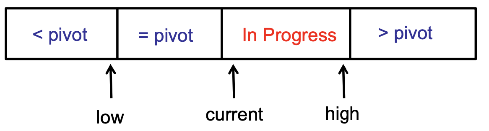
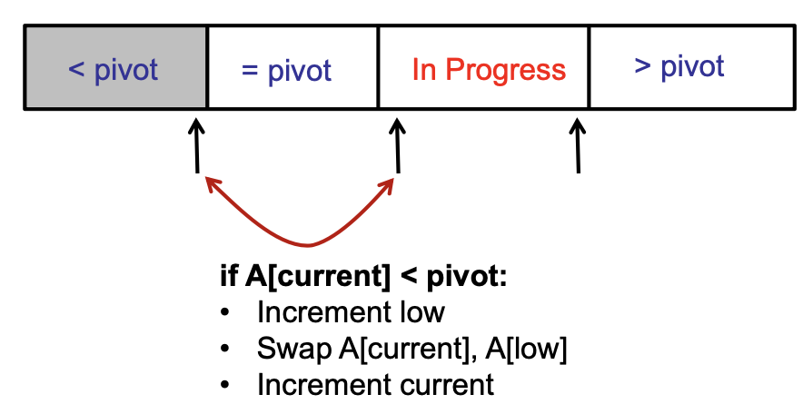
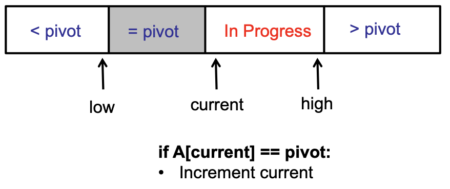
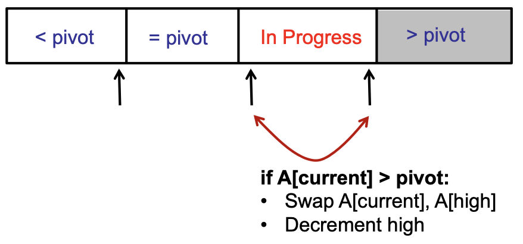

# Sorting

## Quick Summary

| Property         | Bubble Sort                                              | Insertion Sort                                                    | Selection Sort                                                      | Merge Sort                    | QuickSort (first pivot)                                    | QuickSort (random pivot)                                   |
| ---------------- | -------------------------------------------------------- | ----------------------------------------------------------------- | ------------------------------------------------------------------- | ----------------------------- | ---------------------------------------------------------- | ---------------------------------------------------------- |
| Stability        | Yes                                                      | Yes                                                               | No                                                                  | Yes                           | No                                                         | No                                                         |
| Running time     | $O(n^2), \Omega(n)$                                      | $O(n^2), \Omega(n)$                                               | $\Theta(n^2)$                                                       | $\Theta(n \log n)$            | $O(n^2)$                                                   | $E[T(n)] = O(n \log n)$                                    |
| Worst case input | Reversed array                                           | Reverse array                                                     | All inputs                                                          | All inputs (avg)              | Sorted array                                               | All inputs (avg)                                           |
| Invariant        | Largest $i$ elements sorted at end of $i^{th}$ iteration | First $i$ elements relatively sorted at end of $i^{th}$ iteration | Smallest $i$ elements correctly sorted at end of $i^{th}$ iteration | Merge arguments always sorted | Elements smaller than pivot before, larger after partition | Elements smaller than pivot before, larger after partition |
| Extra space      | $O(1)$ (In-place)                                        | $O(1)$ (In-place)                                                 | $O(1)$ (In-place)                                                   | $O(n)$                        | $O(1)$ (In-place)                                          | $O(1)$ (In-place)                                          |

## Bubble Sort

**Algorithm:** Swaps adjacent elements if they are out of order. After each iteration, the next heaviest element bubbles to the end of the array.

**Proof of correctness:** At the end of n iterations, the n heaviest elements are in their sorted positions —> the array is sorted

Since swapping is only done between adjacent elements, it is easy to make the algorithm stable (only do swaps in case of strict inequality).

It is possible to implement a version that terminates as soon as no swaps performed for a complete loop. In such a case, the time taken to sort an already sorted array is $\theta(n)$.

Bubble Sort is quite inefficient and is rarely used in practical applications.

```java
BubbleSort(A, n) {
	for (int i = 0; i < n; i++) {
		for (int j = i; j < n - 1; j++) {
			if A[j] > A[j+1] swap(A, j, j + 1)
		}
	}
}
```

```java
OptimisedBubbleSort(A, n) {
	repeat (until no swaps):
		for (int j = 1; j < n - 1; j++):
			if A[j] > A[j+1] then swap(A, j, j + 1)

}
```

## Insertion Sort

**Algorithm**: Maintain a sorted prefix (beginning with the first element). For every iteration, insert the next element into the correct position in the sorted prefix.

**Invariant**: At the end of the $i^{th}$ iteration, the first $i$ elements in the array are relatively sorted.

Since swaps are performed between adjacent elements, it is easy to ensure stability by only swapping in case of strict inequality.

Best case scenario: already sorted array or very few elements out of place. eg. $A = [2,3,4,5,6,1]$ performs significantly lower number of swaps than $A = [6,5,4,3,2,1]$. You only need to perform 5 swaps to bring 1 to its correct positions. All other elements are relatively sorted.

```java
InsertionSort(A, n):
	for (int i = 1; i < n; i++):
		key = A[i];
		j = i - 1;
		while (j >= 0 and A[j] > key): // Repeats at most i times (the max distance that a key needs to move is i)
			A[j+1] = A[j] //Shift the elements by 1
			j--
		A[j+1] = key // Put the key in the correct position
```

Sometimes, its better to use insertion sort than `MergeSort`. For example, when you know that the list is mostly sorted, insertion sort performs very well. Moreover, even for unsorted arrays of any kind, if the length is less than 1024, insertion sort runs faster in practice than `MergeSort`.

## Selection Sort

**Algorithm**: Find the minimum element. Swap it to the first element in the unsorted array. Continue on the remaining elements.

**Proof of correctness**: After n iterations, the minimum n elements are in their sorted positions —> the array is sorted

**Invariant**: There is a sorted prefix being maintained. At the end of each iteration, the size of the sorted prefix grows by 1 and the size of the unsorted portion decreases by 1. It is important to note that this sorted prefix is absolutely sorted with respect to the entire array, i.e., the elements in the sorted prefix are in their correct positions relative to the entire array too. This is in contrast to insertion sort, in which, after each iteration, the size of the sorted prefix grows by 1 too, but the elements are relatively sorted —> their positions need not be the correct position w.r.t. the entire array.

Finding the minimum element takes $O(n)$ time even if the array is sorted (because we don’t know if the array is sorted or not). So, the total algorithm takes $\Theta(n^2)$ irrespective of the input.

Since the swapping of elements is performed with other elements in between, it does not guarantee stability. An example would be the following array:

$A = [3, 2, 3, 1, 3]$. The swap is performed between A[0] and A[3], in which case the ordering of the 3’s changes. Hence, selection sort is unstable.

```java
SelectionSort(A, n):
	for (int j = 0; j < n; j++):
		let k be the index of minimum element in A[j...n-1]
		swap(A, j, k)

```

## Merge Sort

Classic recursive divide-and-conquer algorithm. Split the array in half. MergeSort each half. Merge the two sorted halves together.

Merging two arrays of length $\dfrac{n}{2}$ each takes $O(n)$ time.

MergeSort can be made stable by adding the element from the left half in case both elements are equal.

The recursive relation of the time complexity for MergeSort is: $T(n) = 2 T(\dfrac{n}{2}) + O(n)$. Solving the recursive relation gives $T(n) = O(n \log n)$

The **total** space consumed by `MergeSort` is also $O(n\log n)$ (Note that at any given time, the space being used is $O(n)$ but in **total**, the algorithm uses $O(n\log n)$ space). At each level of the recursion, you need an array of length n to store the sorted portions of the origninal array. Another way to explain this is that all the time spent during `MergeSort` is essentially to use up space. This is because, merging two arrays requires space equal to the sum of the lengths of both halves. So, you’re spending all the time during merge to put elements in the new array. Since we proved that $T(n) = O(n \log n)$, it follows that $S(n) = O(n \log n)$.

However, there is a space optimisation possible in which only $O(n)$ space is consumed. ($S(n) = 2S(\dfrac{n}{2}) + O(1) = O(n)$). Just reuse the same temporary array at each level of the recursive tree. Don’t allocate new memory for each recursive level. This is because, for any call to `Merge`, you only need the current ordering of the elements and not the ones before that.

Hence, for all references to `MergeSort` in the exam, assume it uses $O(n)$ space.

(The following implementation uses $O(n\log n)$ space since it creates a new array in every call of `Merge`.)

```java
MergeSort(A, n):
	if (n == 1) return;
	else:
		x = MergeSort(A[1...n/2],n/2);
		y = MergeSort(A[n/2 + 1... n], n/2);
		return Merge(x,y,n/2);

Merge(A, B):
	int i = 0;
	int j = 0;
	int[] result = new int[A.length + B.length];
	while (i < A.length && j < B.length) {
		if (A[i] <= B[j]) { // equality ensures stability, i.e., if they are equal, pick from left.
			result[i + j] = A[i]
			i++;
		} else {
				result[i + j] = B[j];
				j++;
		}
	}

	// Exactly one of the following while loops will be executed (since the above while loop terminated, it means that one of the
	// pointers is now equal to the length of the corresponding array

	while (i < A.length) {
		result[i + j] = A[i];
		i++;

	while (j < B.length) {
		result[i + j] = B[j];
		i++;

	return result

```

`MergeSort` can be slower than `InsertionSort` when the number of items to sort is very small. This is due to caching performance, branch prediction, etc. So, for `array.length < 1024` it is advisable to use insertion sort. Moreover, the best algorithm might be to use insertion sort in the base case of recursion during MergeSort (the base case would be `if array.length < 1024: return InsertionSort(array)`).

If you use an iterative version of `MegeSort`(with 2 nested for loops), you have a loop invariant: After the $i^{th}$ iteration, every chunk of size $2^i$ starting from the first element is sorted.

### Iterative MergeSort

For the iterative MergeSort, we will sort the array in groups of power of 2. In other words, we will first sort the arrays in pairs, then merge into 4’s, 8’s and so on, until we have merged the entire array.

For each given size i (that is a power of 2),

- Copy the first i/2 elements into a left array and the next i/2 elements into the right array
- Set the left pointer and right pointer to the first element of each array, and array pointer to the first element of the original array
- Repeat until there is no more element in both arrays
  – Check the first element of the left and right array, and place the smaller element at index array pointer in the original array
  – Increment the pointer for the array containing the smaller number, and
  – Increment the array pointer
- Repeat the above for the next power of 2

In the iterative MergeSort, each size requires $O(n)$ operation to perform the merge operation, where n is the length of the array. The possible number of sizes is $\log n$. And hence, the runtime complexity is $O(n log n)$.

For space complexity, we only require an additional auxillary array, and thus it only requires $O(n)$ space.

## QuickSort

**Invariant**: After performing the partition, all elements smaller than the pivot occur before the pivot, and all elements larger than the pivot occur after the pivot.

It is also a divide-and-conquer algorithm like `MergeSort`.

If randomised pivot is chosen, the expected running time of the algorithm (with very high probability) is $O(nlogn)$.

This is because, for any deterministic pivot selection algorithm, is it possible to produce an adversarial “bad” input such that the algorithm runs in $O(n^2)$. This is an example of worst-case analysis

Stability cannot be ensured since swaps are being performed with other elements in between. For example, consider the following example in case of the pivot being equal to 5: `A = [8, 2, 5, 3, 8, 3]`. When partition occurs about 5, `A[0]` and `A[5]` swap, and the first 8 moves behind the other 8, violating stability.

QuickSort is very fast in practice and many optimizations are also possible. Its variants (eg. dual pivot QuickSort) are used almost ubiquitously in the implementation of sorting algorithms in programming languages.

In case of duplicate elements, we can use three-way partitioning to prevent the running time from being $O(n^2)$.

```java
QuickSort(A[1...n],n):
	if (n == 1) return
	else:
		// Somehow choose pivot index pIndex
		p = partition(A[1...n],n, pIndex) // partition returns the position of the pivot after the partition procedure
		x = QuickSort(A[1...p-1],p-1)
		y = QuickSort(A[p+1...n], n-p)

partition(A[1...n], n, pIndex):
	pivot = A[pIndex] // store the pivot value in another variable
	swap(A, 1, pIndex) // move the pivot to the front of the array
	low = 2 // start after the pivot
	high = n + 1 // Define A[n+1] = infinity
	while (low < high):
		while (A[low] < pivot) and (low < high) do low++ // increment low till you find an element that is greater than pivot
		while (A[high] > pivot) and (low < high) do high -- // decrement high till you find an element smaller than pivot
		if (low < high) swap(A, low, high);
	swap(A, 1, low - 1) // move the pivot to its correct position, which is at index low - 1
	return low - 1 // return the index of the pivot after partitioning - now the pivot is in its correct sorted position.
```

### 3-way partitioning


**Option 1: 2 passes of the array** (Easier to understand and still $O(n)$ for partition)

1. Regular partition
2. Pack duplicates (swap all the elements in the left half that are equal to the pivot to be adjacent to the pivot)

**Option 2: 1 single pass**

Maintain 4 regions of the array






The key invariants for this are:

- Each region has proper elements (< pivot, = pivot, > pivot)
- Each iteration, In Progress region decreases by one

### Analysing Complexity of QuickSort

First, lets try and find the time complexity of a deterministic implementation of `QuickSort`, say one that picks the first element as the pivot. Then, the worst-case running time would be $\Theta(n^2)$ when the array is already sorted (or reverse sorted). The recurrence relation would be $T(n) = T(n-1) + T(1) + \Theta(n) = 1 + 2 + 3 + \dots + n = \Theta(n^2)$.

Since `QuickSort` is a randomised algorithm, its running time is also a random variable. Hence, it is more useful to talk about expected running time of the algorithm. To make it easier to analyze, we consider a paranoid version of `QuickSort` that repeatedly finds a pivot that divides the array such that the bigger half is at most $9/10$th of the total array size. In other words, we only move to the recursive calls if we are sure that the pivot is not terribly bad (for example, if we pick the smallest element as the pivot it would be a bad pivot).
Then the expected running time would be $E[T(n)] = E[T(9n/10)] + E[T(n/10)] + E[\#partitions](n)$. Note that we need to find out the expected number of times we would have to try before we get a good pivot (this is denoted by $\#partitions$). If this turns out to be a large number, that is bad!

Note that in a randomised algorithm, the algorithm makes random choices (such as the choice of pivot index in this case) and for every input, there is a good probability of success. This is in contrast to average-case analysis in which the algorithm may be deterministic and the environment chooses random inputs (based on some heuristic or statistical distribution)! Some inputs are good, some inputs are bad. For most of the inputs, the algorithm does fairly well.

```java
ParanoidQuickSort(A[1...n],n)
	if (n == 1) return
	else
		repeat
			pIndex = random(1,n)
			p = partition(A[1...n], n, pIndex)
		until p > (1/10)n and p < (9/10)n

		x = QuickSort(A[1...p-1, p-1)
		y = QuickSort(A[p+1...n], n-p)
```

Everytime we recurse (call `QuickSort`), we reduce the problem size by at least 1/10.

**Claim**: We only execute the repeat loop $O(1)$ times in expectation. Then we know $T(n) \leq T(n/10) + T(9n/10) + n*\#iterations = O(nlogn)$.

**Proof:**

A pivot is “good” if it divides the array into 2 pieces, each of which is at least size $n/10$. If we pick a pivot at random, what is the probability that it is “good”? Ans: $8/10$. Then, probability of choosing a bad pivot is $2/10$.

$E[\#choices] = \dfrac{8}{10}*1 + \dfrac{2}{10}(E[\#choices] + 1)$ Explanation: If you get a good pivot (with probability 8/10, you are done in just 1 iteration). If not (with probability 2/10), you need to repeat the process and include the fact that you already tried once.

Then, $\dfrac{8}{10}E[\#choices] = 1 \implies E[\#choices] = \dfrac{10}{8}$. So, in expectation, we only need to choose a pivot $10/8$ times to get a good pivot.

Then, $T(n) \leq T(n/10) + T(9n/10) + 2n = O(nlogn)$. This follows from the fact that whenever you divide a problem into two parts by reducing them by a constant factor and then recurse on each of them separatey, it takes $O(nlogn)$ time if the work done in combining/dividing the work is $O(n)$. In particular, the solution to $T(n) = T(n/c) + T(n-\dfrac{n}{c}) + O(n)$ is $O(nlogn)$.

Hence, randomised `QuickSort` has an expected running time of $O(nlogn)$

### More Pivots!

So, we have shown that `QuickSort` is pretty fast. But that was only with one 1 pivot? Can we improve it by using 2 pivots? What about $k$ pivots? What would the asymptotic running time be?

Okay, so we want to find the running time of `QuickSort` with $k$ pivots. The following steps are involved:

1. Selecting $k$ random indices to be the pivot indices - for ease, lets just take this to be a constant time operation. (Even if you consider this to be $O(k)$, it will give the same answer).
2. Sorting the pivots in order - $O(k\ log(k))$ - Either use `MergeSort` or the ordinary `QuickSort`.
3. Now, you have $n-k$ remaining elements to be put in $k + 1$ possible buckets (between each of the pivots). For each of the element, it takes $log(k+1)$ time to find the correct bucket using Binary Search. So the total running time is $\approx (n-k)log(k)$
4. Now, we perform this recursively on each of the $k+1$ buckets.

Overall, the recurrence relation is $T(n) = (k+1)T(\dfrac{n-k}{k + 1}) + O(nlogk)$.

All this simplifies to approximately $T(n) = kT(\dfrac{n}{k}) + O(nlogk)$. Assuming that $k$ is just a constant greater than 1, the asymptotic running time is $O(n(log_kn)(logk)) = O(nlogn)$

So, more pivots does not lead to a better asymptotic running time. But then why do we use dual-pivot quicksort? Because it is much faster in practice. Dual-pivot quicksort takes advantage of modern computer architecture and has reduced cache misses.

## Counting Sort

Consider an array of $n$ integers between 0 and $M$ where $M$ is a small integer ($n > M$). What is the most efficient way to sort it?

1. Go through the array once, counting how many of each element you have, and store this in an array (say, `count`)
2. Then create a new result array of length $n$.
3. Starting from index 0 and $i = 0$, put $i$ at `result[index]`. Increment index and decrement `count[i]`. If `count[i] == 0`, increment $i$ until you find the next non-zero `count[i]`. Repeat till `index == n - 1`.

Running time: $O(M + n)$

Space complexity: $O(M)$ (You can avoid creating a new result by simply overwriting in the original array, but you cannot avoid creating the historgram-like counting array)

Observe that this is a non-comparison based sorting algorithm (does not perform any comparison between elements) and therefore, it is okay for it to be linear in $M$ (Since we already know that the minimum number of comparisons required to sort an array is $nlogn$.)

## Radix Sort

Before exploring radix sort, let us consider a simpler problem:

Consider an array consisting of 0s and 1s, what is the most efficient way to sort it?

We can do this using `QuickSort` partitioning with 2 pointers, one at each end. The 0-pointer will advance to the right up until it finds the first 1; the 1-pointer will move left until it finds the first 0. Then if the 0-pointer is on the left side of the 1-pointer, the elements are swapped. Continue until the 2 pointers cross each other. This takes $O(n)$ since the array is scanned exactly once.

Now, consider the following algorithm for sorting integers represented in binary (radix sort):

First use the in-place algorithm described above to sort by the most significant bit. Once this is done, you have divided the array into 2 parts: the first part contains all the integers that begin with 0 and the second part contains all the integers that begin with 1. That is, all the elements of the (binary) form ‘0xxxxxx’ come before all the elements of the (binary) form ‘1xxxxxx’.

Now, sort the 2 parts using the same algorithm, but using the second most significant bit instead. And then, sort each of those parts using the 3rd bit etc.

Assume that each integer is 64 bits, what is the running time? When is it faster than `QuickSort`?

This algorithm makes 64 total passes through the entire array, i.e., each element is visited 64 times (once for each bit). So, it takes about $64n$ steps. Each level takes $O(n)$ to be sorted, and we repeat this for each bit, making the recursion at most 64 level deep.

`RadixSort` will be faster than `QuickSort` when $64n < nlogn$. In other words, $n > 2^{64}$, which is quite large.

### Optimize?

We can divide each of the 64 bits into 8 chunks of 8 bits ech. Then, we can use counting sort to do the sorting of all the elements based on the each element’s first 8 bits. This only takes $O(n)$. Now the recursion goes 8 levels deep. So, for $n > 2^8$, this will be faster than `QuickSort`

Steps:

1. Convert each integer into its binary representation
2. Create a counting array of size $2^8 - 1 = 255$.
3. Based on the first 8 bits of each element, use `CountingSort` to sort the elements.
4. Sort the 2 parts using the next 8 bits and so on

This takes up space during counting sort and so it is not in-place.

:::tip note
In practice, radix sort is implemented by sorting the chunks of bits/digits from LSB to MSB (so there's no need to track the start/end of each group). But then, we need to use a stable sorting algorithm (usually counting sort) to sort the chunks itself.

Read more about radix sort [here](../../design-and-analysis-of-algorithms/sorting.md#radix-sort).
:::
