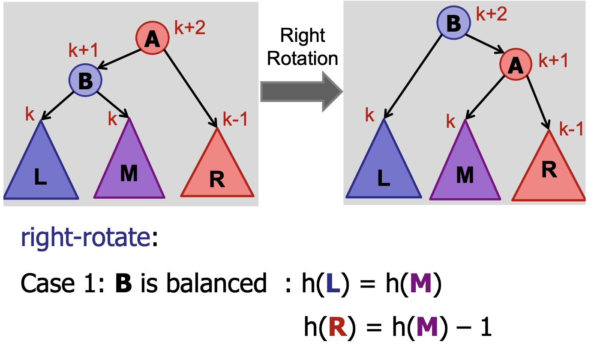
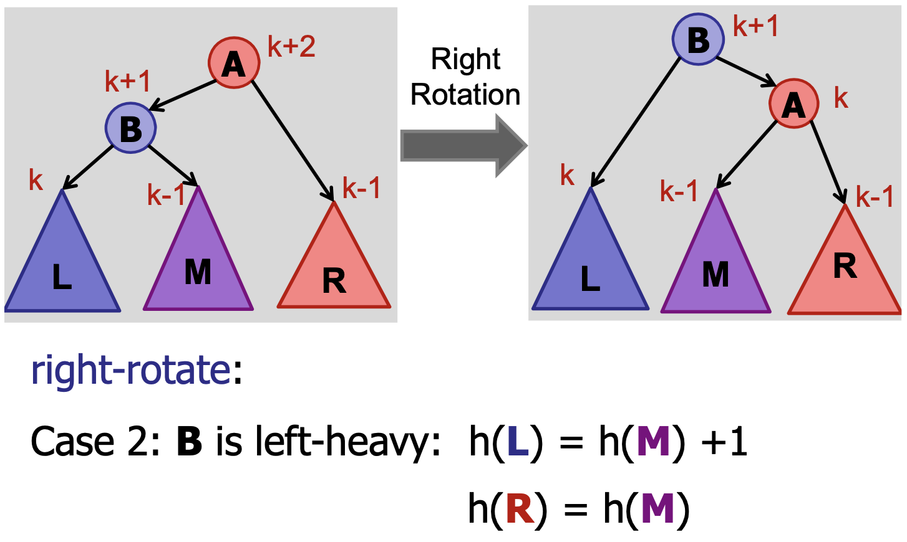
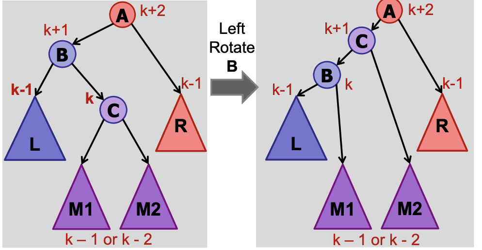
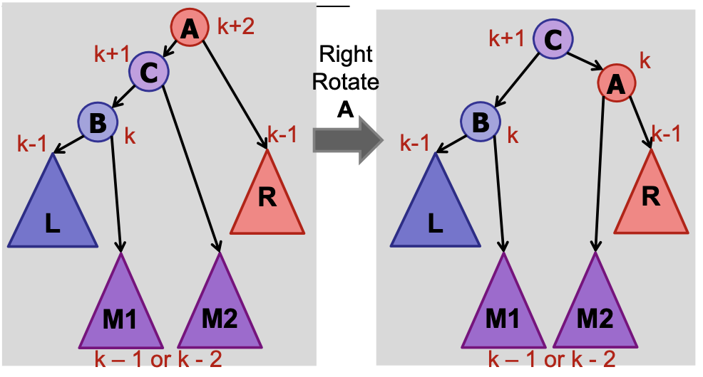

# Binary Search Tree

## Binary Search Tree (BST)

**Aim:** Implementing a dynamic data structure that supports searching in $O(\log n)$ time, inserting in $O(\log n)$ time, and deleting in $O(\log n)$ time.

### Option 1: Use a sorted array

Then searching takes $O(\log n)$ time but insertion takes $O(n)$ time. (Since, you need to move all the other elements by 1 space)

### Implementation Idea: Tree!

Recall that a tree is a circuit free and connected graph. In most trees, there is a root and edges are directed away from the root.

A binary tree is a tree in which every node has less than or equal to 2 children. We denote the two children of any node as `node.left` and `node.right` respectively. Every node except the root has exactly 1 parent. Non-leaf nodes are called internal nodes. That is, a node with at least 1 child is called an internal node.

So, a binary tree can be defined recursively as being either empty or a node pointing to 2 binary trees.

### BST property

The key BST property that allows us to perform searches, insertion, and deletion in $O(\log n)$ time is that:

**All elements in left sub-tree < key < all elements in the right sub-tree.**

Here, we do not allow duplicate elements to remain in the tree.

### Height

The height of any node is equal to 1 greater than the maximum of the heights of its two children. Leaves are assumed to have a height of 0. An empty node (null or absence of a node) is assumed to have a height of -1 (which is consistent with how we defined the height of a leaf).

`height(v) = max(height(v.left), height(v.right)) + 1` - this represents a common property of trees: often, you just need to look at the children of a node to determine the node’s value. You don’t have to search the entire tree. Thus, recursion plays a key role in trees.

Height of a binary tree is the number of edges on the longest root-to-leaf path.

### Searching for a Key

```java
public TreeNode search(int queryKey, TreeNode node) { // this is called with node = root initially
	if (queryKey < node.key) {
		if (node.left != null) return search(queryKey, node.left);
		else return null; // key is smaller than node.key but there is no smaller key in the tree.
	}
	else if (queryKey > node.key) {
		if (node.right != null) return search(queryKey, node.right);
		else return null; //  key is bigger than node.key but there is no bigger key in the tree.
	}
	else return this; // exactly one of <. > and = must be true.
```

It is clear that searching for a key takes $O(h)$ time where $h = height(tree)$.

Notice that for most of the algorithms involving trees, we will be using a recursive approach. If some criteria is satisfied, call the method on the left child, or if some other criteria is satisfied, call the method on the right child. If not, you are done. Mostly the base case is when you encounter a `null` node or a leaf node.

A property of a node is said to be local if it only depends on its children/parent.

### Inserting a new Key

```java
public void insert(int key, int value, TreeNode node) { // this is called with node = root initially
	if (key < node.key) {
		if (node.left != null) insert(key, value, node.left)
		else node.left = new TreeNode(key, value); // insert the new key as the left child of this node
	} else if (key > node.key) {
		if (node.right != null) insert(key, value, node.right)
		else node.right = new TreeNode(key, value); // insert the new key as the right child of this node
	}
	else return; // Key is already in the tree!
```

Observe that a new key is always inserted at a leaf position.

It is clear that inserting a new key takes $O(h)$ time where $h = height(tree)$. (Since at every call of insert, you move down the tree by one level)

### Analysing Complexity of BST

Worst case complexity of insertion and deletion of a node in a tree with n nodes: $O(n)$! This is because the height of the tree can be $O(n)$ in the worst case. All our algorithms depend on the height of the tree (which depends on the shape and hence, order of insertion of elements in the tree). For example, consider inserting elements in their sorted order into a tree. In this case, $h = n$ and we have made no improvement! Then, what’s the advantage in using a BST instead of a regular array? We’ll come back to this when we discuss the importance of being balanced.

Same keys $\neq$ same shape! Performance depends on shape of the tree. If you insert keys in random order, you can expect the tree to be roughly balanced.

### Tree Traversal

- **In order**: left child, node, right child (When you do an in-order traversal of a tree, you get the elements in sorted order)
- **Pre-order**: node, left child, right child
- **Post-order**: left child, right child, node

All traversals take $O(n)$ time where $n$ is the number of nodes in the tree. This is because each node is “visited” exactly once.

### Finding Successor/Predecessor

BSTs are very useful in finding a successor or predecessor of a given key. Here, we only explain how to find the successor but the algorithm for finding the predecessor is very similar.

**Aim:** Given a key `key`, find the smallest key in the tree which is greater than `key`.

**Observation:** When you try to find a key that is not in the tree, you eventually reach a leaf node (say, `u`). `u` is either the predecessor or successor of the key. Verify this by trying a few examples.

**Algorithm:** There are two possibilities - the key `key` may be in the tree or it may not be in the tree.

**Case 1:** `key` not in the tree

1. Perform a search for `key` in the tree. You will eventually reach a leaf node. Say, `u`.
2. If `u.key` > `key`, the successor is `u`
3. If `u.key` < `key`, `u` is the predecessor. So, find the successor of `u`. (This falls under case 2 since we know that `u` is in the tree.) The successor of `u` is also the successor of `key`. (Proof: `u` is the predecessor of `key`. So, there is no element in the tree which lies between `u` and `key`. So, `u's` sucessor must be greater than `key`. Moreover, since it is the successor of `u`, there is no other element that is smaller than it but greater than `u`. Hence, it must also be the successor of `key`.)

**Case 2:** `key` in the tree

**Case 2a:** `key` has a right child.

1. Find the minimum element in `key.right`. (Just keep going left until you reach the leaf node or a node has no left child, which will be the minimum element). This gives the successor of `key`

**Case 2b:** `key` does not have a right child

1. Keep going to the parent of `key` until `parent.left == key`, i.e., find the lowest ancestor of `key` for which `key` lies in its left subtree. That is the successor of key.

Not every node in the graph has a predecessor/successor. In particular, the maximum element of the BST does not have a successor and the minimum element of the BST does not have a predecessor.

### Deletion

When trying to delete `node` from the tree, there are three cases:

**Case 1:** `node` has no children

Simply delete `node` in this case.

**Case 2:** `node` has 1 child

Connect the child of `node` to the parent of `node`, and then just delete `node`

**Case 3:** `node` has 2 children (The most interesting case!)

Find the successor of `node`. Swap `node` with it’s successor. Delete `node`.

**Question**: What if the successor of `node` also has 2 children? Then what can we do??

**Answer**: That is not possible if you think carefully about it. The successor of `node` cannot have a left child (when `node` itself has 2 children, the successor of `node` lies in the right subtree of `node`) because if it did, the left child of our so-called “successor” would be the actual successor of `node` instead.

Deletion also takes $O(h)$ time where $h = height(tree)$.

### The Importance of being Balanced

Since `insert`, `delete`, `findMin`, `findMax`, `successor`, `predecessor`, `search` - all take $O(height)$ time, it is very crucial to try and reduce the height of the tree.

**What is the maximum possible height of a binary tree with $n$ nodes**? $n$ (Imagine a straight line where each node has exactly 1 child)

**What is the smallest possible height of a binary tree with $n$ nodes? $\Theta(\log n)$.**

Proof: We will find the (maximum) number of nodes $n$ in a tree with height $h$ (we are trying to make the tree as compact as possible - i.e., we want a BT as close to a complete BT as possible). Note that at any depth $d$ of a tree, we can have at most $2^d$ nodes (where depth is defined as the distance from the root to the node). Observe that the maximum of the depths of all leaves will be equal to the height $h$ of the tree. Then, the number of nodes in a tree with height $h$ is:

$$
n \leq 1 + 2 + 4 + \dots + 2^h < 2^{h+1}
$$

So, a tree with height $h$ has **at most $2^{h+1}$** nodes. In other words, $h + 1 \geq log_2(n)$ or, the minimum height of a tree with $n$ nodes is $log_2(n) - 1$. So, we cannot do better than $O(\log n)$.

### Balanced Tree

We try to minimize the height of the tree so that our algorithms run faster. We will show how to do this later on using **AVL trees.**

A tree is said to be balanced if its height has $O(\log n)$.

### How to get a Balanced Tree?

1. Define a good property (invariant) of a tree.
2. Show that if the invariant holds, then the tree is balanced.
3. After every insertion/deletion, make sure the invariant still holds. If not, fix it.

## AVL Trees (Adelson-Velskii & Landis 1962)

1. Augment the tree

   1. Store the height of the node at every node. (Or, you can simply store the difference of the left child’s height and right child’s height)
   2. On insertion and deletion, update the height recursively. (You only need to update the heights along the root-to-leaf path along which the insertion or deletion took place so it takes $O(height)$ time. This is crucial: if you had to update the heights of every other node when performing insertion/deletion, it would take $O(n)$, which is very inefficient).

   ```java
   insert(x)
   	if (x < key) left.insert(x)
   	else right.insert(x)
   	height = max(left.height, right.height) + 1
   ```

2. Define the invariant
   1. **A node `v` is height-balanced if: $|v.left.height - v.right.height| \leq 1$** (That is, the difference in heights of a node’s children should not exceed 1)
   2. A binary search tree is height-balanced if **every** node in the tree is height-balanced.
3. Prove that a height-balanced tree is also a balanced tree. (This is not trivial or obvious in any way). Recall that balanced $\implies h=O(\log n)$
   1. **Claim**: A height-balanced tree with $n$ nodes has at most height $h < 2logn$ (which would mean $h = O(\log n)$ and hence, balanced)
   2. This is equivalent to proving that a height-balanced tree with height $h$ has at least $n  > 2^{h/2}$ nodes.
   3. Let $n_h$ be the minimum number of nodes in a height-balanced tree of height $h$.
   4. If a node has a height $h$, at least one of its children must have a height of $h -1$ (only then it can be of height $h$). Since we are trying to show the minimum number of nodes is greater than $2^{h/2}$, we consider the smallest possible height-balanced tree of height $h$. This would be the case when one of the node’s children is of height $h - 1$ and the other of $h - 2$ (to minimize the number of nodes). Then, $n_h \geq 1 + n_{h-1} + n_{h-2}$ (Minimum number of nodes in a tree rooted at `node` $\geq$ `node` itself + Minimum number of nodes in its left and right children). So, we need to solve the reccurence relation,
   5. $n_h \geq 1 + n_{h-1} + n_{h-2} \geq 2*n_{h-2}$ (Obviously, $n_{h-1} \geq n_{h-2}$)
   6. This becomes much easier to solve now, $n_h \geq 2n_{h-2} \geq 4n_{h - 4} \dots \geq 2^{h/2}n_0$ (where $n_0 = 1$, i.e., a tree of height 0 can have at most 1 node.)
   7. Therefore, $n_h \geq 2^{h/2}$.
   8. Hence, $h \leq 2logn$
   9. (In fact, it is possible to show that $h \approx 1.44log(n)$)

### Insertion in AVL Trees

Just insert the node as you would do so in a normal BST. Update the heights of every node once the recursive `insert` call returns. Check if the node is out-of-balance. If it is unbalanced, then balance it. You only need to balance 1 node - the **lowest unbalanced node** in the root-to-leaf path of the newly inserted node. This is because once you balance it, the height of the subtree reduces by 1 and the balance is restored (since at any given time, the maximum difference between the heights of the children can be 2 even if it is unbalanced - this is because whenever we see an unbalanced node, we immediately balance it). So, by reducing the height of the larger child by 1, we bring the difference back to less than or equal to 1.

So, the **maximum number of rotations we need to perform during insertion is 2. (It takes $O(1)$ to rotate after insertion)**

### Tree Rotations

A node is said to be **left-heavy** if the height of its left child is more than that of its right child. Similarly, a node is said to be **right-heavy** if the height of its right child is more than that of its left child. For the purpose of explaining tree rotations, we assume that the node we wish to balance is left-heavy. Then, there are 3 cases to consider:

**Case 1:** `node.left` is balanced - perform right rotation on the node. (the height of the subtreeremains unchanged) (This case is unreachable during insertion - think carefully why: a newly inserted node caused $A$ to go out of balance. Since $B$ has a heavier weight, this means that $B's$ height increased by $1$ after the insertion. The new element either went to the left subtree or right subtree of $B$ and caused an increase in the height. So, before the insertion, at least one of them had a height $k-1$. If the other had a height $k$, then $B's$ height would already have been $k+1$ and there would be no increase in height of $B$, and hence no imbalance of $A$. So, the other subtree of $B$ must have had a height $k-2$. But this contradicts the fact that after insertion, both subtrees of $B$ have the same height. Hence, this can never happen during insertion!!! If you still don’t understand, write a formal proof for it.)



**Case 2:** `node.left` is also left-heavy - perform right rotation on the node (the height of the subtree reduces by 1 —> restores balance).

@

**Case 3:** `node.left` is right-heavy, then first perform left-rotation on the left child (to make it left heavy, and reduce it to case 2), and then perform a right-rotation on the node.





```java
rightRotate(v):
	w = v.left;
	w.parent= v.parent // w becomes the root of the subtree
	v.parent = w;
	v.left = w.right;
	w.right = v; // v becomes the right child of w
```

Right rotation —> root of the subtree moves right

Left rotation —> root of the subtree moves left

Note that a left-rotation requires a right child and a right-rotation requires a left-child.

In Cases 2 and 3, the height of the resulting tree reduces by 1, and Case 1 is unreachable during insertion (since if this happened, it would mean that the tree was already unbalanced before). Therefore, we only need to perform rotation on the lowest unbalanced node during insertion and we are done!

Trick to remember which rotation to perform:

1. **When a node is left-heavy, we perform a right-rotation (on that node) and vice versa.**
2. **When the node and its heavier child have opposite heaviness (left-right-heavy or right-left-heavy), we need to perform 2 rotations.**

### Deletion in AVL Tree

Similar to insertion into an AVL tree, when you delete a node, you need to update the heights of the nodes once the recursive call returns. Also, there is a chance that some nodes become unbalanced. However, in case of deletion, you need to perform $O(\log n)$ rotations, as simply balancing one node does not ensure that the rest of the nodes become balanced automatically. This is because deletion results in a possible reduction of height. Rebalancing also results in a possible reduction of height. So, the two do not “cancel out” as they did in case of insertion. So, it is necessary to propagate the change in height throughout the root-to-leaf path by performing rotations whenever necessary. In the worst case when the height of the tree is $h$, you may have to perform $2h$ rotations.

Fun fact: It is possible to create every possible tree shape using rotations !!

A possible optimisation: Storing the height of a node can possibly take 32 bits (depends on the default memory for an `int`). You can instead store just the difference between the left and right child of the node and use a maximum of 2 bits!)

Note (Midterm question): **An AVL tree (in fact, any balanced tree) does not give any bound for the difference in depths of leaves. In particular, the difference in depth of leaves (from the root) can be as large as $\Theta(\log n)$ where $n$ is the number of nodes in the height-balanced binary tree.**

An AVL tree is said to be **maximally imbalanced** if it has the maximum possible height for the number of nodes it contains. A property of a maximally imbalanced tree is that every node in the tree is maximally imbalanced, i.e., the subtree rooted at every node is also maximally imbalanced. To generate a maximally imbalanced tree, you need to ensure that each node is either left-heavy or right-heavy (but not balanced! since that would decrease height). This is simply a consequence from the fact that an AVL tree with the minimum possible number of nodes with height $h$ has two subtrees with minimum possible number of nodes with height $h − 1$ and $h − 2$, namely, $S(h) = S(h−1)+S(h−2)+1.$
