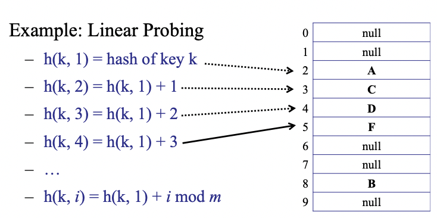

# Hash Table

## Symbol Table

A symbol table is an abstract data type that supports insert, search, delete, contains and size methods. The important thing to note here is that unlike a dictionary which supports successor or predecessor queries, a symbol table is unordered. That is, there is no ordering of keys in the data structure.

## Idea 1: Implement using AVL tree

If we implement a symbol table using an AVL tree, the cost of insertion is $O(logn)$ and the cost of searching is also $O(logn)$ (Moreover, this is because it stores the key in an ordered fashion and hence it also supports successor and predecessor queries).

But what if we don’t want/need any ordering or successor/predecessor queries? Is it possible to sacrifice the ordering to gain some extra speed in insertion and searching? YES!

Our aim is to implement a symbol table with cost of insertion and cost of searching $O(1)$.

It is a well-known fact that any comparison based sorting algorithm requires at least $\Omega(nlogn)$ comparisons. Furthermore, the fastest searching algorithms (eg. binary search) require at least $\Omega(logn)$ comparisons. So, how is it possible to achieve $O(1)$ for insertion and searching?? Simple - we don’t use comparison based operations (at least not directly - i.e., we don’t directly compare the elements, we compare based on their hashes 😅).

## Idea 2: Use a direct access table

The idea is to use a direct access table indexed by the keys.

For example, if you wanted to store (4, Devansh) in the table, it would be stored at index 4 of the array/table.

Problems:

1. Too much space (in particular, if keys are integers, then the table size > 4 billion)
2. How would you store non integral values?

## Solution: Use a hash function

We use hash functions to map a huge possible number of keys (out of which we have $n$ actual keys) to $m$ number of buckets.(You don’t know which keys are going to be inserted, and new keys can be inserted, old keys can be deleted, etc.)

So, we define a hash function $h : U \rightarrow \{1,\dots,m\}$ where $U$ is the universe of possible keys (the permissible keys). We store the key $k$ in the bucket $h(k)$.

Time complexity for insertion: Time to compute $h$ + Time to access bucket. If we assume that a hash function has $O(1)$ computational time, then we can achieve insertion in $O(1).$

**Simple Uniform Hashing Assumption (SUHA)**

1. Every key is equally likely to map to every bucket.
2. Keys are mapped independently of previously mapped keys.

**Question**

Why don’t we just insert each key into a random bucket, i.e., why do we need a specific hash function at all?

Answer: Because then searching would be very very slow. How would you find the item when you need it? You would have to search through all the buckets to find the item. This would take $O(m)$ time, where $m$ = size of the hash table (i.e., number of buckets you have).

We say that 2 distinct keys $k_1,k_2$ **collide** if $h(k_1) = h(k_2)$.

By pigeonhole principle, it is impossible to choose a hash function that guarantees 0 collisions (Since the size of the universe of keys is much larger than $m$)

So, how do we handle collisions? There are 2 popular approaches: chaining and open addressing, each has its pros and cons.

### Chaining

Each bucket contains a linked list of items. So, all the keys that collide at a particular value are all inserted into the same bucket.

How does this affect the running time of insert? No change! Still $O(cost(h))$ to compute hash function + $O(1)$ to add it to the **front** of the linked list. This is if we assume that we are not checking for duplicate keys while inserting.

How does this affect the running time of search? Well, now once we find the bucket in $O(cost(h))$ time using the hash function, we may need to traverse the entire linked list to find the key. So, it can take up to $O(\text{length of  the longest chain})$, which is $O(n)$ **in the worst case** (when all the inserted keys collide into the same bucket - as obviously intended by the adversary who is running your program)

Similarly, deletion also takes $O(n + cost(h))$ time.

**Question**

Imagine that we implement a symbol table using a single-ended Queue as the data structure. What would be the worst-case time complexities of insert, delete and search operations? (Assume we do not try to insert duplicate keys. You can only access the queue using standard queue operations, e.g., enqueue and dequeue.)

Answer: Insertion takes $O(1)$, Search and Deletion takes $O(n)$

**Question**

Assume that we're using a hash function to map keys to their respective positions in the symbol table. The time complexity for computing the hash is `O(b)` for an input key of size `b` while array access and comparing keys is constant time complexity.  Assuming collisions are resolved by chaining linked lists and `m` elements are present in the table, and assuming there are never duplicate values inserted, what is the worst-case time complexity of insert and search operations on keys containing n bits?

Answer: Insertion $O(n)$, Search $O(n + m)$

#### Load

The load of a hash table is the expected number of items per bucket. If we assume that we have $n$ items and $m$ buckets then,

$load(hash\ table) = \dfrac{n}{m} = average \ \# items/bucket$

So, Expected Search Time = $O(1)$ + Expected number of items per bucket (Assuming it takes $O(1)$ for hash function computation and array access)

Let us calculate the expected search time in such a case.

Let $X$ be a random variable defined by:

$$
\begin{equation*}
X(i,j) = \begin{cases}
1 \qquad \text{if item } i \text{ is put in bucket }j \\
0 \qquad \text{otherwise}
\end{cases}
\end{equation*}
$$

We define the random variable in this way so that for any bucket $j$, $\sum_i X(i,j)$ gives us the number of items in that bucket.

$P(X(i,j) = 1) = \dfrac{1}{m}$ for any value of $i,j$. This is simply because there are $m$ possible buckets for any item and each can be picked with equal probability.

$E(X(i,j)) = P(X(i,j) = 1)\times 1 + P(X(i,j) = 0)\times 0 = \dfrac{1}{m}$.

So, expected number of items in bucket $b$ would be:

$\sum_i X(i,b) = \dfrac{n}{m}$. (Each item contributes $1$ to the bucket it is in).

Hence, Expected Search Time = $O(1)$ + $\dfrac{n}{m}$. (So, we take $m = \Omega(n)$ buckets, eg. $m = 2n$)

(But it is important to realise that the **worst-case search time** (not expected running time!) is still $O(n)$).

**Question**

What if you insert $n$ elements in your hash table which has $n$ buckets. What is the expected **maximum** cost?

Answer: This is like throwing $n$ balls into $n$ bins. The expected maximum number of balls in a bin is $O(\log n)$. Actually, a tighter bound would be $\Theta(\log n/\log(\log n))$ → it’s not that trivial to prove.

### Open Addressing

**Properties:**

- No linked lists!
- All data is stored directly in the table
- One item per slot

**Logic:** On collision, probe a sequence (deterministic) of buckets until you find an empty one

Example of a probe sequence: **linear probing:** (if $h(k)$ is taken, then look at bucket $h(k) + 1$ and so on, until you find a bucket that is empty)

So now for this we need to have a new hash function,

$h(key, i) : U \rightarrow \{1,2,\dots, m\}$ where $key =$ the item to map, $i + 1=$ the number of collisions encountered so far



#### Sample Code

This code is for _any_ kind of probing, not just linear probing.

**Inserting a key:**

```java
hash-insert(key, data) {
    int i = 1;
    while (i <= m) {
        int bucket = h(key, i);
        if (T[bucket] == null) { // Found an empty bucket
            T[bucket] = {key, data}; // Insertion
            return success;
        }
        i++;
    }
	throw new TableFullException(); // you visited every bucket and checked that it was full :(
}
```

**Searching for a key:**

```java
hash-search(key) {
    int i = 1;
    while (i <= m) {
        int bucket = h(key, i);
        if (T[bucket] == null) // Empty bucket! If this is empty, we know that the key cannot be
        // after this because it would have come here during the probe sequence
            return key-not-found;
        if (T[bucket].key == key) // Full bucket
            return T[bucket].data;
        i++;
    }
    return key-not-found; // Exhausted entire table
}
```

### Deleting a Key

If you just remove the key from the table and set it to `null`, during search, the hash-search function may return `key-not-found` even if the key exists (because of the “gap” in the probe sequence).

Simple solution: Don’t set the value to `null` on deletion, set it to `DELETED` to indicate that the slot is empty now but there was an element here before.

If you encounter a `DELETED` value while probing for a bucket to insert, you can feel free to insert the new item there (because `DELETED` is just a placeholder that can be safely overwritten)

#### Hash Functions

2 Properties of a good hash function:

1. $h(key, i)$ enumerates all possible buckets as $i$ iterates from $1$ to $m$ (So that you only return `TableFullException()` when the table is actually full and you have made sure that there are no empty slots).
   1. For every key $key$, and for every bucket $j, \exists \ i, \ h(key, i) = j$
   2. The hash function is a permutation of $\{1,2,\dots,m\}$
2. **Uniform Hashing Assumption (UHA) -** Every key is equally likely to be mapped to every permutation, independent of every other key. (There are $m!$ permutations for a probe sequence, where $m =$ table size.

Note that Linear Probing satisfies the first property but does not satisfy the second property! (For example, it is impossible to find a key $k$ such that its hash generates the permutation $2,1,3$ for a table of size 3. This is because the only possible permutations generated by the linear probing sequence is $1,2,3$ or $2,3,1$ or $3,1,2$)

#### Problem with Linear Probing: Clusters

If there is a cluster (when a lot of elements are placed in contiguous buckets), there is a higher probability that the next $h(k)$ will hit the cluster. Because if $h(k,1)$ hits the cluster (any bucket in the cluster), the cluster grows bigger as the item gets added to the end of the cluster. This is an example of “rich get richer”.

If the table is $1/4$ full, there will be clusters of $\Theta(\log n)$. This ruins constant-time performance for searching and inserting.

But, in practice linear probing is very fast! Why?

Because of caching! It is cheap to access nearby array cells (since the entire block containing a lot of contiguous array cells is loaded into the main memory). For example, if you want to access `A[17]`, the cache loads `A[10...50]`. Then, it takes almost 0 cost to access any cells in that range. Recall that block transfer time is far far more than memory access time.

So, even though there will be clusters of $\theta(logn)$ when the table is $1/4$ full, the cache may hold the entire cluster. So, this makes linear probing no worse than a wacky probe sequence that circumvents the issue of clusters.

#### Good hashing functions

We saw that linear probing does not meet the second criteria of a good hash function, i.e., it does not satisfy UHA. So, the question is: How do we get a good hash function that satisfies UHA? Double hashing of course!

Start with 2 ordinary hash functions satisfying SUHA: $f(k), g(k)$

Define a new hash function: $h(k, i) = (f(k) + i\times g(k))\  mod \ m$

Since $f(k)$ is pretty good, $h(k,1)$ is “almost random”.

Since $g(k)$ is pretty good, the probe sequence becomes “almost random” (we just added some “noise” to the value to increase randomness). (we need to $mod \ m$ in the end so that we get a value between $0$ and $1-m$ and we can map it to a bucket of table size $m$.)

#### $h(k,i) = (f(k) + i\times g(k))\ mod \ m$

**Claim: if $g(k)$ is relatively prime (co-prime) to $m$, then $h(k,i)$ hits all buckets (i.e., it generates a permutation of $\{1,\dots,m\}$.**

Proof: Suppose not. Then for some distinct $i, j< m$ (since it does not hit all buckets then there must be two equal values of $h(k,i)$ for two distinct $i,j$ - by Pigeonhole Principle):

$$
\begin{equation*}
\begin{split}
(f(k)+ ig(k)) \ mod \ m&= (f(k) + jg(k)) \ mod \ m \\
ig(k) \ mod \ m &= jg(k) \ mod  \ m \text{\quad (since (a+b)mod m = ((a mod m) + (b mod m)) mod m ) } \\
(i - j)g(k) &= 0 \ mod \ m  \\
\implies & g(k) \text{ is not relatively prime to }m \text{ since }i,j < m
\end{split}
\end{equation*}
$$

Example: If $m = 2^r$, then choose $g(k)$ to be odd for all keys $k$.

#### Performance of Open Addressing

Let Load $\alpha = n/m = Average \# \dfrac{ items}{bucket}$. Assume $\alpha < 1$ (the table is not full)

**Claim: For $n$ items, in a table of size $m$, assuming uniform hashing, the expected cost of an operation (insert, search, delete) is: $\leq \dfrac{1}{1-\alpha}$.**

Example: if $\alpha = 90\%$, then $E[\#probes] = 10$.

**Proof of Claim:**

Say, you have already inserted $n$ items and you want to insert the next element $k$.

The probability that the first bucket you find (i.e., $h(k,1)$) is full is $n/m$. Then, the probability that the second bucket is full given that the first bucket is also full is $\dfrac{n-1}{m-1}$. So, you need to probe again: probability that the third bucket is also full given that the first two are full: $\dfrac{n-2}{m-2}$ and so on..

Expected cost: $1 + \dfrac{n}{m}\left( 1 + \dfrac{n-1}{m-1}\left( 1 + \dfrac{n-2}{m-2} \dots\right)\right)$

**Note: $\dfrac{n - i}{m - i} \leq \dfrac{n}{m} = \alpha$. (only when $\dfrac{n}{m} < 1$).** For example, $\dfrac{4-1}{3-1} = \dfrac{3}{2} > \dfrac{4}{3}$)

Therfore, expected cost is $\leq 1 + \alpha(1 + \alpha^2(1 + \dots)) \leq 1 + \alpha + \alpha^2 + \dots = \dfrac{1}{1-\alpha}$

If $n < m$, the expected cost of searching in a hash table using open addressing is $O(1)$. Is this true or false?

False. Let $n = m - 1$. Then $\dfrac{1}{1-\alpha} = \dfrac{1}{1-(n-1)/n} = \dfrac{1}{1-(1-1/n)} = \dfrac{1}{1/n} = n$ so it will take $O(n)$ to search for an item in a hash table with $n$ items and $n+1$ buckets. Moreover, we know that when we use linear probing and even if the table is quarter full, we will have clusters of size $\Theta(logn)$ in expectation. So, the cost of searching in a hash table using open addressing is at least $logn$.

**You are only allowed to use $O(\dfrac{1}{1-\alpha})$ under the assumption of UHA. Linear probing, quadratic probing, etc. do not satisfy UHA and you cannot use this time complexity!**

**If $m$ (table size) is prime, and $\alpha < 0.5$, only then we can guarantee that quadratic probing hits all the buckets in the table. Sometimes, it is possible that quadratic probing finds an empty slot in the table after $m$ tries too (which is why some people wait for a longer time before they return a `tableFullException()`.**

### Summary of Open Addressing

Advantages:

- Saves space - Empty slots vs linked lists (in chaining)
- Rarely allocate memory (only during table resizing) - no new list-node allocations
- Better cache performance - table all in one place in memory. Fewer accesses to bring the table into cache. Linked lists can wander all over memory.

Disadvantages:

- More sensitive to choice of hash function: clustering is a common problem in case of linear probing
- More sensitive to load (than chaining) - performance degrades very badly as $\alpha \rightarrow 1$


### Resizing the Table

Throughout this discussion of table resizing, assume that we are using **hashing with chaining** and our hash function obeys simple uniform hashing (although this is a false assumption - it can never be true in practice)

We know that the expected search time is $O(1 + n/m)$.

So, the optimal size of the table is $m = \Theta(n)$.

The problem is we don’t know $n$ in advance. If $m < 2n$, then there’s a possibility of too many collisions, and if $m > 10n$ , there’s too much wasted space (of course the numbers 2 and 10 here are arbitrary but it provides some intuition as to why we need to grow and shrink our table size as new elements are added and old elements are deleted from the table).

**Idea:** Start with a small constant table size. Grow and shrink the table as necessary.

1. Choose a new table size $m'$
2. Choose a new hash function $h'$ (Why do we need a new hash function? Because the hash function depends on the table size! $h: U \rightarrow \{1,\dots,m\}$. Java hides this by doing the hashing itself)
3. For each item in the old hash table, compute the new hash function and copy item to the new bucket.

How much time would this take? Well, it takes $O(m)$ to access $m$ buckets. In each of the $m$ buckets, we need to access the elements themselves. There are $n$ elements. So, it takes $O(n)$ elements for that. ALSO, allocating memory takes time proportional to the memory size being allocated. That is, if you initialise a large array, that takes some time. So, to allocate a table of size $m_2$, it takes $O(m')$.

Hence, the total time to grow/shrink the table is $O(m + m' + n)$.

But... How much should we grow by? When should we grow?

#### Idea 1: Increment table size by 1

This is a ridiculously bad idea because each time you add a new element, you need to create an entirely new table. This takes too much time (in particular, the total time for inserting $n$ items would be $O(n^2)$) This is because you are thinking short-term and each time you insert after growing the table, the table becomes full again. So, when you insert again, you need to resize.

Note that this is also true for incrementing the table size by a constant number (i.e., $m' = m + c$ will also take $O(n^2)$ for large values of $n$ no matter how large $c$ is). Unfortunately, even seasoned software engineers write code that grows the table size by a constant factor like 1000, forgetting that it is still a bad design decision which leads to $O(n^2)$ complexity.

#### Idea 2: Double table size

if $(n == m): m' = 2m$ (when the table is full, create a new table whose size is double - so there is sufficient space for insertions to occur)

Then, you perform expansions only $O(logn)$ times while inserting $n$ items. So, the total cost of inserting $n$ items is $O(n)$.

For example, let your initial table size be 8 (it’s always good practice to keep your table size a power of 2). Then, the cost of resizing is:


Cost of resize: $O(n)$

Cost of inserting $n$ items + resizing: $O(n)$

Most insertions take $O(1)$ time (since no resize is required). Some insertions are expensive (linear cost).

The average cost per operation is $O(1)$. In fact, the amortized cost of insertion is $O(1)$ - think of depositing $\$3$ each time you insert an element, with each insert operation itself costing $\$1$. You use the additional $\$2$ to grow the table size (assuming growing to a size $m$ requires $\$m$ and so, each element needs to have $\$2$ to contribute to the expansion process). Observe that you are growing the table only after filling it completely and so you are sure that you have added $m$ new items before the next growth occurs (assuming current table size is $m$). Similarly for deletion, deposit $\$3$ for each delete operation: $\$1$ to fund the delete operation and $\$2$ for future shrink operations. So, each operation requires a constant amount of money and hence is amortized $O(1)$.

#### Idea 3: Squaring table size

If doubling table size is good, squaring table size must be better right? Well, no. not really. In fact, it is $O(n^2)$. This is because you’re allocating toooo much memory at each resize. For example, if your table size is 64 and you insert the 65th element, the table size grows to 64\*64 = 4096!

Each resize takes $O(n^2)$ time. So, average cost of each operation is $O(n)$


### Shrinking Table

When the table becomes too big, we need to shrink the table. Again, the question is: When do we shrink?

#### Attempt 1

if $(n == m) : m' = 2m$ (grow) and if $(n < m/2) : m' = m/2$ (shrink).

This is actually a really bad idea! Consider the following problem:


You might have to resize at every insertion and deletion

#### Attempt 2

If $(n== m): m' = 2m$ (grow when the table is full)

If $(n < m/4): m' = m/2$ (shrink when the table is less than a quarter full so that when you half the size, there is still sufficient space for insertions to be performed)

**Claim (very important invariants that you should be able to observe for any kind of growth/shrink rules given):**

- **Every time you double a table of size $m$, at least $m/2$ new items were added (after your previous grow/shrink operation)**
- **Every time you shrink a table of size $m$, at least $m/4$ items were deleted. (after your previous grow/shrink operation)**

These two claims can be easily proven by observation.

By analysing the amortized time complexity, we find that insertion and deletion both take $O(1)$ amortized.

Note that search takes **expected** time $O(1)$ (not amortized!)

- Insertions and deletions are amortized because of table resizing (i.e., an insertion/deletion algorithm can trigger a table resize once in a while - which is expensive)
- Inserts are not randomized (because we are not searching for duplicates)
- Searches are expected (because of randomization of length of chains in each bucket) and not amortized (since no table resizing on a search)
