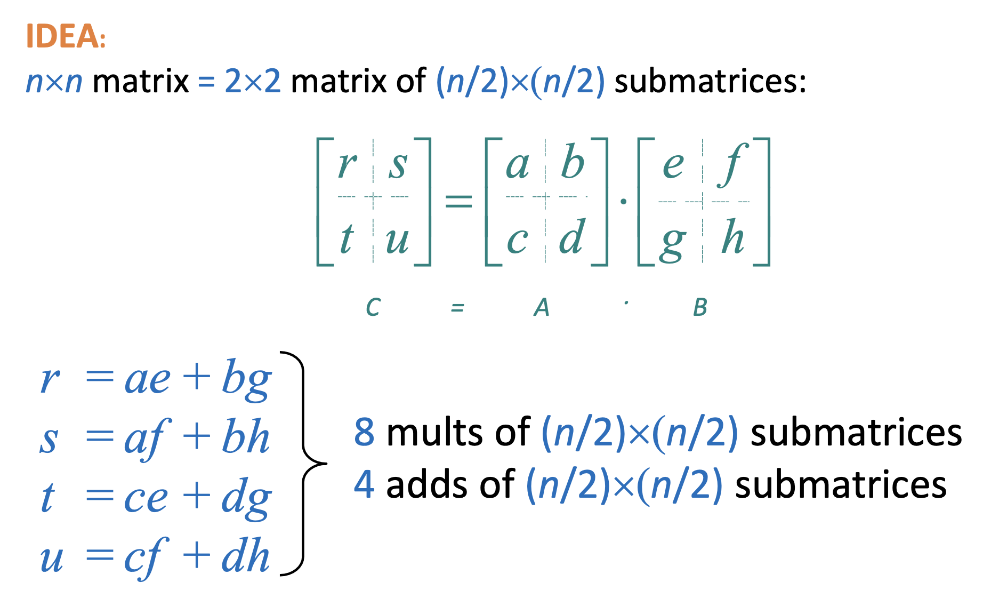
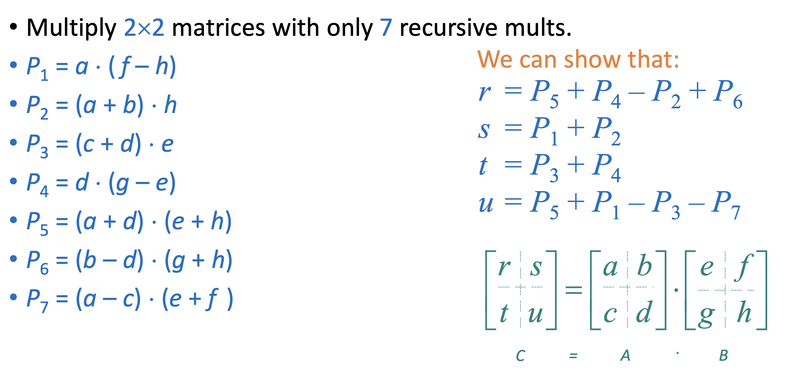

# Divide and Conquer

## A Familiar Paradigm

The Divide-and-Conquer (DnC) paradigm basically consists of:

1. Dividing the problem into smaller subproblems.
2. Conquering the subproblems by solving them recursively.
3. Combining the solutions to the subproblems into the solution for the original problem.

DnC algorithms are typically recursive, and have a recurrence relation of the form:

$$
T(n) = aT(n/b) + f(n)
$$

Here,

- $a$ is the number of subproblems generated from each problem
- $b$ is the factor by which you reduce the problem size
- $f(n)$ is the time taken to divide the problem into subproblems and combine the solutions to the subproblems into the solution for the original problem.

DnC algorithms are everywhere. Common examples include: `MergeSort`, `BinarySearch`, `QuickSort`.

:::note
Although Binary Search can be implemented iteratively, it can still be seen through the lens of Divide-and-Conquer (because we are dividing the search space and hence, the problem size)
:::

Let's look at a couple of interesting examples.

## Powering a Number

Classic example of DnC.

**Assumption**: $n,m$ fit into one/constantly many words → so that multiplication is $\Theta(1)$

### Naive solution

To calculate $a^n$, we calculate $a^{n-x}$ and then multiply the result by $a^x$.

Recurrence relation: $T(n) = T(n-1) + T(x) + O(1)$, which gives $T(n) = \Theta(n)$

But can we do better??

### Optimised solution

We can make our solution more efficient by observing that we can divide $n$ into 2 parts such that we only need to make one recursive call. In particular, if $n$ is even, we can just calculate $a^{n/2}$ and multiply it by itself! If $n$ is odd, we can do $a \times a^{(n-1)/2} \times a^{(n-1)/2}$, which still only involves a single recursive call.

So, the recurrence relation becomes: $T(n) = T(n/2) + O(1)$ , the solution to which is: $T(n) = O(\log n)$ (observe that it is the same recurrence relation as binary search)

## Computing Fibonacci Numbers

We can use our fast-exponentiation technique to calculate fibonacci numbers too!

But, let’s take a step back and start from scratch. We already know a method to calculate $F_n$ in $O(n)$.

We also know that $F_n$ has a closed form: $F_n = \dfrac{1}{\sqrt{5}}(\phi^n - (-\phi)^n)$ where $\phi = \dfrac{1 + \sqrt{5}}{2}$

Through our recently learned powering technique, we can calculate $F_n$ using the above formula in $O(\log n)$. But, this solution is not good in practice as floating point arithmetic is prone to rounding errors!

We make another key observation:

$$
\begin{bmatrix}
F_{n+1} & F_n \\
F_n & F_{n-1}
\end{bmatrix} =
\begin{bmatrix}
F_n + F_{n-1} & F_n \\
F_{n-1} + F_{n-2} & F_{n-1}
\end{bmatrix}
=
\begin{bmatrix}
F_n & F_{n-1} \\
F_{n-1} & F_{n-2}
\end{bmatrix} \cdot
\begin{bmatrix}
1 & 1 \\
1 & 0
\end{bmatrix}
$$

Then, we have the following theorem:

$$
\begin{bmatrix}
F_{n+1} & F_n \\
F_n & F_{n-1}
\end{bmatrix} =
\begin{bmatrix}
1 & 1 \\
1 & 0
\end{bmatrix}^n
$$

Matrix multiplication like this is also very similar to regular multiplication → It is $O(1)$ since the matrix size is $2$ so we only perform $8$ operations.

So, now we use our fast-exponentation method to calculate the $n^{th}$ power of the matrix in $\Theta(\log n)$ time. This gives us a way to calculate fibonacci numbers in logarithmic time.

## Matrix Multiplication

This is quite a common subroutine in many other algorithms (graph algorithms, machine learning, etc.) and so we need to try and optimise the matrix multiplication algorithm.

**Problem**: Given 2 matrices of compatible sizes, return their product.

The naive solution (standard algorithm based on the definition) would be:

```python
def matrix_mult(A, B):
	# assuming A, B both n x n for simplicity
	C = [[0 for _ in '.'*n] for _ in '.'*n]
	for i in range(n):
		for j in range(n):
			for k in range(n):
				C[i][j] = C[i][j] + A[i][k] * B[k][j]
	return C
```

The running time of the above code is obviously $\Theta(n^3)$ since there are 3 nested for-loops, where $n$ is the order of the matrix.

Can we do better? Let’s try using a Divide and Conquer Algorithm based on the following observation:



So, we can reduce multiplying 2 matrices, each of size $n \times n$, to multiplying $8$ submatrices, each of size $(n/2) \times (n/2)$ and then performing $4$ matrix additions on those submatrices.

We know that matrix addition is $\Theta(n^2)$ since there are $n^2$ additions we need to perform - one for each pair of elements.

The recurrence relation is: $T(n) = 8T(n/2) + \Theta(n^2)$ where $n$ is the order of each input matrix. (Here, $n/2$ is the size of the submatrix, $8$ is the number of multiplications of submatrices, and $\Theta(n^2)$ for additions)

Using master theorem, we get $T(n) = \Theta(n^3)$ → which is no improvement from the naive solution! In fact there will probably be an overhead in performing so many function calls.

We know that one way to reduce the time complexity is to reduce the number of subproblems. In this case, can we try to reduce the number of matrix multiplications on submatrices we are performing?

### Strassen's Algorithm

We can reduce the number of multiplications to $7$, by increasing the number of additions to 18 (since multiplication is what is expensive here!)



Then the recurrence relation becomes: $T(n) = 7T(n/2) + \Theta(n^2)$ → which gives us the time complexity $T(n) = \Theta(n^{log_27}) = \Theta(n^{2.807})$

For smaller inputs like $n < 1000$, the ordinary algorithm performs better in practice than Strassen’s algorithm (as we are ignoring the large constants in Strassen’s algorithm). So, we use the naive algorithm for $n < 1000$ as the base case. (Something like using `InsertionSort` as base case in `MergeSort` for $n < 1024$)

Best to date matrix multiplication algorithm (of theoretical interest only): $O(n^{2.375})$ → Coppersmith-Winograd Algorithm

Recall that the asymptotic notation hides the constant factors. So, even the $O(n^{2.375})$ algorithm is slower in practice than Strassen’s algorithm. We call such algorithms _galactic algorithms_ since they have enormous constant factors!
