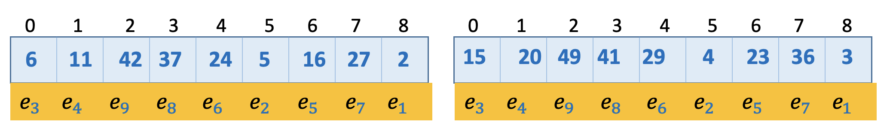
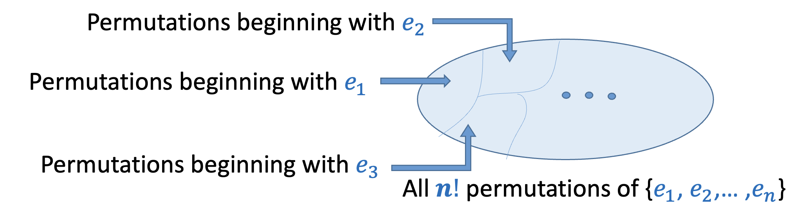
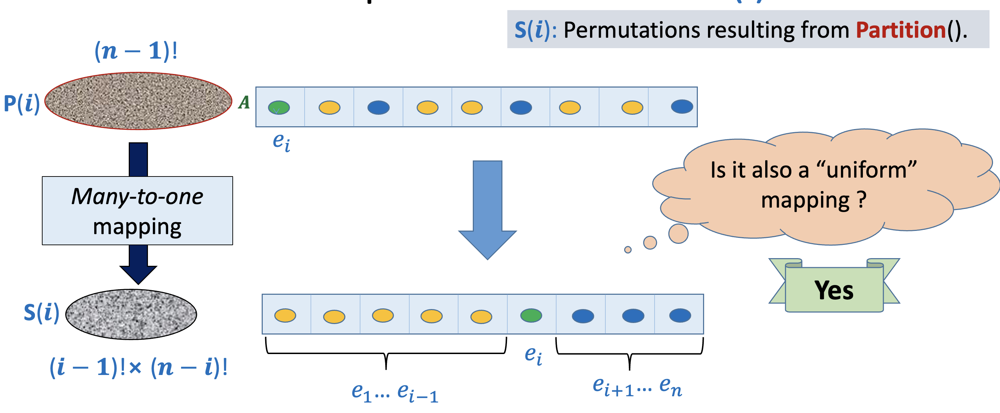
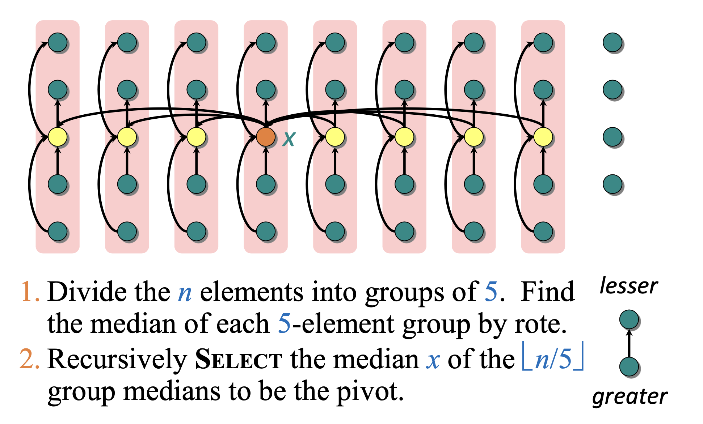
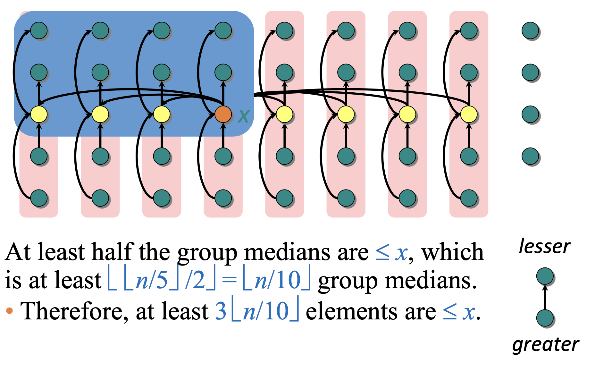
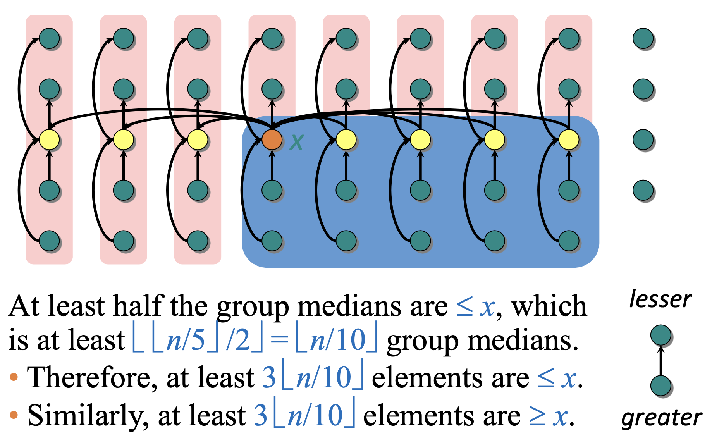

# Randomised Algorithms and Order Statistics

As an example of randomized algorithms, we shall analyze the time complexity of quicksort in detail (for both cases: fixed pivot and random pivot).

**Quicksort** is a classic divide-and-conquer sorting algorithm proposed by C.A.R. Hoare in 1961. It sorts “in place” and is very fast in practice as it makes use of locality of reference (caching on modern processors).

The algorithm for quicksort is described as such:

1. **Divide:** Partition the array into 2 subarrays around a pivot $x$ such that elements in lower subarray $\leq$ $x \leq$ elements in upper subarray. This is done by comparing each element with the pivot and performing swaps as necessary. It takes $\Theta(n)$ time to partition an array of $n$ elements since exactly $n - 1$ comparisons are performed (i.e, comparing each element with the pivot).
2. **Conquer**: Recursively sort the 2 subarrays
3. **Combine**: Trivial.

There are different variants of quicksort: one that uses a fixed pivot (say the first element as the pivot) and another that uniformly at random picks an element as the pivot. We shall discuss both versions separately but it is important to note the difference:

- In the case of fixed pivot, there is no randomness inherent in the algorithm. Given the same input, the algorithm executes exactly in the same manner every time it is run. Here, the randomness lies in the distribution of the input. So, we talk about average case analysis which describes the behaviour of the algorithm over all possible inputs, assuming each of the input permutations are equally likely. Note that this version is NOT a randomised algorithm.
- In the case of random pivot, even for the same input, the algorithm can execute differently each time it is run. This means that we don’t have to consider the randomness of the input, since randomness is now transferred to be within the algorithm itself. Any input can be “good” or “bad” depending on the choice of pivot for that particular run of the algorithm (so there’s no point talking about the input distribution). In such cases, we are interested in calculating the expected running time, i.e., how long our algorithm takes on average, given any input (might even be fixed input - doesn’t matter).

It is important to understand where the randomness lies.

:::tip think
Q. Why do we use often random pivots in quicksort?

Ans: Using random pivots makes quicksort insensitive to the input distribution → time taken does not depend on the initial permutation but on the choice of pivot. So, even if the inputs are not chosen uniformly at random but by an adversary, the algorithm is robust in terms of the running time since there is no “bad input” anymore.
:::

## Analysis of Fixed-Pivot QuickSort

### Worst Case Analysis

Denote $T(n)$ to be the worst case running time on an array of $n$ elements. Denote $A(n)$ to be the average-case running time on an array of $n$ elements.

In the worst case, we always pick the smallest element (or largest element) as the pivot (e.g. quicksort trying to sort an already sorted array by picking the first element as the pivot). Then, $T(n) = T(0) + T(n-1) + \Theta(n)$.

This can be easily solved to give: $T(n) = \Theta(n^2)$ (using arithmetic series).

So, **the worst case running time of a fixed pivot quicksort algorithm is $O(n^2)$.**

### Average Case Analysis

Let’s now perform average-case analysis of QuickSort (this is not so trivial and the proof is quite involving).

Our analysis assumes all input elements are distinct (but if duplicates exist, we can use 3-way partitioning to improve the running time too).

First, given an inpiut array size of $n$, how many possible inputs are there? Well, infinite! Because there are infinite numbers!

But we observe that the execution of quicksort does not depend on the absolute numbers themselves but on the relative ordering of numbers within the array. In particular, **if $e_i$ denotes the $i^{th}$ smallest element of the input array $A$, then the execution of quicksort depends upon the permutation of $e_i's$ and not on the values taken by the $e_i's$.** For example, the 2 arrays below will have the same execution steps of quicksort since their permutation of $e's$ is the same.

Since we’re dealing with average running time, we need to have some assumption about the distribution of possible inputs. In our case, **we define the average running time for quicksort on input of size $n$ to be the expected running time when the input is chosen uniformly at random from the set of all $n!$ permutations (of $e_i's$), i.e., the expectation is over the random choices of the input.**

In other words, $A(n) = \frac{1}{n!} \sum_\pi Q(\pi)$, where $Q(\pi)$ is the time complexity (or number of comparisons) when the input permutation is $\pi$.

We define $P(i)$ to be the set of all those permutations of $\{e_1, e_2, \dots, e_n\}$ that begin with $e_i$. Clearly each $\bigcup_i P(i) =$ set of all permutations, and for each $i \neq j, P(i) \cap P(j) = \phi$. This means that the $P(i)'s$ form a partition of the input space.

Since each of the $n!$ permutations are equally likely, the size of each of the $P(i)$ is also the same and equal to $(n-1)!$. So, each $P(i)$ constitutes $1/n$ of all the permutations of the total input space.

We define $G(n, i)$ to be the average running time of QuickSort over $P(i)$. Clearly, $A(n) = \frac{1}{n} \sum_{i=1}^n G(n, i)$ (that is, the average running time over all inputs, is the average of the average running time for each group of $(n-1)!$ permutations (since each is equally likely). We can prove this formally as such:

Observe that $G(n, i) = \frac{1}{(n-1)!} \sum_{\pi \in P(i)} Q(\pi)$

Now,

$$
\begin{equation}
\begin{split}
A(n) &= \dfrac{1}{n} \sum_\pi Q(\pi) \\
&= \dfrac{1}{n!} \left ( \sum_{\pi \in P(1)} Q(\pi) + \sum_{\pi \in P(2)} Q(\pi) + \dots + \sum_{\pi \in P(n)} Q(\pi) \right ) \\
&= \dfrac{1}{n} \left ( \dfrac{1}{(n - 1)!}\sum_{\pi \in P(1)} Q(\pi) + \dfrac{1}{(n - 1)!} \sum_{\pi \in P(2)} Q(\pi) + \dots + \dfrac{1}{(n - 1)!} \sum_{\pi \in P(n)} Q(\pi) \right ) \\
&= \dfrac{1}{n} \sum_{i=1}^n G(n, i)
\end{split}
\end{equation}
$$

Now, we need to derive an expression for $G(n, i)$. For this purpose, we need to have a closer look at the execution of QuickSort over $P(i)$

We define $S(i)$ to be the set of all possible permutations of $e's$ after partitioning takes place on an input from $P(i)$

Consider what happens after partitioning on an input from $P(i)$. There will be $(i-1)$ elements less than the pivot that will be placed in the first i positions and the remaining $(n-i)$ elements will be placed after the pivot. It should be obvous that the number of permutations possible after partitioning is less than the number of input permutations (since we’re imposing more constraints and decreasing the entropy of the space). In particular, there are $(i-1)! \times (n-i)!$ permutations.

Observe that many different input permutations will give rie to the same permutation after partitioning takes place. The real question now is: Are the number of permutations that map to a single permutation after partitioning the same? (In a mathemetical sense, let $partition$ be a function. Then, we’re interested in finding out whether for each $y \in S(i)$, whether the size of $\{ x : x \in P(i) \land partition(x) = y \}$ is the same) This is called a uniform mapping.

And the answer is yes! There’s no reason why some permutations will have more preimages than other because each input permutation in $P(i)$ is chosen uniformly at random (equally likely). In fact, there are exactly $\binom{n-1}{i-1}$ permutations from $P(i)$ that get mapped to a single permutation in $S(i)$ (why? 🤔)

Recall that $G(n, i)$ is the average running time of QuickSort over $P(i)$. Then, $G(n, i) = A(i - 1) + A(n - i) + (n - 1)$ (The last term comes because we perform exactly $(n-1)$ comparisons in the partitioning steps, comparing each element with the pivot $e_i$)

We have already seen that $A(n) = \frac{1}{n} \sum_{i=1}^n G(n, i)$

So, $A(n) = \frac{1}{n} \sum_{i=1}^n (A((i-1) + A(n-i) + n - 1)$. We observe that each of the $A(i-1)$ will appear twice in the sum → once from the first term, once from the second term (e.g. $A(0)$ will appear when $i = 1$ as well as when $i = n$).

So, $A(n) = \frac{2}{n} \sum_{i=1}^n (A(i-1) + n-1) = \frac{2}{n} \sum_{i=1}^n A(i-1) + n-1$ (We removed the $(n-1)$ out of the summation, since it is added $n$ times, but then divided by $n$)

Multiplying both sides by $n$, we get:

$$
\begin{equation}
nA(n) = 2 \sum_{i=1}^n A(i-1) + n(n-1)
\end{equation}
$$

We don’t know how to solve the above recurrence relation easily, but we can try to get rid of the summation and proceed from there.

We know that this must hold true for any value of $n$. In particular, the same recurrence relation should also be true for $(n-1)$. So,

$$
\begin{equation}
(n-1)A(n-1) = 2 \sum_{i=1}^{n-1} A(i-1) + (n-1)(n-2)
\end{equation}
$$

Subtracting equation $(2)$ and $(3)$, we get: $nA(n) - (n-1)A(n-1) = 2A(n-1) + 2(n-1)$ (since all other terms in the summation get cancelled).

We can rewrite this in the following form using partial fractions (so that we can apply the telescoping method later):

$$
nA(n) - (n+1)A(n-1) = 2(n-1) \\
\implies \dfrac{A(n)}{n + 1} - \dfrac{A(n-1)}{n} = \dfrac{2(n-1)}{n(n+1)} = \dfrac{4}{n+1} - \dfrac{2}{n}
$$

We expand the series using telescoping method as such:

$$
\begin{equation}
\begin{split}
\dfrac{A(n)}{n + 1} - \dfrac{A(n-1)}{n} &= \dfrac{4}{n+1} - \dfrac{2}{n} \\
\dfrac{A(n-1)}{n} - \dfrac{A(n-2)}{n-1} &= \dfrac{4}{n} - \dfrac{2}{n-1} \\
\dfrac{A(n-2)}{n-1} - \dfrac{A(n-3)}{n-2} &= \dfrac{4}{n-1} - \dfrac{2}{n-2}
\\ \dots \\
\dfrac{A(1)}{2} - \dfrac{A(0)}{1} &= \dfrac{4}{2} - \dfrac{2}{1}
\end{split}
\end{equation}
$$

Summing up all the above equations (and splitting each term of the form $\frac{4}{i}$ to be $\frac{2}{i} + \frac{2}{i}$ so that one of them cancels out with the other negative $\frac{2}{i}$ term), we get:

$$
\dfrac{A(n)}{n+1} - \dfrac{A(0)}{1} = \frac{4}{n+1} - 2  + \sum_{i=2}^n \frac{2}{i}
$$

Obviously $A(0) = 0$ (it takes $0$ comparisons to sort an array of size $0$)

So, we have: $\dfrac{A(n)}{n + 1} = \dfrac{4}{n+1} - 2 +  \sum_{i=2}^n \dfrac{2}{i}$.

Then adding $4$ and subtracting $4$ to get the harmonic series form:

$$
\dfrac{A(n)}{n + 1} = \dfrac{4}{n+1} - 4 +  \sum_{i=1}^n \dfrac{2}{i}
$$

Factoring out the $2$ from the series,

$$
\dfrac{A(n)}{n + 1} = \dfrac{4}{n+1} - 4 +  2 \sum_{i=1}^n \dfrac{1}{i}
$$

This gives us the harmonic series, and so,

$$
\dfrac{A(n)}{n + 1} = \dfrac{4}{n+1} - 4 +  2 H(n)
$$

where $H(n)$ is the harmonic series up to $n$ terms.

Multiplying both sides by $(n+1)$,

$$
A(n) = 4 - 4(n+1) + 2(n+1)H(n)
$$

And we know that $H(n) = ln(n) + \gamma$ where $\gamma \approx 0.5772$ is the Euler-Mascheroni constant.

Substituting the exact values, **we find that $A(n) \approx 1.39nlog_2n$.**

We care about the constant in this case because we want to show that the constant factor is not very large, hence, QuickSort is fast.

### QuickSort vs. MergeSort

QuickSort is still the most preferred algorithm in practice. This is because of the overhead of copying the array in MergeSort (to perform the merging operation) and higher frequency of cache misses in case of MergeSort.

What makes QuickSort popular is that as $n$ increases, the chances of deviation from average case decreases (which means that it performs close to average-case $n\log n$ with very high probability as $n$ increases). Hence, the reliability of QuickSort increases as $n$ increases.

However, there is a strong assumption here: the input permutations must be random for QuickSort to be reliably fast. In other words, **Fixed Pivot QuickSort is distribution sensitive, i.e., time taken depends on the initial input permutation (not just input size!).**

Oftentimes, real data is not random and it’ll be quite unfortunate if QuickSort performs in $O(n^2)$ on real data. So, we face a difficult question: **can we make QuickSort distribution-insensitive?**

And, the answer is YES! We’ll take a look at how to achieve this next.

## Analysis of Random-Pivot QuickSort

We have seen that using a fixed pivot makes the running time dependent on the input permutation, which can be set by an adversary. Our goal by using a randomised version of QuickSort is to be able to guarantee an expected running time of $O(n)$ regardless of the input permutation. In some sense, we are transferring the randomness from the choice of input to the choice of pivot, which is internal to the algorithm.

This is necessary because often, real data is not random → suppose we have a nearly sorted array, then if we naively pick the first element as the pivot, we might end up with $O(n^2)$ time (in the case of an already sorted array).

Till now, all algorithms we’ve seen so far have been deterministic. That is, given a fixed input, the algorithm follows the same sequence of execution of instructions. Now, we’re looking at a randomised algorithm, i.e., the sequence of instructions depends not only on the input but also on some random bits, which potentially change each time the function is called or the program is run. **Since the sequence of instructions executed is different each time, the output as well as the running time is a function of the random bits as well as the input chosen**.

This means that some times, the output produced may be incorrect/unexpected, and some times the running time may be longer than other times.

:::danger theorem [Colin McDiarmid, 1991]:
Probability that the run time of Randomized Quick Sort exceeds the average by $x$% is $n^{-\frac x {100} ln(ln(n))}$.
:::

In particular, the probability that the run time of randomisd quicksort is double the average for $n \geq 10^6$ is $10^{-15}$. This is a very very low probability. So, with a very high confidence/probability, we can say that QuickSort will perform well in nearly all cases.

Very often, randomised algorithms are much simpler to understand (and code!) than regular algorithms. And they’re also often much faster!

⭐ There are 2 types of randomised algorithms:

1. Randomised **Las Vegas Algorithms** - Output is always correct, but the running time is a random variable (e.g. QuickSort, QuickSelect)
2. Randomised **Monte Carlo Algorithms** - Output may be incorrect with some small probability, running time is deterministic (e.g. Freivald’s algorithm for matrix multiplication)

Let's revisit a familiar problem, Matrix Multiplication, to see the power (and elegance) of randomised algorithms.

## Matrix Multiplication

**Problem Definition: Given 3 matrices, $A, B, C$, decide whether $A \cdot B = C$**

Deterministic algorithm: Multiply $A$ and $B$ (which takes $O(n^{2.37})$ time) and then check equality (which takes $O(n^2)$ time)

Randomised algorithm (Freivald’s algorithm): Pick a random $x \in \{0, 1\}^n$ uniformly at random, and check whether $A \cdot (B \cdot x) = C \cdot x$ in $O(n^2)$ time. We can repeat this $k$ times independently. Then, the time complexity is $O(kn^2)$. It can be shown that the error probability is $2^{-k}$ for any $k$ we desire, i.e., the probability that the algorithm will claim that $A \cdot B = C$ even when they’re actually unequal is $2^{-k}$ (false positive rate). Obviously, it can never have false negatives because if indeed, $A \cdot B = C$ then for any vector $x$, the equality will hold true and the algorithm will always output “YES” (and so it’ll be correct).

Observe that Freivald’s algorithm is very easy to code and understand, and it also has lower time complexity than the best known matrix multiplication algorithm. So, in practice, we often use it instead (when we can afford to be wrong with a very small probability and time is more important then being 100% correct).

So, Freivald’s algorithm is a randomised monte carlo algorithm.

:::tip think
Question: Why do we need to take $x = \{0, 1\}^n$? We can take any vector of the correct dimension, i.e., $1 \times n$ right? In fact, if the elements of $x$ are chosen uniformly at random, the probability of being wrong will be even lower right?

Ans: YES! You can pick any vector $x$. In fact, if you don’t limit yourself to only $0$ and $1$s then the probability of false positives is much much lower. In theory and literature, we use a 0/1 vector as the probability is easier to analyse - but in practice, to increase the probability of successfully classifying an equation, we can use any range of values of $x$ (the larger the better)
:::

## Analysis of QuickSort using Balls into Bins

We’ll now start to analyse the running time of randomised quicksort by trying to understand the balls and bins experiment. **Suppose there are $m$ balls and $n$ bins and each ball selects its bin uniformly at random and independent of other balls and falls into it.** There are certain questions that we might have:

1. What is the expected number of balls in any bin? (obviously $m/n$)
2. What is the expected number of balls in the heaviest bin? (You can show that if $m = n$, then this is $\Theta(\frac {\log n} {\log \log n})$ as discussed in tutorial)
3. What is the probability that there is at least one empty bin? (You can use Principal of Inclusion-Exclusion here)

Note that all these have very important applications in Computer Science, especially in **hashing** and **load balancing in distributed environments**.

Le’s try to answer the third question (though we won’t since we’ll get side-tracked midway and start focusing more on QuickSort once we understand the concept behind how to solve such problems)

What is the probability that there is at least one empty bin? Well, the size of the sample space $S = n^m$ (each of the $m$ balls can go into any of the $n$ bins). Let us define the event $E_j^i: j^{th}$ ball falls into $i^{th}$ bin. Then,

1. $E_j^i$ and $E_j^k$ are disjoint when $i \neq k$ (the $j^{th}$ ball can only go into one bin - either $i$ or $k$ but not both)
2. $E_j^i$ and $E_l^k$ are independent (by the question)
3. $E_j^i$ and $E_l^i$ are independent (by the question)

Then, $P[E_j^i] = \frac 1 n$. So, $P[\bar {E_j^i}] = 1 - \frac 1 n$.

Then, the probability that the $i^{th}$ bin is empty: $P[\bar {E_1^i} \cap \bar {E_2^i} \cap \dots \cap \bar {E_m^i} \cap] = P[\bar {E_1^i}] \times P[\bar {E_2^i}] \times P[\bar {E_m^i}] = \left ( 1 - \frac 1 n \right )^m$

Similarly, the probability that the $i^{th}$ and $k^{th}$ bins are empty = Probability that all balls fall into neither of those bins = $\left (1 - \frac 2 n \right ) ^ m$

In general, the probability that a _specific_ set of $l$ bins are empty = $\left ( 1 - \frac l n \right ) ^ m$

Now, we try to express the event that there is at least one empty bin as the union of some events. Define $A_i :$ $i^{th}$ bin is empty. Then, the event “there is at least one empty bin” = $\bigcup_{i=1}^n A_i$.

Then, we can just apply inclusion-exclusion to solve this problem! (Obviously this will give a very complicated expression - because the probability itself is not so simple to calculate - there is no other simple way of doing this)

For now, let’s look at a different question: **In the execution of randomised QuickSort, what is the probability that $e_i$ is compared with $e_j$?** We can assume that all elements are distinct (if not, break the ties arbitrarily). Recall that $e_i$ denotes the $i^{th}$ smallest element in the array $A$.

Obviously we cannot explore the sample space associated with Randomised QuickSort because the sample space consists of all recursion trees (rooted binary trees on $n$nodes). We’d have to add the probability of each recursion tree in which $e_i$ is compared with $e_j$ which is not feasible!

**Instead, we’ll try to view randomised quicksort from the perspective of $e_i$ and $e_j$. To do this, we visualize elements $e_1, \dots , e_n$ arranged from left to right in increasing order of values. This visualization ensures that the two subarrays which we sort recursively lie to the left and right of the pivot. In this way, we can focus on the subarray containing $e_i$ and $e_j$ easily. Note that this visualisation is just for the sake of analysis. It will be grossly wrong if you interpret this as if we are sorting an already sorted array.**

Recall that during the partitioning subroutine of QuickSort, elements are only compared with the pivot. In particular, if we are partitioning an array of size $n$, there will be exactly $n - 1$ comparisons performed - between the pivot and each of the other elements (to decide where that element should be placed).

**Also, notice that if we pick a pivot $e_k$ such that $i < k < j$ then after partitioning, $e_i$ and $e_j$ will be on opposite sides of the pivot and so they will never be compared.**

Let $S_{ij}$ denote the subarray of elements from index $i$ to $j$ (inclusive). Then**, we observe that $e_i$ and $e_j$ get compared during an instance of randomised quicksort if and only if the first pivot from $S_{ij}$ is either $e_i$ or $e_j$.**

Another observation (which should be trivial) is that any 2 elements are compared at most once (because after partitioning, the pivot is not included in either subarray and so, it can never be compared again - which makes sense since it’s absolute position in the sorted array is already fixed so there’s no point in comparing it to other elements after partitioning anyway)

We define $B_i :$ first pivot element selected from $S_{ij}$ during randomised quicksort is $e_i$ and we define $B_j :$ first pivot element selected from $S_{ij}$ during randomised quicksort is $e_j$. Then, (as we’ve seen), $P[e_i$ and $e_j$ get compared$] = P[B_i \cup B_j]$

Obviously $B_i$ and $B_j$ are disjoint (since only one of $e_i$ and $e_j$ can be chosen as the first pivot in the subarray $S_{ij}$). So, $P[B_i \cup B_j] = P[B_i] + P[B_j]$.

We’re assuming that pivots are chosen uniformly at random. There are $j - i + 1$ elements in $S_{ij}$ and so $P[B_i] = \frac 1 {j - i + 1} = P[B_j]$. Then, we have $P[B_i \cup B_j] = \frac 2 {j - i + 1}$

**In conclusion, $P[e_i$ and $e_j$ get compared$] = \frac 2 {j - i + 1}$. This is quite an interesting result! It suggest that:**

1. **The probability depends upon the rank separation $j -i + 1$ (how far elements are from each other in the sorted array)**
2. **The probability does NOT depend on the size of the array**
3. **Probability that $e_i$ and $e_{i+1}$ are compared is $1$ (which should seem obvious because there is no other way to tell which element is smaller than the other, i.e., there is no middle element that can serve as pivot to partition $e_i$ and $e_{i+1}$**
4. **Probability of comparison of $e_0$ and $e_{n-1}$ is $\frac 2 n$ (if in the first partitioning, any other pivot other than $e_0$ or $e_{n-1}$ is chosen, they will definitely be on opposite sides of the pivot and will never be compared subsequently)**

**Notice that the probability that 2 elements are _directly compared_ decreases with increase in rank separation as there is an increasing chance that their ordering can be inferred by comparing each of them to any of the elements between them.** This is the key intuitiion.

We’ve now found an equation for the probability of any 2 elements being compared or not. But we haven’t found the expected number of comparisons performed by QuickSort. Let’s proceed with our analysis by considering 2 similar problems:

1. Balls and bins Experiment: What is the expected number of empty bins if $m$ balls are thrown into $n$ bins?
2. Randomised QuickSort: What is the expected number of comparisons performed?

Both these problems are equivalent in the sense that solving one will give us an idea on how to solve the other. So, let’s start with the balls and bins problem.

We can directly apply the definition of expectation but we’ll get stuck because we cannot calculate the probability that exactly $i$ bins are empty in simple terms - due to inclusion-exclusion, the formula gets really messy. So, we need to come up with a clever idea.

**Since viewing the random experiment in its entirety looks so complex, let’s take a microscopic view. Let’s focus on one particular box at a time → This is the key shift in perspective that we need to solve this problem!**

We define $X_i$ to be a random variable as follows:

$$
X_i =
\begin{cases}
1 \quad \text{if bin i is empty} \\
0 \quad \text{otherwise}
\end{cases}
$$

We call such variables that take only values $0$ and $1$ **indicator random variables** (as they indicate the presence or absence of a certain event).

Then, $E[X_i] = 1 \times P(i^{th}$ bin is empty$) + 0 \times P(i^{th}$ bin is not empty$)$. We already know that $P(i^{th}$ bin is empty$) = \left ( 1 - \frac 1 n \right ) ^m$.

So, $E[X_i] = \left ( 1 - \frac 1 n \right ) ^m$.

**Also observe by linearity of expectation that $E[X] = E[X_1 + X_2 + \dots + X_n] = E[X_1] + E[X_2] + \dots + E[X_n]$, where $X =$ total number of empty bins.**

Recall that for any 2 events $X, Y$ (does not matter whether dependent of independent), $E[X + Y] = E[X] +E[Y]$

**So, $E[X] = n \left ( 1 - \frac 1 n \right ) ^m$** (since each of the bins have the same probability of being empty)

We solved our balls and bins problem! (observe that we found $E[X]$ but to find the actual probability of there being at least one empty bin, we cannot escape using the messy inclusion-exclusion principle)

We return to solve our main problem of calculating the expected number of comparisons, $E[Y]$ ($Y$ is the number of comparisons). Using our newfound perspective, we view randomised quicksort from the perspective of $e_i$ and $e_j$.

Recall that we’ve already established a key observation: $e_i$ and $e_j$ get compared during an instance of randomised quicksort if and only if the first pivot from $S_{ij}$ is either $e_i$ or $e_j$. And we’ve also seen that this probability is, $P[e_i$ and $e_j$ get compared$] = \frac 2 {j-i+1}$.

Now, we define $Y_{ij}$ for any $1 \leq i < j \leq n$ to be an indicator random variable that indicates whether $e_i$ and $e_j$ are compared during the execution of randomised quicksort. So,

$$
Y_{ij} =
\begin{cases}
1 \quad \text{if }e_i \text{ and } e_j \text{ are compared during randomised quicksort} \\
0 \quad \text{otherwise}
\end{cases}
$$

Then, $E[Y_{ij}] = \frac 2 {j - i + 1}$.

By definition of $Y$, we have: $Y = \sum_{i=1}^n \sum_{j=i+1}^n Y_{ij}$.

By linearity of exepctation, $E[Y] = \sum_{i=1}^n \sum_{j=i+1}^n E[Y_{ij}]$

We can rewrite the sum as: $E[Y] = 2 \sum_{i=1}^n [ \frac 1 2 + \frac 1 3 + \dots + \frac 1 {n-i+1} ]$. We can add and subtract $2n$ to the series (so that we get the harmonic series, whose bound we know). We get, $E[Y] = 2 \sum_{i=1}^n [1 + \frac 1 2 + \frac 1 3 + \dots + \frac 1 {n-i+1}] - 2n$.

Now we use the fact that $\sum_{i=1}^n \frac 1 i = \log_en + 0.58..$ where $\gamma = 0.58..$ is the Euler-Mascheroni constant. We can neglect the constant since we’re looking for a $\Theta()$ bound. So, $E[Y] = 2[\log_en + \log_e(n-1) + \log_e(n-2) + \dots + \log_e1] - 2n$.

Let’s get a tight bound on $\sum_{i=1}^n \log_ei$. Using stirling’s approximation, $(\frac n e)^n \leq n! \leq n^n$.

$\sum_{i=1}^n \log_ei = \log_e(n!)$

Now, $\log_e(\frac n e)^n \leq \log_e n! \leq \log_e n^n \implies n\log_e n- n \leq \log_e n! \leq n \log_e n$. We can see that $\log_e n!$ is upper-bounded and lower-bounded by $n\log_en$. In particular, $\log_e n! = \Theta(n\log n)$.

Hence, we get $E[Y] = 2[n \log n] - 2n = \Theta(n\log n)$

Hence, we see that in expectation, randomised QuickSort performs $\Theta(n \log n)$ comparisons and hence runs in expected $\Theta(n \log n )$ time complexity. Notice that we didn’t consider any kind of input here → because the input really doesn’t matter here, only the choice of pivot matters, which is randomised anyway.

There’s a subtle leap from “QuickSort performs $\Theta(n \log n)$ comparisons in expectation” to “QuickSort runs in $\Theta(n \log n)$ expected time” but it’s easy to see once you realise that all the time spent by QuickSort is in comparing elements (and performing swaps, but that can be consumed within the “compare” operation) and so there’s no other time spent.

We’re done with the analysis of randomised QuickSort! We’ll now look at another common problem - order statistics - and some common algorithms to solve it.

## Order Statistics

**Problem Definition: Given an unsorted list of $n$ elements, the $i^{th}$ order statistic is the $i^{th}$ smallest element (that element is said to have _rank_ $i$)**

**Algorithms we can use:**

1. Naive: Sort the array and then report the $i^{th}$ element → $\Theta(n \log n)$

**It can be shown that order statistics requires $\Omega(n)$ beause you need to “see” each element at least once, what if you miss an element and that happened to be the required order statistic?**

So, we can we do it in $O(n)$? YES!

We’ll look at 2 solutions - one is a worst-case linear time algorithm, called median of medians, and the other is a randomised divide-and-conquer algorithm that takes expected $O(n)$ time, QuickSelect.

### QuickSelect

1. Pick a pivot at random and partition about it (all elements on left side of pivot are less than the pivot, and all elements on the right side of the pivot are more than the pivot)
2. If the position of the pivot is $>$ target rank, recurse on left half
3. If the position of the pivot is $<$ target rank, recurse on right half

Each partitioning is $O(n)$ and it can be shown that if our choice of pivot is “decent”, the algorithm runs in $O(n)$, which is why the expected running time is $O(n)$. In the worst case, say the array is already sorted and our algorithm keeps picking the first element as the pivot and our target rank is $n$, then it will take us $O(n^2)$ time.

It’s very easy to implement → the partitioning algorithm can be slightly tweaked to handle duplicates too (just have 3 regions instead of 2 → < pivot, = pivot, > pivot).

### Median of Medians

**Worst case time complexity: $O(n)$**

**Median of medians solves the problems of “bad pivots” from QuickSelect. Before partitioning, we ensure that our chosen pivot is “good” such that it divides the array into 2 subarrays of roughly similar sizes so that no matter which side we recurse on, our subproblem is much smaller than before.**

Algorithm:

Say we’re searching for the $i^{th}$ order statistic.

1. Divide the $n$ elements into groups of $5$ (Why $5$? Why not $3$ or $7$? We’ll discuss this later)
2. Find the median of each 5-element group by brute force (just use `if-else` or you can even sort those 5 elements and report median)
3. Recursively use median of medians algorithm to find the median $x$ of the $\lfloor n/5 \rfloor$ group medians to be the pivot
4. Partition around the pivot $x$. Let $k = rank(x)$
5. If $k$ is the target rank, return $x$.
6. If $k > i$, recursively use median of medians on the left subarray
7. If $k <  i$, recursively use median of medians on the right subarray to find the $(i-k)^{th}$ smallest element.

How can we prove that this algorithm works in $O(n)$?

It’s best to visualise the size of the subarrays based on our chosen pivot:

So, the size of each subarray is no more than $7n/10$. Since $7n/10 < 3n/4$, we can write our recurrence relation as:

$$
T(n) \leq T(n/5) + T(3n/4) + \Theta(n)
$$

Explanation of the time complexity:

1. Finding median of each group of $5$ is $O(1)$ and there are $n/5$ such groups → which takes $O(n)$ time in total
2. We use median of medians to find the median of the $n/5$ group medians → which takes $T(n/5)$ time
3. Partitioning about the chosen pivot takes $O(n)$
4. Recursively calling median of medians on either half - since we’re considering worst case, we always consider bigger side.

We can solve the above recurrence relation by using substitution. $T(n) \leq cn$

After substituting we get, $T(n) \leq \frac 1 5 cn + \frac 3 4 cn + \Theta(n) = \frac {19} {20} cn + \Theta(n) = cn - (\frac 1 {20}cn - \Theta(n)) \leq cn$ if our chosen $c$ is large enough to handle both $\Theta(n)$ as well as the initial conditions.

So, we have shown that $T(n) = O(n)$ in the worst case (notice that this is a stronger guarantee on the running time as compared to QuickSelect). In practice, this algorithm runs slowly because of the large constant factor in front of $n$ and the randomised QuickSelect algorithm is far more practical (and easier to code).

Coming back to the question of group-size of $5$:

1. Can we use a group-size of $3$ instead? No! Then the algorithm will run in $O(n \lg n)$ as the recurrence relation becomes: $T(n) = T(n/3) + T(2n/3) + O(n)$, which should remind you of MergeSort (except that the halves are not equal) → notice that $n/3 + 2n/3$ sum to $n$ and in general, the recurrences of this form take $O(n\lg n)$ time.
2. Can we use a group-size of $7$ instead? Yes! The algorithm will still run in $O(n)$ time (but the constant factor may be large since you need to find the median of 7 elements by using `if-else` statements or by sorting them)
