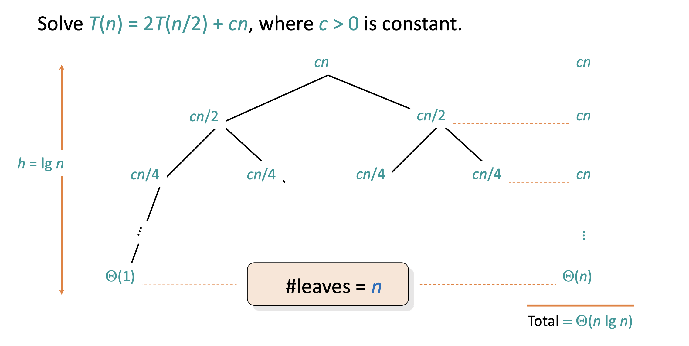

# Solving Recurrences

Recall that one of our main aims in CS3230 is to be able to analyze algorithms. Often, we have recursive algorithms which leads to running time in the form of recurrence relations. For example, the recurrence relation for MergeSort is $T(n) = 2T(n/2) + O(n)$.

It is not easy (at least, not always) to derive the big-O or other asymptotic bounds just by looking at the recurrence relations.

So, how do we solve recurrence relations? There are 4 ways described below:

1. Telescoping Method
2. Recursion Tree
3. Master Method
4. Substitution Method

## Telescoping Method

For any sequence $a_0, a_1, a_2, \dots, a_n$:

$$
\sum_{k=0}^{n-1} (a_k - a_{k + 1}) = (a_0 - a_1) + (a_1 - a_2) + (a_2 - a_3) + \dots + (a_{n-1} - a_n) = a_0 - a_n
$$

In short, all the terms in the middle cancel out and only the first and last term remain. This property is very useful in simplifying such sums of series.

For example,

$$
\sum_{k = 1}^{n-1} \dfrac{1}{k(k+1)} = \sum_{k = 1}^{n-1} \left ( \dfrac{1}{k} - \dfrac{1}{k + 1} \right ) \\
= 1 - \dfrac{1}{n}
$$

To split a fraction with multiple terms in the denominator, we use partial fractions.

The following is a summary of the partial fractions that are good to know (you can set up the equations and solve for the constants A, B, C, etc.)

As an example, let's try to derive a bound for `MergeSort` using the telescoping method.

We have: $T(n) = 2T(n/2) + n$ (ignoring theta-notation for simplicity).

This implies, $\dfrac{T(n)}{n} =\dfrac{T(n/2)}{n/2} + 1$

Let’s go ahead and expand the above equation:

$$
\begin{equation*}
\begin{split}
\dfrac{T(n)}{n} &= \dfrac{T(n/2)}{n/2} + 1 \\
\dfrac{T(n/2)}{n/2} &= \dfrac{T(n/4)}{n/4} + 1 \\
\dfrac{T(n/4)}{n/4} &= \dfrac{T(n/8)}{n/8} + 1 \\
\cdots \\
\dfrac{T(2)}{2} &= \dfrac{T(1)}{1} + 1
\end{split}
\end{equation*}
$$

Notice that $\dfrac{T(n/2)}{n/2}$appears on the RHS in the first equation, and on the RHS in the second equation. Similarly for all the other middle terms. So, what happens when we add all these equations together?? These terms get cancelled out! (if it’s easier to visualize it, you can move all terms except $1$ in every equation to the LHS - keep $1$s on RHS - and then add everything up)

We finally end up with $T(n)/n = T(1)/1 + (1 + 1 + \cdots + 1)$

How many $1$s are there? Well, how many equations are there? Since we stopped when $n$ reached $2$, we have exactly $log_2n$ equations. So, we have $\log_2n$ many $1$s. That is,

$T(n)/n = T(1) + \log_2n$

Since $T(1)$ is constant time, we get, $T(n) =O(n\log n)$

In fact, since we didn’t make any loose calculations/assumptions (we did not ignore a single term), we can even say $T(n) = \Theta(n\log n)$ since there have to be _at least_ $\log n$ equations above.

### Generalizing the method

Let’s try to generalize this telescoping method now.

Consider a recurrence relation: $T(n) = aT(n/b) + f(n)$

The question is: how do we get it to be of the form that we can apply telescoping series results?? What quantity do we use to divide both sides by??

**Answer: We want to express the relation as: $\dfrac{T(n)}{g(n)} = \dfrac{T(n/b)}{g(n/b)} + h(n)$**

So, our goal is to find a $g(n)$ that satisfies this condition.

**This simplifies to finding a $g(n)$ such that $\dfrac{g(n)}{g(n/b)} = a$. We can take $g(n) = n^{log_ba}$ to satisfy this constraint.**

## Recursion Tree

This is the most general way which can be used to solve any kind of recurrence relation.

For example,

In short, the steps to follow are:

1. Draw the recursion tree by identifying how many recursive calls are made
2. Calculate the work done/cost to be paid by the algorithm _apart_ from the recursive calls. This gives the cost at each node
3. Find the total cost of each level of the recursive tree
4. Sum up the costs of all levels

## Master Method

The master method is a (no-brainer) method to solve recurrences of a certain form. It is a direct consequence (i.e., a special case) of the recurrence tree method. Each of the 3 cases of the master method corresponds to a certain type of recursion tree (left as an exercise to figure out).

The master method applies to recurrences of the form: $T(n) = aT(n/b) + f(n)$ where $a \geq 1, b > 1$, and $f$ is asymptotically positive.

There are 3 common cases of the master theorem, each involves comparing $f(n)$ with $n^{log_ba}$ (recall this is what we got $g(n)$ to be for our telescoping method too! → it turns out that this is the number of leaves in the recursion tree!):

:::danger important

1. **If $f(n) = O(n^{log_ba - \epsilon})$ for some constant $\epsilon > 0$, i.e., $f(n)$ grows _polynomially slower_ than $n^{log_ba}$ by an $n^{\epsilon}$ factor. Then, $T(n) = \Theta(n^{log_ba})$**
2. **If $f(n) = \Theta(n^{log_ba}log^kn)$ for some constant $k \geq 0$, i.e, $f(n)$ and $n^{log_ba}$ grow at similar rates, then $T(n) = \Theta(n^{log_ba}log^{k+1}n)$**
3. **If $f(n) = \Omega(n^{log_ba + \epsilon})$ for some constant $\epsilon > 0$, i.e,. $f(n)$ grows _polynomially faster_ than $n^{log_ba}$ by an $n^{\epsilon}$ factor and $f(n)$ satisfies the regularity condition that $af(n/b) \leq cf(n)$ for some constant $c < 1$, then $T(n) = \Theta(f(n))$**

:::

Note:

1. The regularity condition guarantees that the sum of subproblems is smaller than $f(n)$ → otherwise the time complexity might be exponential - imagine if it takes longer to solve the subproblems than the main problem LOL
2. For (1) and (3), $f(n)$ being _polynomially_ slower/faster than $n^{log_ba}$ is a strict requirement. For example, $n^{1.5}$ grows polynomially slower than $n^{1.8}$. But, $\dfrac{n}{\log n}$ does NOT grow polynomially slower than $n$ although $\dfrac{n}{\log n} = O(n)$ because you cannot find any $\epsilon$ that satisfies the requirement.
3. $\epsilon$ cannot be 0 for case 1 and 3. If this happens, then it actually belongs to case 2.

A result of (2) is that for every constant $\epsilon > 0$, we have $n^\epsilon = \omega(\log n)$. That is, a polynomial running time, no matter what the power, is always worse (faster-growing) than a logarithmic running time.

Akra-Bazzi theorem is a generalization of master theorem

## Substitution Method

This is the most general method: you just “guess” the form of the solution and verify by induction.

Not recommended to be used.

## Appendix

### Further Details of Master Theorem

In $T(n) = aT(n/b) + f(n)$,

- $f(n)$ is the amount of work done to combine the smaller sub-problems
- $a$ is the number of subproblems you are dividing into
- $n/b$ is the size of each smaller sub-problem
- $n^{log_ba}$ is the amount of work done in the entire recursion tree.
- Depth of recursion tree: $log_bn$
- Branching factor of recursion tree: $a$

Then, the 3 cases of master theorem can be understood as follows:

- **Case 1 of Master Theorem**: Most amount of work happens at the leaves (because of the number of subproblems at the lowest level) since $f(n) = O(n^{log_ba - \epsilon})$
- **Case 3 of Master Theorem**: Because $f(n) \in \Omega(n^{log_ba})$, amount of work done in each recursive call grows faster than the number of leaves ($n$ is highest at the root). So, the amount of work done at the root node of the recursive tree dominates → That is why $T(n) = \Theta(f(n))$. You need to ensure regularity which means that the work done at the root dominates the amount of work done by its children. (this is not normally the case because in most divide and conquer algorithms, we want to spread the load → most work happens in the recursive call and the combination part is faster). Sometimes, work done by parent does not dominate the children
- **Case 2 of Master Theorem**: Both $f(n)$ and $n^{log_ba}$ grow at the same rate, so you cannot ignore any of them(e.g. `MergeSort`) → the work done by each level of the recursion tree is about the same. Most of the time, $k = 0$. Then, total work done = work done at each level \* depth of recursion tree.

:::note terminology

- $f(n)$ is called the **driving function**
- $n^{log_ba}$ is the **watershed function**

:::
