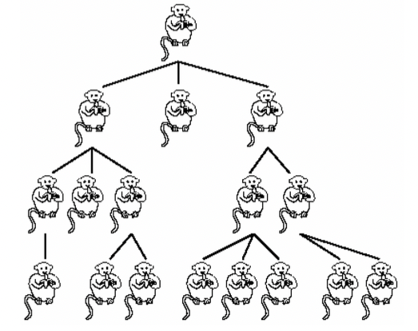
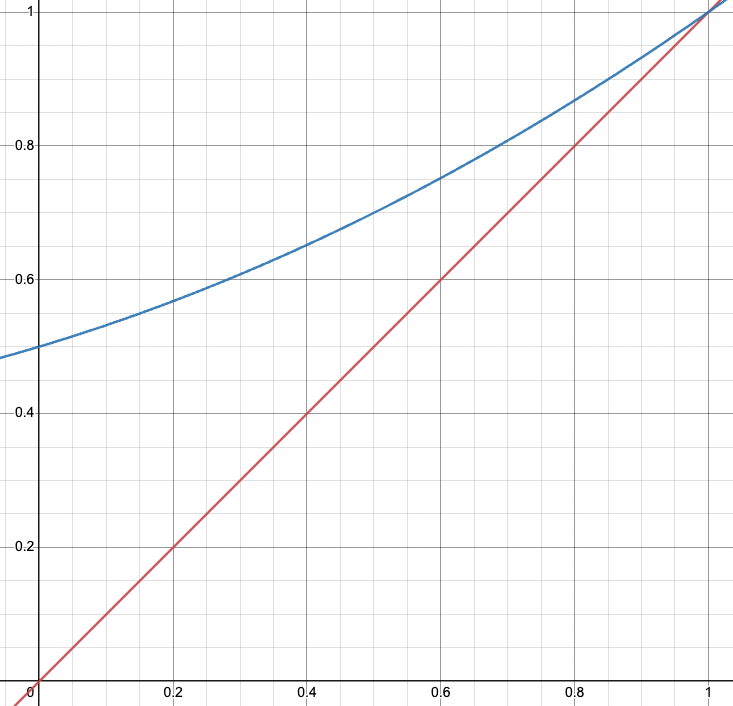
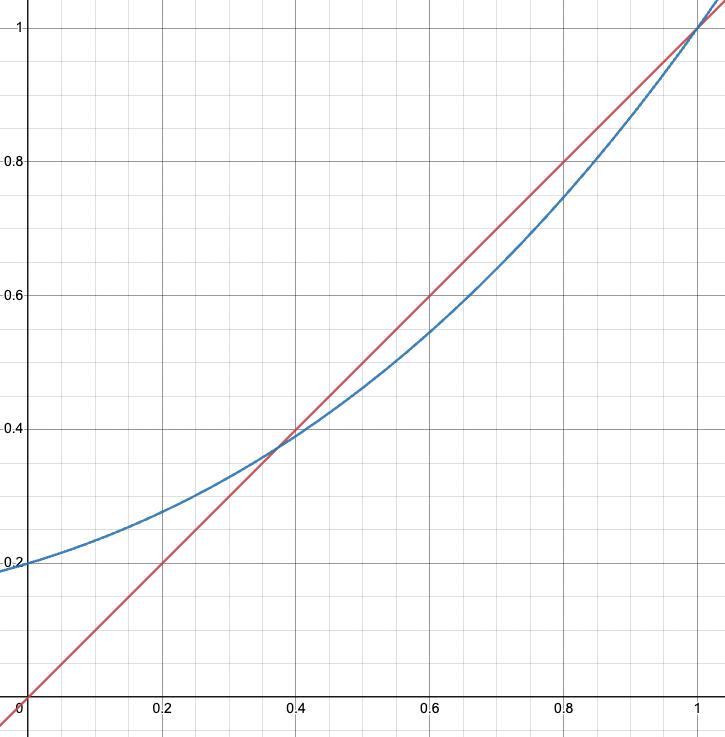

# Branching Process

Now that we’ve learnt everything, it’s time to apply it to examples! We’ll be looking at 3 main examples:

1. Branching Process
2. Ranking Pages in a Search Engine
3. Monte Carlo Markov Chain (MCMC)

This page covers the first example, and the subsequent pages discuss the other examples.

---

# Introduction

**Branching process** (aka birth-and-death process) is commonly used to model problems involving the population of a species.

As a motivating example, consider a population of monkeys in a group. Suppose we have only 1 monkey at the beginning (don’t worry about _how_ the monkey will reproduce by itself 😆). At each generation, the monkey can give birth to $\xi$ monkeys and the old monkey will die.

Clearly, $\xi$ is a random variable because every monkey can give birth to different number of children (generally called offsprings).

If we define $X_n$ to be the number of monkeys in the $n$th generation, then the process $\{X_n\}_{n=1}^\infty$ is a branching process. (We call it a “branching” process because every edge in the population “tree” looks like a branch)

Here, we have: $X_0= 1$ and monkey $i$ will generate $\xi_i$ new monkeys (and itself die), where $\xi_i$ are i.i.d. from a some distribution $F$.

Hence, the $(n+1)$th generation has $X_{n+1} = \sum_{i=1}^{X_n} \xi_i$ monkeys. Observe that $X_n$ itself is a random variable that is independent of $\xi_i$. So, this is a _random sum_!

Formally, we can define a branching process as such:

::: definition
**Branching Process**

Suppose initially there are $X_0$ individuals. In the $n$-th generation, the $X_n$ individuals independently give rise to number of offsprings $\xi_1^{(n)}, \xi_2^{(n)}, \cdots, \xi_{X_n}^{(n)}$, which are i.i.d. random variables with the same distribution as:

$$
P(\xi = k) = p_k, \quad k =0,1,2, \cdots
$$

The total number of individuals produced for the $(n+1)$-th generation is:

$$
X_{n+1} = \xi_1^{(n)}, \xi_2^{(n)}, \cdots, \xi_{X_n}^{(n)}
$$

Then, the process $\{X_n\}_{n=0}^\infty$ is a _branching process_.

:::

Clearly, a branching process is a stochastic process. Moreover, it’s a stationary markov chain.

What parameters do we need to specify this markov chain? Well, if we know $X_0$ (initial state) and the distribution of $\xi$, we can completely describe the MC.

Note: An important (and strong) assumption of the branching process is that $\xi$ is not dependent of $X_n$. That is, the number of children an individual has does not depend on the current population. While this may sound reasonable in some cases, the assumption may not hold in other cases - be sure to verify this assumption before modelling a problem as a branching process!

## Examples

Branching processes are not only useful for population-related problems. We can use them in other situations too. For example,

1. Electron Multiplier: Each electron, as it strikes the first plate, generates a random number of new electrons, which in turn strike the next plate and produce more electrons, etc.
2. Nuclear Fusion: Similar to electron multiplier, in every generation, some atoms combine together and produce enough energy to set of a chain reaction.

## Motivating Questions

For every branching process, we’re interested in asking some questions (to predict the future, so we can plan accordingly):

1. How many individuals will be alive in the $n$-th generation? That is, $X_n$
2. Will the population ever go extinct? If so, what’s the expected time? That is, the minimum $n$ s.t. $X_n=0$

# Probabilistic Structure

Consider a simple case where $X_0=1$. Then, the whole process looks like a tree (look at the picture of monkeys above).

If we have $X_0=k$, then it’s identical to having $k$ independent trees (since all the $\xi$ are independent anyway) → just treat every monkey in the first generation as the root of a subtree. Alternatively, you can think of it as $X_{-1}=0$ and that $-1$th generation created $k$ individuals (i.e., we can simply shift every generation by one to “force” the first generation to have only one individual and pre-assign certain values of $\xi$ for that first generation to “recreate” our given process)

Let $X_{n}^{(i)}$ be the number of indviduals of the $i$th tree in the $n$th generation. Then, $X_n = \sum_{i=1}^k X_{n}^{(i)}$.

So, we only need to analyze the case where $X_0 =1$ and we can generalize the result quite easily.

Note: Actually in _every_ (not just the first) generation, we can consider each monkey to be the “root” it’s own subtree and treat them as being independent of each other (and then, we can add them all up later to get the “total” tree).

---

What can we derive about the branching process?

To be able to derive anything, we need to have some information → specifically, we need to have information about the distribution of $\xi$ (which we denote by $F$).

We’ll consider 2 cases:

1. **Partial Information**: We only know the mean $\mu$ and variance $\sigma^2$ of $\xi$, but not the exact distribution.
2. **Complete Information**: We know the exact distribution, $F$, of $\xi$

## Partial Information

Suppose we’re given that $E[\xi] = \mu$ and $Var(\xi) = \sigma^2$. Further, suppose that $X_0 = 1$

What can we derive about the process? Obviously since we don’t know the exact distribution of $\xi$ we cannot create a transition probability matrix. But does this mean we can’t do anything?

No! Since, we’re given the mean and variance of $\xi$, we should be able to find the mean and variance of $X_n$ too!

Recall that for a random sum, we had obtained the following results (where $Y= \sum_{i=1}^N X_i$ and $N$ was a RV independent of the $X$’s):

$$
E[Y] = E[X] E[N], \quad Var(Y) = (E[X])^2Var(N) + Var(X)E[N]
$$

So, applying those results to the branching process, we have:

$$
E[X_{n+1}] = \mu E[X_n]
$$

$$
Var(X_{n+1}) = \mu^2 Var(X_n) + \sigma^2 E[X_n]
$$

Note that these results hold _for all_ values of $n=0,1,2, \cdots$. So, we can use induction on $n$ to find the exact values of each of the $E[X_{n+1}]$ and $Var(X_{n+1})$ for all $n$ (since each term only depends on the previous term, and we’re given the initial “term” $X_0$).

For the expectation, we have:

$$
E[X_{n+1}] = \mu E[X_n] = \mu^2 E[X_{n-1}] = \cdots = \mu^{n+1}E[X_0] = \mu^{n+1}
$$

So, the general formula can be written as: $E[X_n] = \mu^n$.

This should be quite intuitive because on average, _every_ _individual_ (_in every generation_) creates $\mu$ offsprings. So, the population growth is exponential.

Now, consider the variance. We can write it as:

$$
\begin{align*}
Var(X_{n+1}) &= \mu^2 Var(X_n) + \sigma^2 \mu^n \\
&= \mu^4Var(X_{n-1}) + \sigma^2 \mu^{n+1} + \sigma^2\mu^n \\
&= \cdots \\
&= \mu^{2(n+1)}Var(X_0) + \sigma^2(\mu^n + \mu^{n+1} + \cdots + \mu^{2n}) \\
&= \mu^n\sigma^2 \left ( \frac{1-\mu^{n+1}}{1 - \mu} \right)
\end{align*}
$$

The last equality holds because $Var(X_0)$ is zero (since it’s a constant number → no variance). Further, the geometric series “formula” only holds when $\mu \neq 1$ (because if $\mu=1$, we can simply add the $n$ terms to give $n$).

Hence, the general formula is:

$$
Var(X_n) = \mu^{n-1}\sigma^2 \times
\begin{cases}
\frac{1-\mu^n}{1-\mu}, \quad \mu \neq 1 \\
n, \quad \mu = 1
\end{cases}
$$

The above results are for the initial state $X_0=1$.

When we have $X_0=k$, we know that $X_n = \sum_{i=1}^k X_n^{(i)}$ and then the results can be adjusted to obtain:

$$
E[X_n|X_0=k] = k\mu^n
$$

The above result holds because of linearity of expectation.

$$
Var(X_n|X_0=k) = k\mu^{n-1}\sigma^2 \times
\begin{cases}
\frac{1-\mu^n}{1-\mu}, \quad \mu \neq 1 \\
n, \quad \mu = 1
\end{cases}
$$

The above result holds because the $X^{(i)}$’s are independent of each other, i.e., the covariance is zero → hence, the variance of the sum of independent random variables is equal to the sum of their respective variances.

**Note**: The variance of the sum of $k$ i.i.d. variables, $\sum_{i=1}^k X_i$ is NOT equal to the variance of $k \times X_i$. Because if we’re only considering one term and multiplying it by $k$, then, it is no longer independent → we will have additional covariance terms, i.e., $Cov(X_i, X_i) = Var(X_i)$ and hence, we’ll end up with larger variance (by a factor of $k$). In particular, $Var(kX_i) = k^2Var(X_i)$ but $Var(\sum_{i=1}^k X_i) = kVar(X_i)$ if all the $X_i$’s are i.i.d.

## Complete Information

Now, suppose we have the full knowledge about the distribution of $\xi$, i.e., we know $P(\xi=k) = p_k$ for all $k=0,1,2, \cdots$

Then, we can derive the transition probability matrix! (not explicitly anyway because _may_ be infinite but we can calculate any entry if we want to)

We’re interested to find a (simple 😅) expression for $X_n$ (not just the mean and variance, but the actual distribution of $X_n$), and also the long-run performance of $X_n$.

To do so, we need to define another term.

### Probability Generating Function

::: definition
**Probability Generating Function (PGF)**

For a _discrete_ random variable $X$, the probability generating function is defined as:

$$
\phi_X(t) = E[t^X] =\sum_{k=0}^\infty P(X=k)t^k
$$

:::

Note that the Moment Generating Function (MGF) can be ued for both discrete as well as continuous RVs but the Probability Generating Function (PGF) is only for discrete RVs.

Similar to the MGF,

- $\phi_X(t)$ is a function of $t$ ($X$ is a pre-specified parameter whose distribution defines the function, it is not the input)
- There’s no randomness in $\phi_X(t)$. Evaluating the function at any value of $t$ gives us a plain constant number, not a random variable.
- $\phi_X$ is sufficient to completely characterize the random variable $X$. In other words, there is a one-to-one mapping between $\phi_X$ and the distribution of $X$.
  In particular, once we have $\phi_X$, then we can obtain the distribution of $X$ as such:
  $$
  P(X=0) = \phi_X(0), \quad P(X=k) = \frac 1 {k!} \frac {d^k} {dx^k} \phi_X(t) |_{t=0}, \ k=1,2,\cdots
  $$
  The proof of the above is quite straightforward (by using induction on $t$ and taking higher order derivatives) and is left as an exercise for the reader 😮
- If $X$ and $Y$ are independent, then $\phi_{X+Y}(t) = \phi_X(t) \phi_Y(t)$ → this will be quite useful for our branching process soon.

### Distribution of $X_n$

As we’ve seen that $X_n$ and $\phi_{X_n}(t)$ are equivalent, we can derive the following quantities of interest instead:

- $\phi_{X_{n+1}}(t)$ given $X_n$
- $\phi_{X_n}(t)$ given $X_0$

Note that because we’re given the full distribution of $\xi$, it is equivalent to knowing $\phi_\xi(t)$

Let’s try to find $\phi_{X_{n+1}}(t)$ if we’re given $X_n$

$$
\begin{align*}
\phi_{X_{n+1}}(t) &= E[t^{X_{n+1}}] \\
&= E[t^{\xi_1^{(n)} + \xi_2^{(n)} + \cdots + \xi_{X_n}^{(n)}}] \\
&= E\left [\prod_{i=1}^{X_n}t^{\xi_i^{(n)}}\right] \\
&= \prod_{i=1}^{X_n}E[t^{\xi_i^{(n)}}] \quad \text{because }\xi_i's \text{ are independent} \\
&= \phi_\xi^{X_n}(t) \quad \text{because } E[t^{\xi_i}] = \phi_\xi(t)
\end{align*}
$$

So, if we know $X_n$ (as a fixed number), we can find the distribution of $\phi_{X_{n+1}}(t)$, and therefore all the probabilities too.

Note: The above result is only useful when we know the numerical value (i.e., the realization) of the random variable $X_n$ (otherwise, we cannot raise $\phi_\xi(t)$ to the power of $X_n$ if $X_n$ is a random variable).

We still need to express $X_{n+1}$ using the initial state. We can do this by considering $X_n$ as a distribution, and applying the law of iterated expectation:

$$
\begin{align*}
\phi_{X_{n+1}}(t) &= E\left [\prod_{i=1}^{X_n}t^{\xi_i}\right] \\
&= E \left [ E \left [ \prod_{i=1}^{X_n} t^{\xi_i} | X_n \right ] \right ] \\
&= E[\left(\phi_\xi(t)\right)^{X_n}] \\
&= \phi_{X_n}(\phi_\xi(t))
\end{align*}
$$

As we’ve done several times already, we can use induction on $n$ (since the above result must hold for all $n=1,2 \cdots$) and obtain an expression for $X_n$ that contains only the initial state.

Suppose our initial state is $X_0=1$. Then, we have:

$$
\phi_{X_n}(t) = \phi_{X_{n-1}}(\phi_\xi(t)) = \phi_{X_{n-2}}(\phi_\xi(\phi_\xi(t))) = \cdots \phi_\xi^{(n)}(t)
$$

Note: $f^{(n)}(x) = f(f(\cdots n \text{ times} \cdots (x)))$ → basically it is composing the function with itself $n$ times. That is, $\phi_\xi^{(n)}$ can be viewed as a function itself. In particular, $\phi_\xi^{(n)}(t) \neq (\phi_\xi(t))^n$ → it has nothing to do with the power (although it’s unfortunate that the superscript notation we use for both might cause some confusion).

The final result (when $X_0=1$) is:

$$
\phi_{X_n}(t) = \phi_\xi^{(n)}(t)
$$

When $X_0 =k$, we can show that:

$$
\phi_{X_n}(t) = [\phi_\xi^{(n)}(t)]^k
$$

The above result is true because we just need to add the population in the $k$ trees, and since they’re independent, we can multiply their PGFs together. Recall that the PGF of the sum of independent RVs is equal to the product of their individual PGFs.

## Extinction Probability

The branching process is a stationary MC with known transition probability function $F$ of $\xi$, state space $S= \{0, 1, 2, \cdots \}$. Observe that the MC is aperiodic in the general case (unless there’s some weird constraints on $\xi$ - eg. only even number of offsprings are allowed)

Also, we can see that ther are 2 classes: $\{0 \}$ and $\{1, 2, \cdots \}$ (Why? because $0$ is an absorbing state → once the population reaches $0$, it’s not possible for a “new generation” to be created - a monkey 🐒 cannot just appear out of nowhere without any parent.)

Once $X_n = 0$, we say that the population has become _extinct_ → it can never be revived.

So, naturally we are interested to know: what is the probability of the population going extinct? 🤔

And, if the population is “guaranteed” to go extinct, we want to know the mean generation at which it will become extinct (so we know how much time we have before we _need_ to invent time travel ⌛).

Formally, we’re interested to find the long-run probability of the system entering $\{0\}$.

Let $T = \min \{n : X_n = 0 \}$ be the extinction time.

Define $u_n = P(X_n = 0|X_0) = P(T \leq n |X_0)$ be the probability of the population going extinct _by_ the $n$th generation, i.e., the probabiilty that the extinction happens in or before the $n$th generation (and in either case, $X_n= 0$, hence the definition makes sense).

We’re also interested in: $u_\infty = \lim_{n \to \infty} u_n$

$u_\infty$ is the total probability of extinction, i.e,. what is the probability that the population _will eventually go extinct_? If $u_\infty = 1$, then the population is guaranteed to go extinct in the long-run. If $u_\infty < 1$, then there is some hope that the population will continue indefinitely in the long-run and never go extinct.

Okay, now let’s start solving!

Suppose that $X_0=1$ (as before, we can generalize the results to $X_0=k$ later).

Recall that we have: $\phi_{X_n}(t) = \phi_\xi^{(n)}(t)$. How do we find $P(X_n=0)$ using this information?

Recal that $\phi_{X_n}(t) = \sum_{k=0}^\infty P(X_n=k)t^k$. Also, $t^0$ will be $0$ for any finite value of $t$, including $t=0$. In particular, $0^0 = 1$, not undefined!

Then,

$$
\phi_{X_n}(t) = P(X_n=0) + \sum_{k=1}^\infty P(X_n=k)t^k
$$

If we evaluate the above expression at $t=0$, we get exactly what we need, i.e., $\phi_{X_n}(0) = P(X_n=0)$ gives us the probability of the population going extinct _by_ the $n$th generation.

Also, since $\phi_{X_n}(t) = \phi_\xi^{(n)}(t)$, we can say that $P(X_n=0) = \phi_{X_n}(0) = \phi_\xi^{(n)}(0)$

:::info note
This also shows the power and versatility of probability generating functions - they can be used to express important quantities quite conveniently.

:::

Now, we already have a way to calculate the extinction probability using PGF. But, for the sake of practice, let’s try to use First-Step Analysis (FSA) to derive the extinction probability in another way. Why? Because we should be able to! In all the previous MCs we’ve seen, we used FSA to solve problems related to the stopping time, and this should be no different.

Define $u_n^{(k)} = P(T \leq n|X_0=k)$ be the probability of going extinct by the $n$th generation if we start of with $k$ individuals. If we try to directly apply FSA to this, we’ll end up with too many equations, because both $k$ and $n$ are parameters here so we have to set up equations for $u_j^{(l)}$ for all $l$ and $j$! (in all our previous analyses of MCs, we only had a single parameter).

But there is a way to simplify this 😌

Recall that for a branching process, $X_0=k$ means that there are $k$ independent proceses with $X_0=1$. Then, if $T$ is the stopping time of the original process (with $X_0=k$), and $T_i$ is the extinction time of the $i$th branching sub-process, then the event $\{ T \leq n \} = \cap_{i=1}^k \{T_i \leq n \}$. In other words, if we say that the entire population goes extinct, then _all_ of the $k$ sub-processes (”branches”) must have gone extinct (and vice versa). If there’s even one $T_i > n$ it means that in the $n$th generation, if we look at the overall original process, there is at least one individual alive in the $n$th generation, hence the population cannot be said to be extinct.

Another way of looking at it is that $X_n = \sum_{i=1}^k X_n^{(i)}$ and if we want $X_n=0$ (extinct), then each of the $X_n^{(i)}$’s must also be zero.

Therefore, by independence of the branching subprocesses,

$$
u_n^{(k)} = P(T \leq n|X_0=k) = \prod_{i=1}^k P(T_i \leq n | X_0=k) = (u_n^{(1)})^k = u_n^k
$$

where we define $u_n = u_n^{(1)}$ for convenience.

Then, we have:

$$
u_n = \sum_{l \in S}P(X_1=l|X_0=1)u_{n-1}^{(l)} = \sum_{l \in S}P(\xi = l)u_{n-1}^l
$$

The difference here is that $l$ can be treated as just a number → it’s no longer a “parameter”. We only need to set up the equations for $u_i$ for all $i=1,2, \cdots$

Observe that the above form is the same with the PGF of $\phi_\xi(t)$. In particular,

$$
u_n = \phi_\xi(u_{n-1})
$$

For sake of convenience, if we define $\phi(t) = \phi_\xi(t)$, then we have:

$$
u_2 = \phi(u_1), \quad u_3 = \phi(u_2) = \phi(\phi(u_1)), \quad u_4 = \phi(u_3) = \phi(\phi(\phi(u_1))), \cdots
$$

Further, note that the only way the population (starting from one individual) goes extinct in the immediately next generation is when there are no offsprings of that individual:

$$
u_1 = P(T \leq 1 |X_0 =1) = P(X_1=0|X_0=1) = P(\xi = 0)
$$

So, we can calculate $u_1$. Hence, we can also calculate all the other $u_n$’s. Hence, we can calculate all the $u_n^{(k)} = u_n^k$’s too.

If you’re wondering what is $u_0$, naturally $u_0 = 0$ if you start with at least one individual. So, we can also write $u_1$ as $u_1 = P(\xi = 0) = \phi_\xi(0)$.

And hence, $u_n = \phi_\xi^{(n)}(0)$ → exactly what we derived earlier.

In summary, here’s the procedure for calculating the extinction probability by the $n$th generation:

:::danger definition
For a branching process, suppose the distribution of $\xi$ is given. The extinction probability $u_n^{(k)} = P(X_n=0|X_0=k)$ is the probability that there are no more individuals at the $n$th generation. It can be calculated as such:

1. Define the PGF of $\xi$:

   $$
   \phi_\xi(t) = E[t^\xi] = \sum_k P(\xi = k) t^k
   $$

2. Set $u_1 = P(\xi = 0)$
3. Iterating $u_m = \phi_\xi(u_{m-1})$ for $m=2,3, \cdots, n$. So, now we have $u_n$.
4. Calculate $u_n^{(k)} = u_n^k$

:::

Note that once we’ve found the extinction probabilities using the above procedure, we can also find the probability that the population goes extinct at exactly the $n$th generation by $u_n - u_{n-1}$, because $P(T = n) = P(T \leq n) - P(T \leq n-1)$. Obviously this also holds for when $X_0=k$, i.e., $P(T=n|X_0=k) = P(T \leq n |X_0=k) - P(T\leq n-1|X_0=k)$

### Eventually Extinct

Recall that we have another question to answer: what is the probability that the population _eventually_ dies out? That is, we want to calculate:

$$
u_\infty^{(k)} = \lim_{n \to \infty} u_n^{(k)} = \lim_{n \to \infty} u_n^k
$$

So, once we find $u_\infty$, we can also find $u_\infty^{(k)}$ easily. Hence, the goal is to find $u_\infty$.

First, we have to show that the limit exists.

According to the definition, $u_n = P(T \leq n |X_0=1$). Cleary, the sequence of $u_n$’s forms a non-decreasing sequence of numbers (because the event defined by $u_{n-1}$ is a subset of the event defined by $u_n$).

Moreover, $u_n \leq 1$ since it is a probability. (this shows that there is an upper-bound on the numbers and so, the sequence cannot keep increasing without bound, and it also cannot ever decrease → intuitively, then it must be true that at after many terms, the $u_n$’s approach a constant value, i.e., they gradually “plateau” out and this value gives us the limit)

As a result, we can claim that the limit $\lim_{n \to \infty}u_n$ always exists.

Okay, so we know that the limit exists. But how do we find it? 🤔

There’s a really neat trick for solving such kind of limits. They make use of the intuitive property of a limit - that for large enough $n$’s, the value doesn’t change anymore. (We actually used a similar logic for the limiting distribution of a MC too)

In our case, we know that:

$$
u_n = \phi_\xi (u_{n-1})
$$

Under the limit, and noting that $\phi_\xi(t)$ is continuous (by definition) so we have:

$$
\lim_{n \to \infty} u_n = \lim_{n \to \infty} \phi_\xi(u_{n-1}) \implies u_\infty = \phi_\xi(u_\infty)
$$

Note that we can only do the above because we can shift the limit inside, i.e, for a continuous function: $\lim_{x \to a} f(x) = f(\lim_{x \to a} x) = f(a)$

Hence, the value of $u_\infty$ must be the solution of the equation:

$$
x = \phi_\xi(x), \quad x \in [0,1]
$$

Let’s take a moment to analyze this equation.

Based on the definition, $\phi_\xi(x) = E[x^\xi]= \sum_{k=0}^\infty P(\xi=k)x^k$. When $x=0$, and $x=1$, we can calculate:

$$
\phi_\xi(0) = P(\xi=0)
$$

$$
\phi_\xi(1)= \sum_k P(\xi =k)1^k = \sum_k P(\xi = k) = 1
$$

Further, we check the derivative:

$$
\frac d {dx}\phi_\xi(x) = \sum_{k=1}^\infty P(\xi = k)kx^{k-1}
$$

which is always positive when $0 \leq x \leq 1$. Hence, $\phi_\xi(x)$ is an increasing function on $(0, 1]$.

The second derivative, as can be easily verified, is also positive on $(0, 1]$. Hence, $\phi_\xi(x)$ will increase faster and faster.

We need to find the point of intersection of the function $\phi_\xi(x)$ with the line $y=x$ (because we want the functional value of $\phi_\xi$ at the point to equal to the input $x$ to the function) in the range $0 < x \leq 1$).

There are a few possibilities:

- If $P(\xi =0) = 0$, then $u_1 = 0$ and $\phi(0) = P(\xi = 0) = 0$, so the extinction probability is zero. In other words, if the offspring is at least 1, then the population never dies out.
- If $P(\xi =0) > 0$, we have 2 cases:
  - Case 1:
    
    Blue line is $y=\phi_\xi(x)$ and the red line is $y=x$
    - $\phi_\xi(x) \geq x$ on $(0, 1)$ and the only intersection is $(1, 1)$.
    - Since $u_\infty$ exists and satisifes $u_\infty = \phi_\xi(u_\infty)$, so $u_\infty = 1$
    - It means that in such a case, the extinction probability is 1
  - Case 2:
    
    Blue line is $y=\phi_\xi(x)$ and the red line is $y=x$
    - There is one and only one intersection of $\phi_\xi(x)$ and $y=x$ on $(0,1)$ → and the second interaction is at $(1,1)$
    - $u_\infty$ is the $x$-value of this intersection since it satisfies $u_\infty = \phi_\xi(u_\infty)$
    - It means that in such a case, the extinction probability is $<1$

But how do we differentiate the 2 possibilities analytically?

Note that the slope of the line $y=x$ is $1$. In particular, the slope of the $y=x$ line is $1$ at the point $(1,1)$ as well.

Visually, we can see that:

- the $\phi_\xi(x)$ curve with one intersection only has slope $\leq 1$ at $(1, 1)$, so that it can decrease to $1$. This is because it comes from above, and needs to slow down so that the $y=x$ line can catch up with it.
- the $\phi_\xi(x)$ one with two intersections has slope $> 1$ at $(1, 1)$, since it has to increase to $1$. Here, it comes from below and so, it needs to increases faster than $y=x$ to be able to meet the line at $(1,1)$

Hence, we can use $\frac d {dx} \phi_\xi(x)|_{x=1}$ to be the criteria:

- If $\frac d {dx} \phi_\xi(x)|_{x=1} \leq 1$, then there is only one interaction and $u_\infty = 1$
- If $\frac d {dx} \phi_\xi(x)|_{x=1} > 1$, then there are 2 interactions, and $u_\infty < 1$

Observe that:

$$
\frac d {dx} \phi_\xi(x)|_{x=1} = \sum_{k=1}^\infty P(\xi = k) \cdot k \cdot 1^{k-1} = \sum_{k=0}^\infty k P(\xi = k) = E[\xi]
$$

Wow! 😮 Look how simple and intuitive this turned out to be!

The interpretation is really intuitive: if the birth rate (determined by $\xi$) per individual is more than $1$, i.e., every individual, on average, produces more than one offspring, the population will not die. But if $E[\xi] < 1$, the population has a higher death rate than birth rate because for every individual that dies from one generation to the next, he is producing, on average, less than $1$ new individual. This will eventually cause the population to go extinct. The case when $E[\xi] = 1$ is tricky → there’s a “chance” it may die out in the long-run.

In conclusion,

:::info summary
Consider a branching process with the distribution of $\xi$ as $F$. The extinction probability $u_\infty$ can be found as follows:

1. If $P(\xi = 0)$, then $u_\infty = 0$ → no chance of extinction because every individual generates at least one offspring.
2. If $P(\xi = 0) > 0$ and $E[\xi] < 1$, then the process is called subcritical, and $u_\infty = 1$ (the population eventually goes extinct)
3. If $P(\xi = 0) > 0$ and $E[\xi = 1]$, then the process is called critical and $u_\infty = 1$ (still goes extinct)
4. If $P(\xi = 0) > 0$ and $E[\xi] > 1$, then the process is called supercritical and $u_\infty < 1$, and it can be found by the equation: $x = \phi(x)$ where $\phi(x) = \sum_kP(\xi = k)x^k$

:::

The terms subcritical, critical, and supercritical are normally associated with nuclear reactions at nuclear power plants too. If the reaction is subcritical, it is “controlled”. If it’s critical, there’s a chance it can go on forever, but it will eventually die out too. If it is supercritical, it’s a big problem 💥
