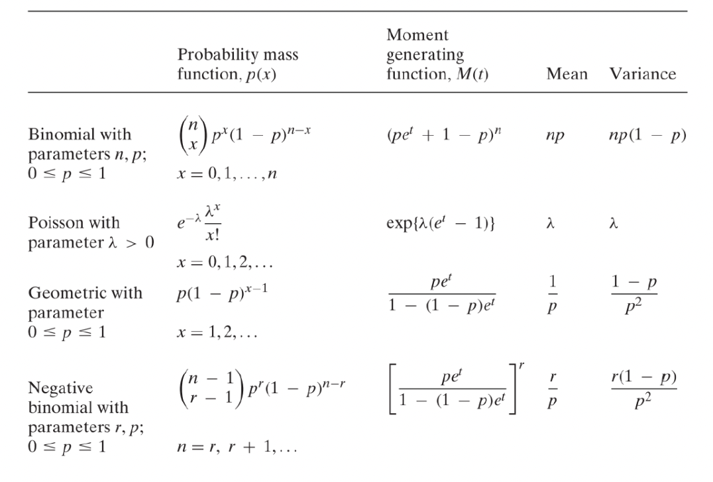

# Introduction

### Introduction and Definition

Stochastic processes deal with modeling a series of actions/steps (with a certain goal in mind) and anlayzing the possible paths/steps. This is in contrast with regular probability problems in which there is only a constant number of “actions” being performed (e.g. drawing a ball from a bag, rolling a die, tossing a coin)

**Proeess**: a series of actions or steps in order to achieve a particular end.

**Stochastic**: we have some randomness (i.e., uncertainty - which is measured using probabiilty) in each action of this process. e.g. in the snakes and ladder game, we don’t know how many steps we should walk for each action, and the final path is not definite (in fact, we don’t even know how many steps we need to take - if we’re unlucky, we might not reach the goal even after taking 1000 steps).

:::info
However, we can say that the probability that we evenutally reach the final square (100) in the snakes and ladder game approaches 1 as we play for a longer time. In other words, we are ["almost sure"](https://en.wikipedia.org/wiki/Almost_surely) to reach the final square in the long run. This is an example of a "convergence" property of stochastic processes.

:::

### Stochastic Process vs. Random Variables

What’s the difference between a stochastic process and random variable? Well, they both measure some kind of randomness and are used to model situations. The difference lies in the kinds of situations each is used to measure.

A random variable is used to describe the randomness of a univariate quantity. For each random variable, we have:

1. the sample space $\Omega$ of all possibe outcomes
2. an event $F$ which is a set of some (possible none) outcomes
3. the probability measure $P$ which gives the probability of each event occuring.

A random variable is a mapping from $\Omega \to \mathbb{R}$

A stochastic process needs to describe the randomness of a complete process (you can think of this as a combination of a lot of random variables - since each random variable can be used to describe an action/step - but note that in a process, each action may be related to the previous ones so the random variables used to model the steps/actions may not be independent). So, we have:

1. the sample space $\Omega$ which is a set of all possible outcomes - but now, each outcome is a possible path from the start to end (goal).
2. an event $F$, which is a set of outcomes, i.e., a set of some paths. e.g. the paths with the first roll as $4$ in the snakes and ladders game
3. the probability measure $P$. E.g. P(first roll is 4) = 1/6

A stochastic process is a mapping from $\Omega \to \mathbb{R}^N$. In particular, note that we don’t assign a probability for each path (because it would be meaningless in cases where there are $\infty$ possible paths - e.g. snakes and ladders). A stochastic process gives us the probability of any action occuring given the current state (and possibly the history of previous actions)

:::tip think 🤔
Q. In snakes and ladders, isn’t the probability of each path equal to the product of the probabilities of each action (since dice rolls are independent in every turn)? And this would be a finite number right? And there are $\infty$ such paths so wouldn’t that mean that the sum of probabilities of all paths is greater than one?

Ans: It is correct that the probability of each path is finite and that there are infinite paths - but note that as the length of a path increases, it’s probability decreases (this means that longer paths are less likely to occur). So, although there are infinite paths (think of infinite terms in a series), they converge to a single value (which must be $1$ since it must form a valid probability function).

Also, it's important to remember that we need to consider a "disjoint" set of paths, for the sum of their probabilities to equal 1. E.g. if we consider all paths of length 2 (or any fixed finite length $k$ for that matter, they are disjoint - none of the paths are "sub-paths" of each other. However, if we consider the set of "all possible paths", obviously they are not disjoint - in particular, all paths of length $1$ are sub-paths of all paths of length $2$ (and so on). Hence, we cannot simply add the probabilities of all paths and exepct it to be 1.

:::

:::tip note
Read more about convergence tests for series [here](https://en.wikipedia.org/wiki/Convergence_tests) to verify the above claim.

:::

Also in general, we don’t care so much about a single “path” rather than a set of paths (which is basically defined by an event). e.g. the set of paths which take at least one snake, the set of paths which reach the last square in 15 steps, etc. This is similar to the case of continuous random variable → we can never assign a probability measure for $P(X=a)$ when $X$ is a continuous random variable because $X$ can take on infinite number of value - so we look at a range $P(a < X < b)$ (and consider the limit as the size of the interval $(a, b)$ shrinks to zero whilst still always containing our point of interest).

### Why do we care about Stochastic Processes?

Because a lot of the real world problems can be modelled as a kind of stochastic process!

Examples:

1. Stock Price (where we use time series data)
2. Population growth
3. Weather change
4. Number of customers in a queue

Also, modelling any problem/situation as a stochastic process helps us answer important questions:

- Short-term questions:
  - After $n$ steps, what will be the distribution of $X$?
  - How does the distribution of $X_n$ (after $n$ steps) rely on the initial state $X_0$?
- Strategy related questions (called so since they relate to states/paths, which we can analyze to come up with a “winning” strategy to a problem/game → based on some rules - e.g. in poker, if I ever reach the state “royal flush”, I will immediately go all in - we can update our strategy when we reach a certain state or meet a certain condition):
  - Is it possible that a given state $i$ can be visited in the long run? If yes, what is the probability?
  - If the probability of visiting a state $i$ is $1$, what will be the expected time to arrive at this state?
  - What will be the probability that state $j$ is visited before state $i$?
- Performance in the long run:
  - Will there be a “stable” distribution on states in the long run?
  - What are the necessary/sufficient conditions to achieve this distribution?
  - How to calculate it?

:::note
In this course, we only deal with _discrete_ stochastic processes → there are fixed “states” and “actions” to move between states. This is in contrast with _continuous stochastic process_ (e.g. any process that depends on continuous time - as opposed to discrete blocks of time).

:::

:::tip think
It’s interesting to note that though time is always flowing (and is hence intuitively continuous), we (humans) found a way to “discrete-ize” (think: second, day, year) it so that it is easier to analyze. We “zoom out” to a level of granularity/complexity that we can deal with - we do this in every aspect of life.

:::

## Review on Basic Probability and Statistics

### Discrete Random Variable

Consider a random variable $X$ (note that $X$ is a function that maps every outcome to a real number). If the range of $X$ is finite or countably infinite (e.g. $\mathbb{N}$), then $X$ is said to be a discrete random variable. (otherwise, continuous)

A discrete random variable can be specified by defining the probability on each value, i.e., specifying $p_x = P(X = x)$ for all values of $x$. This is called the probability distribution of $X$.

Note that once we have the probability distribution of a random variable, we don’t need anything else - not even a definition for it - to work with it. A definition could be something like: “the minimum number when 2 die are rolled”. In other words, a probability distribution of a random variable _completely_ specifies all properties of $X$. (though obviously we prefer to have some definitions for random variables, which relate to the problem we’re trying to solve, so that we can think about what each of the random variables "mean" in our head - unless you’re a maniac who’s just aimlessly analyzing random variables)

If we have a function $p(x)$ that satisfies:

1. $0 \leq p(x) \leq 1$
2. $\sum_x p(x) = 1$

then $p(x)$ specifies a discrete random variable.

### Indicator Function

For any event $A$, we can define an indicator function $I(A)$ (note that $I(A)$ is a function, NOT a number. This function, $I(A)$, is then applied to any outcome and the output of that is a number - either 0 or 1)

The indicator function $I(A)$ of an event $A \subset \Omega$ is the function:

$$
I(A)(x) =
\begin{cases}
1, \quad \text{if } x \in A \\
0, \quad \text{if } x \notin A
\end{cases}
$$

Note: In the above definition, $x$ is an element of the sample space, i.e., it is an outcome.

:::tip think 🤔
What is the domain and codomain of the function $I$ (which I term “indicator-generating function”)?

Ans: Domain: Set of all possible events. Codomain: Set of all functions whose domain is the sample space, and codomain is $\{0,1\}$. Writing it “programmatically” as a higher order function:

```tsx
I: (event) => (outcome) => 0 / 1;
```

:::

The indicator function $I(A)$ is a random variable. Note that is NOT random in terms of $A$ → we’re talking about a fixed event $A$, for which it maps every elment of the sample space to either $0$ or $1$.

The indicator variable follows $P(I(A) = 1) = P(A)$ and $P(I(A) = 0)= 1- P(A)$. Hence, it is obvious that $E[I(A)] = P(A)$ (very often, we make use of this fact without proving it).

We can also specify the indicator RV as a Bernoulli random variable with parameter $p= P(A)$. Recall that even a bernoulli RV has only 2 outcomes: success (1) and failure (0) and we use $p$ to be the probability of success.

Properties of indicator variable:

1. $I(A^c) =1 - I(A)$ → and this is also a random variable
2. $I(A \cap B) = I(A) \times I(B)$ → easy to prove since it is $1$ only if the element is in both sets, and if it is absent from either one, multiplying by $0$ will result in $0$.
3. $I(A \cup B) = I(A) + I(B) - I(A)\times I(B)$ → can be proven easily using division into cases since there are only 4 cases.

### Expectation, Variance, MGF

A random variable always has an associated distribution with numerical values. So, we can perform addition, subtraction, multiplication, etc on it.

For a discrete RV with probability mass function $P(x)$, the **expectation (mean)** is:

$$
E[X] = \sum_{x \in R_X} xP(X= x)
$$

where $R_X$ is the range of $X$.

Expectation shows the long-run average of the random variable.

Some properties of exepctation:

1. If $X \geq 0$, then $E[X] \geq 0$
2. If $X \geq 0$ and $E[X] = 0$, then $P(X= 0) = 1$ ($X$ is a constant, not a random variable)
3. **If $a$ and $b$ are constants, then $E[a + bX] = a + bE[X]$**
4. **Linear additivity: for _any_ random variables $X_1, \dots, X_n$, we have $E[\sum_{i=1}^n X_i] = \sum_{i=1}^n E[X_i]$, i.e., the expectation of the sum of RVs is equal to the sum of their individual expectation. Note that this does NOT (even) require independence between the RVs.**
5. **Minimization: $E[X]$ is the constant $c$ that minimizes the squared loss $E[(X-c)^2]$. Hence, $E[X]$ is also viewed as the center of the distribution.**

We can define some more terms through expectation of a function of a random variable.

**Variance: $Var(X) = E[(X-E(X))^2]$**; and the standard deviation $sd(X) = \sqrt{Var(X)}$

Properties of variance:

1. $Var(X) \geq 0$
2. If $Var(X) = 0$, then $X$ is a constant
3. $Var(a + bX) = b^2Var(X)$ → 1) shifting the distribution doesn’t affect the variance 2) scaling has a square effect on the variance.
4. $Var(X) = E[X^2] - (E[X])^2$

**Moment generating function: $M_X(t) = E[e^{tX}]$**

Note that the moment generating function is a function of $t$, NOT a function of $x$.

There is a one-to-one mapping between $X$ and $M_X(t)$, i.e., the moment generating function is a characterization of $X$ (it completely describes the distribution of $X$) → if 2 random variables have the same MGF, then they have the same distribution.

:::tip think
Note that the expectation and variance (even together) cannot completely describe the distribution. Why? Because they are just numbers! They cannot contain all the information about a distribution → they are “summary” statistics. However, the MGF is itself a function and by changing the value of $t$, we can observe the value of MGF and determine the distribution of $X$.

:::

Why do we care about the moment generating function and why is it called so? Because it helps us calculate all possible “moments” of $X$. The $k$-th moment of $X$ is defined by $E[X^k]$.

We can obtain $E[X^k]$ to be:

$$
E[X^k] = \frac{d^k}{dt^k} M_X(t)|_{t=0}
$$

In words, the $k$-th moment of $X$ can be obtained by evaluating the $k$-th order derivative of the moment function at $t=0$ (this result is a number, as “expected” hehe nice pun)

When a linear transformation $X \to aX + b$ is applied to a RV, the moment generating function changes as such: $M_{aX+b}(t) = e^{bt}M_X(at)$.

Another way to put it: $M_{aX+b}(t) = e^{bt}E[e^{atX}]$ (by definition)

### Summary of Some Useful Discrete Distributions



### Multiple Random Variables

Let $X$ and $Y$ be 2 RVs on the same sample space $\Omega$.

The event ($X= x, Y = y$) is defined to be $\{\omega: X(\omega) = x \land Y(\omega) = y \}$

The **joint distribution** of $X$ and $Y$ is:

$$
p_{X,Y}(x,y) = P(X=x, Y=y) = P(\{\omega: X(\omega) = x \land Y(\omega) = y \})
$$

The **maringal distribution** of $X$ is:

$$
p_X(x) = P(X=x) = \sum_{y}P(X=x, Y=y) = P(\{ \omega: X(\omega) = x \})
$$

**Covariance** between $X$ and $Y$ is:

$$
Cov(X,Y) = E[(X-E(X))(Y-E(Y))] = E[XY] - E[X]E[Y]
$$

:::tip note
Covariance is a measure of how $X$ and $Y$ “move together” → positive covariance means that when $X > E[X]$, it is more likely for $Y > E[Y]$ as well (and vice versa).

:::

:::tip note
It is important to note that $Var(X + Y) = Var(X) + Var(Y) + 2Cov(X,Y)$. In other words, variance of the sum of 2 RVs is not additive (due to the interaction term, $2Cov(X,Y)$). More generally, $Var(aX+bY) = a^2Var(X) + b^2Var(Y) + 2abCov(X,Y)$

:::

**Correlation** of $X$ and $Y$ is:

$$
Corr(X,Y) = \rho_{X,Y} = \frac{Cov(X,Y)}{\sqrt{Var(x)}\sqrt{Var(Y)}} = \frac{E[XY] - E[X]E[Y]}{\sqrt{E[X^2] - (E[X])^2}\sqrt{E[Y^2] - (E[Y])^2}}
$$

It is the “normalized” covariance, i.e., correlation is always a number between $-1$ and $1$.

**Independence**: The discrete RVs $X_1, \dots, X_n$ are independent if, and only if, _for any_ $x_1, \dots, x_n$, $P(X_1=x_1, \dots, X_n=x_n)= \prod_{i=1}^n P(X_i=x_i)$. In other words, independence is achieved when the joint distribution of the RVs is the product of the marginal distributions for all possible outcomes in the sample space.

For indepdendent RVs, we have: $Cov(X, Y) = 0$. Hence, for independent RVs: $Var(X+Y) = Var(X) + Var(Y)$.

:::caution
However, $Cov(X, Y) = 0$ does not imply $X_i \perp X_j$ (independence). Why? Because covariance is only a measure of the inner product relationship (i.e., linear combinations). It cannot capture other non-linear relationships between the 2 variables. So, independence is a much stronger/tighter constraint than simply “zero covariance” (or equivalently, “zero correlation”)

:::

Properties of Independence:

1. **Preservation of Independence**: If $X_1, \dots, X_n$ are independent random variables, and $f_i, \dots , f_n: R \to R$ are _any_ functions, then the variables $f_1(X_1), \dots, f_n(X_n)$ are also independent random variables (with no restriction on the functions $f_i$). Intuitively, once you have achieved independence, applying _any_ function on each of the random variable will “preserve” the independence property.
2. If $X_1, \dots, X_n$ are independent, then

   $$
   E[\prod_{i=1}^n X_i] = \prod_{i=1}^nE[X_i]
   $$

   Note that the above result is _only_ true when the RVs are independent.

3. If $X_1, \dots , X_n$ are independent and $Y = \sum_{i=1}^n X_i$ then

   $$
   Var(Y) = \sum_{i=1}^n Var(X_i)
   $$

   $$
   M_Y(t) = \prod_{i=1}^n M_{X_i}(t)
   $$

   Notice the different effect of adding independent RVs on variance and MGF: variance becomes additive whereas MGF becomes “multiplicative”.

**Conditional Probability:** We want to explore what happens when $X$ and $Y$ are not independent.

Recall for events:

$$
P(A|B) = \frac{P(A \cap B)}{P(B)}
$$

Similarly for discrete RVs, we define the conditional probability:

$$
p_{X|Y}(x|y) =  P(X=x|Y=y) = \frac{P(X=x, Y=y)}{P(Y=y)}
$$

Notice that the conditional distribution is the ratio of the joint distribution to the marginal distribution.

:::caution
When we hold $y$ constant, and look at $p_{X|Y}(x|y)$ for a fixed $y$, the distribution becomes a function (only) of $X$. And this distribution is a probability distribution, i.e., $\sum_x p_{X|Y}(x|y) = 1$ for _every_ $y$.
On the other hand, $\sum_y p_{X|Y}(x|y)$ is NOT a probability distribution for a fixed value of $x$.

:::

**Multiplication Law** (the joint distribution is the product of the conditional distribution and the marginal distribution):

$$
p_{X,Y}(x,y) = p_{X|Y}(x|y) \times p_Y(y) = p_{Y|X}(y|x) \times p_X(x)
$$

**Law of Total Probability:**

$$
p_X(x) = \sum_y p_Y(y)p_{X|Y}(x|y)
$$

**Bayes’ Formula** (combining multiplication law - numerator - and law of total probability - denominator):

$$
p_{Y|X}(y|x) = \frac{p_{X,Y}(x,y)}{p_X(x)} = \frac{p_{X|Y}(x|y) \times p_Y(y)}{\sum_y p_Y(y)p_{X|Y}(x|y)}
$$

**Conditional Independence:**

We say $X \perp Y$ given $Z$ if for any $x, y, z$:

$$
P(X = x, Y = y | Z = z) = P(X=x|Z=z)P(Y=y|Z=z)
$$

In general, if for any vector $(x_1, \dots x_n)$ and $y$, there is:

$$
P(X_1 =x_1, \dots , X_n=x_n|Y=y) = \prod_{i=1}^n P(X_i=x_i|Y=y)
$$

then we say that $X_1, \dots , X_n$ are conditionally independent given $Y$.

Example (of _events_ being conditionally indepdendent, but the same intution can be applied to RVs):

Conditional independence depends on the nature of the third event. If you roll two dice, one may assume that the two dice behave independently of each other. Looking at the results of one dice will not tell you about the result of the second dice. (That is, the two dice are independent.) If, however, the 1st dice's result is a 3, and someone tells you about a third event - that the sum of the two results is even - then this extra unit of information restricts the options for the 2nd result to an odd number. In other words, two events can be independent, but NOT conditionally independent.

:::caution
Conditional Independence and Independence are unrelated concepts! One does not imply the other.

:::

Given $Y = y$, $X|Y=y$ is a random variable. Hence, we can calculate $E[X|Y=y]$ → conditional expectation.

Note that in general, $E[X|Y=y_1]$ and $E[X|Y=y_2]$ are different. We can view $E[X|Y=y]$ as a function of $y$ denoted as $h(y): R \to R$. Recall that $Y: \Omega \to R$. Hence, $h \circ Y= \Omega \to R$. It means that $h(Y) = E[X|Y]$ is also a random variable. It is a transformation of $Y$.

We also call this random variable $E[X|Y]$ as a condtional expectation.

Since $E[X|Y]$ is a random variable, we can calculate the expectation and variance of it. Similarly, we can also find the conditional variance $Var(X|Y)$, it is also a random variable.

**Law of Total Expectation (aka Law of Iterated Expectation, or Adam’s Law):**

$$
E[X] = E[E(X|Y)]
$$

**Law of Total Variance (aka Eve’s Law):**

$$
Var(X) = E[Var(X|Y)] + Var(E[X|Y])
$$

:::tip note
Intuition behind law of total variance: It is the decomposition of the total variance of $X$ into 2 parts:

1. The expected value over all the variances of $X$ for a given value of $Y$ (i.e., variance within each group when $X$’s are grouped by $Y$). → “expectation of variances”
2. The variance between the difference expected values of $X$ for different values of $Y$ (i.e., variance between the groups when $X$’s are grouped by $Y$) → “variance of expectations”

Intuitively, the total variance is the sum of both the parts.
We use the terms “explained variance” and “unexplained variance” when we’re dealing with the analysis of variance (ANOVA) test (to see if different categories are statistically different)

:::

Let’s prove the law of total variance (to convince ourselves that the above identity is correct and is a good practice of math). Before we prove it, it’s necessary to understand that:

- $E[X|Y]$ is a function of $Y$, NOT $X$. For a given $Y=y$, $E[X|Y=y]$ is a fixed number (here, we’re taking the expectation over $X$ for a fixed $Y$)
- In $E[E[X|Y]]$, the outer expectation is taken over different values of $Y=y$, while the inner $E[X|Y]$ is calculated for a fixed $Y=y$ (i.e., expectation is over possible values of $X$)

Proof (to show that $Var(X) = E[Var(X|Y)] + Var(E[X|Y])$:

1. $Var(X|Y) = E[X^2|Y] - (E[X|Y])^2$ (by the definition of variance: $Var(X) = E[X^ 2] - (E[X])^2$. Here, it’s the same formula but we’re applying it in the conditional universe where $Y$ is already known.)
2. Then, $E[Var(X|Y)] = E(E[X^2|Y] - (E[X|Y])^2) = E[E[X^2|Y]] - E[(E[X|Y])^2]$ (by linearity of expectation)
3. But from the law of iterated expectation, we know that: $E[E[X^2|Y]] = E[X^2]$
4. So, we have: $E[Var(X|Y)] = E[X^2] - E[(E[X|Y])^2]$ → first term in the equation
5. Also, we have: $Var(E[X|Y]) = E[(E[X|Y])^2] - (E[E[X|Y]])^2$ (by the definition of variance applied on the random variable $E[X|Y]$)
6. Again, from the law of iterated expectation, we know that $E[E[X|Y]] = E[X]$.
7. Then, we have: $Var(E[X|Y]) = E[(E[X|Y])^2] - (E[X])^2$ → second term in the equation
8. Combining the equations in steps (4) and (7), we get:

   $E[Var(X|Y)] + Var(E[X|Y]) = E[X^2] - (E[X])^2 = Var(X)$ (by definition)

9. Hence, proved.

### Random Sum

Random sum is a classic example to test understanding of conditional expectation, conditional variance and MGF.

Let $X_1, X_2, \dots$ be a sequence of i.i.d. (independent and identically distributed) random variables.

Let $N$ be a discrete random variable, independent with $X_i's$.

Then, the random sum is defined as: $Y = \sum_{i=1}^N X_i$. That is, the number of terms to be summed is also random. That is why it’s called random sum.

Say, $E[X_i] = \mu$ and $Var(X_i) = \sigma^2$ for notation simplicity.

Then we have,

**Expectation** $E[Y]$:

$$
E[Y] = E(\sum_{i=1}^N X_i) = E[E(\sum_{i=1}^N X_i|n)] = E[N\mu] = \mu E[N]
$$

The above result should be fairly intuitive → the expectation of the random sum is just the product of the expectation of the number of terms, $N$, and the expectation of each random variable $X_i$, $\mu$.

Note that the above formula for expectation works even when the $X_i's$ are NOT independent.

**Variance** $Var(Y)$:

$$
\begin{equation*}
\begin{split}
Var(Y) &= Var(\sum_{i=1}^N X_i) \\
&= E[Var(\sum_{i=1}^NX_i|N)] + Var(E[\sum_{i=1}^NX_i|N]) \\
&= E[N\sigma^2] + Var(N\mu) \\
&= \sigma^2E[N]+\mu^2 Var(N)
\end{split}
\end{equation*}
$$

**Moment generating function $M_Y(t)$:**

$$
\begin{equation*}
\begin{split}
M_Y(t) &= M_{\sum_{i=1}^N X_i}(t) \quad \text{(by def. of Y)} \\
&= E[e^{t\sum_{i=1}^N X_i}] \\
&= E[E[e^{t\sum_{i=1}^N X_i}|N]] \quad \text{(by LIE)}\\
&= E[(M_X(t))^N] \quad \text{(this is an average over N)} \\
&= E[e^{N\ ln\ M_X(t)}] \quad \text{(by def. of log)} \\
&= M_N(ln[M_X(t]) \quad \text{(by def. of MGF of N)}
\end{split}
\end{equation*}
$$
