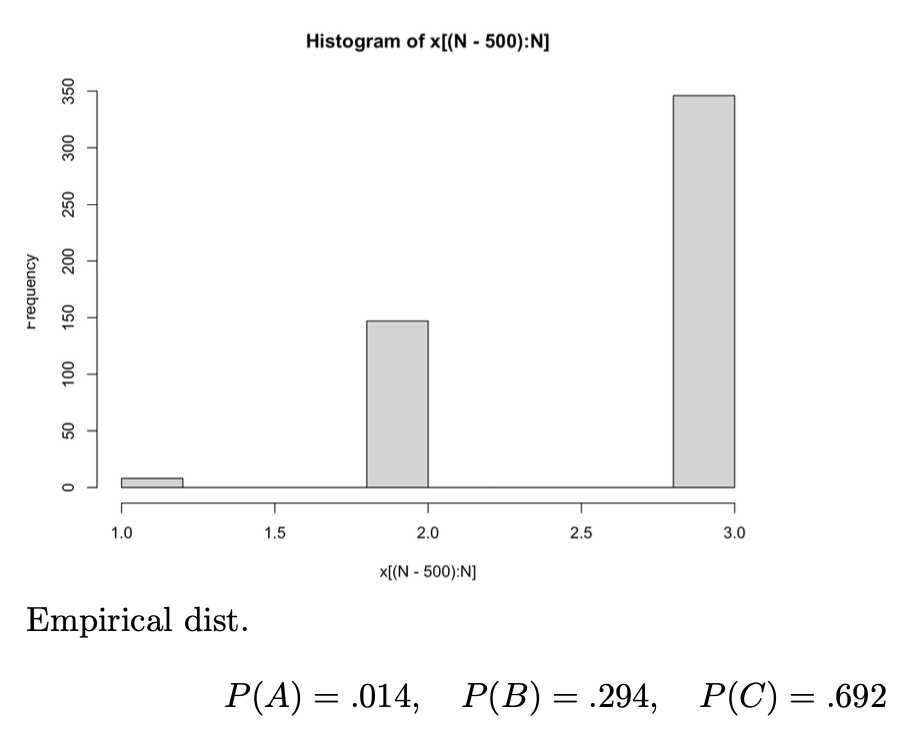

# Markov Chain Sampling

## Motivation

Sampling is an important part of statistics - it’s used in simulation (to verify algorithms), stochastic integration, etc.

It’s quite common that we want to generate some random variables that follow a specific distribution. For example, we may wish to generate a uniform random variable or generate Bernoulli random variables or even generate a path of a stochastic process.

Sampling from popular distributions (e.g. normal, binomial, uniform, etc.) is easy - we can simply use the built-in functions for these.

But what if the distribution that we want to generate is not popular? e.g. generate a sample path of the simple random walk given $X_5=3$.

In such cases, we can use other methods: rejection sampling, transformer, MCMC sampling, etc.

Here, we’re only going to focus on MCMC sampling. MCMC stands for “Markov Chain Monte Carlo”.

## MCMC

Consider a simple example: suppose we wish to sample from $Possion(5)$ distribution and further suppose that we do not have any built-in function to do so. The probability distribution function is:

$$
P(X=k) = \frac{e^{-5}5^k}{k!}, \quad k = 0,1,2,3, \cdots
$$

We will try to generate $X$ under such a distribution, using what we’ve learnt about Markov Chains → this is why it’s called _Markov Chain_ Monte Carlo sampling.

We can do this as such:

1. Define a MC by specifying the state space, time index, and $P$
2. If the MC is “good” (i.e., useful for our sampling purposes), then $X_n$ converges to the limiting distribution $\pi$.
3. Then, we can take any $X_n$ for a large $n$, which should follow $X_n \sim \pi$
4. If we can ensure that $\pi = Poission(5)$, then we’re done 🎉

Now, the question is this: how do we come up with a MC given a limiting distribution we wish to achieve (in this case, $Poission(5)$)?

- The state space should be the exactly same as the space of $X$ (the space of the distribution we wish to generate). In this case, $0,1,2,3, \cdots$
- The time span should be $1,2,3, \cdots$

The difficult part is the transition probability matrix $P$. We need this to be true (this is our goal):

$$
P(X=j) = \sum_{k=1}^N P_{kj}P(X=k)
$$

because under the limiting distribution, $\pi = \pi P$ must hold. We already know $P(X=j)$ and $P(X=k)$ because they are the goals we want to reach → but we still need to find the $N^2$ values of $P_{kj}$ for all $k,j$ (these are the unknowns).

Notice that we have $N^2$ unknowns, but only $N$ equations! This means it’s “too flexible” - there are too many possible ways to set the variables up 😟

We want a convenient way to set up the equations and solve for the unknowns, that can be generalized to any sampling distribution.

For this, we first need to digress to learn about global and local balanced equations.

## Global Balanced Equations

Recall the equations for the limiting distribution are given by $\pi = \pi P$.

Element-wise, this means that:

$$
\pi(j) = \sum_{k \in S} \pi(k)P_{kj}
$$

Note that $\pi(k) = P(X_n=k)$ and $P_{kj} = P(X_{n+1}=j|X_n=k)$ and so, the above equation can be interpreted as: the probability of being at state $j$ in the next step is given by taking the sum over all the states of the probability that the process will jump from any state $k$ to state $j$ in the next step. This is necessary for the “equilibrium” to be stable. i.e., the limiting distribution to be invariant/stationary.

Another way to look at it is this:

- The LHS gives the total probability of jumping out state $j$ since $\pi(j) = \sum_{k} \pi(j)P_{jk}$ and $\sum_k P_{jk}=1$ because it is a probability distribution. Note that the jump may return to $j$ but it still counts as a jump.
- The RHS gives us the total probability of entering state $j$ (as explained above).

So, we have that the total leaving probability from any state must be equal to the total entering probability of that state (from all states). This always needs to be true for a limiting distribution to exist.

These are called the _global balanced equations_. “Global” because they deal with _any_ states → every state depends on _every_ other state (in these equations).

:::info note
This is very similar to the “flow conservation” constraint in Max-Flow algorithms.

:::

## Local Balanced Equations

But what if we not only consider the total probability of entering/leaving one state, but we also consider which state it jumps to/from.

The probability of jumping from $i \to j$ is: $\pi(i)P_{ij}$

The probability of jumping from $j \to i$ is: $\pi(j)P_{ji}$

We _hope_ that:

$$
\pi(i)P_{ij} = \pi(j)P_{ji}
$$

Such a system of equations are called local balanced equations. “Local” because we’re considering the _pairwise_ transitions between states, instead of looking at the entering probability from all the states together.

Here, we want the leaving probability from $i \to j$ to be the same as that from leaving $j \to i$ so they both effectively “cancel” each other and the overall distribution remains intact.

Hence, we’re imposing a stricter constraint than the global balanced equations. We not only care that the total leaving probability is equal to the total entering probability (as we did for the global balanced equations), we also care where the process comes from and goes to - and we want to match these probabilities.

The global balanced equations constraint that the following sums must be equal:

$$
\sum_{k}\pi(j)P_{jk} = \sum_{k} \pi(k)P_{kj}
$$

But the local balanced equations require that _every corresponding term of the sum_ (on both sides) must be equal.

Clearly, if all the individual corresponding terms are equal, the sums on both sides must also be equal.

Local equations are also used to discussed the time-reversibility of stochastic processes.

## Local Equation vs. Global Equations

For a MC with $N$ states:

- We have $N$ global balanced equations and we have $\binom{N}{2}$ local balanced equations
- If there is a solution that satisfies local balanced equations, then it is also a solution of the global balanced equations
- For an ergodic MC, there _always_ exists a solution to the global balanced equations, but not necessarily to the local balanced equations (because the additional pairwise constraints are imposed by us, they are our assumptions)

---

Coming back to sampling, now we can set up $P$ such that we require $P$ to satisfy the local balanced equations as well, and now we have $\binom{n}{2}$ equations instead of $n$, which is much better.

As a summary until now, our aim has been to sample from a distribution $\pi$. So, we try to setup a MC such that the limiting distribution is exactly $\pi$.

- $S$, the state space of this MC, should be exactly $supp(\pi)$, called the “support” of $\pi$, which refers to all the possible values of the distribution we wish to sample from
- $T = 0,1, 2, \cdots$ is the index set
- $P$ should be set up in order to satisfy the local balanced equations

## Transition Probability Matrix Set Up

Let’s now look into _how_ to set up the transition probability matrix.

### Approach 1

We can start with a $P_{ij}= c$ to set up all the $P_{ij}$, and then standardize each row to be with sum $1$.

This might be difficult because we will have a lot of equations to solve simultaneously. Moreover, if we have $\infty$ states, this is not feasible. Or if we have a continuous set $S$, i.e., $S$ is not discrete at all (so we can’t even talk about “state” in this context).

### Approach 2

Begin with a general transition probability $Q$ on the state space, and then “adjust” $Q$ to $P$. How do we “adjust” it?

First, we introduce the thinning algorithm: consider a simple example where $X \sim Bernoulli(1/2)$ and $Y = 
\begin{cases}
0, \quad \text{if }X = 0 \\
Bernoulli(1/2) \quad \text{if }X =1
\end{cases}$. Then, clearly $P(Y=0) =3/4$ and $P(Y=1) =1/4$. We notice that compared to $X$, $Y$ has a larger probability of being zero. We call this the thinning on the distribution of $Y$.

Another example: suppose $X \sim P$ where $P$ is some arbitrary distribution where $P_i = P(X=i),i \geq 0$. We further define $Y = X \cdot Bernoulil(1/i), i > 0$. Then, what is the distribution of $Y?$

When $i > 0$, then: $P(Y=i) = P(X=i) \times (1/i) = \dfrac {P_i} i$

And when $i=0$,

$$
P(Y=0) = P_0 + \sum_{i>0} P_i(1-\frac 1 i)
$$

Clearly, $P(Y=i) < P(X=i)$ for all $i > 1$. Again, we see the “thinning” effect.

Notice that these thinning algorithms do not have any restriction on the range of $X$ → even if $i$ is negative, we can always just take the absolute value of $i$ in the parameter of $Bernoulli(1/|i|)$.

We use this “thinning algorithm” idea to adjust $Q$ towards $P$.

Given $X_n$, sample a new random variable $t \sim Q_{X_n}$ (the distribution of $t$ is given by the $X_n$th row of $Q$). Note that $t$ is not $X_{n+1}$ (i.e., it is not guaranteed that we will make the jump to $t$ → we will “thin” this probability of jumping to ensure we satisfy the local balanced equations).

Currently, the local balanced equations are:

$$
\pi_i Q_{ij} = \pi_j Q_{ji}
$$

which usually does not hold because we’ve chosen $Q$ arbitrarily.

We want to add a new term $0 < \alpha(i, j) \leq 1$ so that:

$$
\pi_i Q_{ij}\alpha(i, j)  = \pi_j Q_{ji}\alpha(j, i)
$$

Then, $P_{ij} = Q_{ij} \alpha(i, j)$

This is easier to solve because $\alpha(i, j)$s don’t have to sum to one. They can be _any_ arbitrarily chosen numbers as long as they’re between 0 (exclusive) and 1 (inclusive)!

Now, see that $\pi_i Q_{ij}$ is the probability of jumping from $i \to j$, and $\pi_j Q_{ji}$ is the probability of jumping from $j \to i$. We want these two flows between the state to be equal.

We can easily get the 2 flows to be equal by choosing an appropriate value of $\alpha(i,j)$.

We can first find the minimum of the two flows, i.e,. $\min(\pi_i Q_{ij}, \pi_j Q_{ji})$. We want to reduce the bigger one to be equal to the smaller one by multiplying the bigger one by some number (less than 1) and multiplying the other term by 1 (keep it constant).

Mathematically, we can write this as such: we desire $\pi_i Q_{ij} = \pi_j Q_{ji} = \min(\pi_i Q_{ij}, \pi_j Q_{ji})$. So, we set:

$$
\alpha(i,j) =
\begin{cases}
1, \quad \text{if  } \pi_i Q_{ij} \leq \pi_j Q_{ji} \\
\frac {\pi_j Q_{ji}} {\pi_i Q_{ij}}, \quad \text{otherwise}
\end{cases}
$$

By setting up $\alpha(i,j)$ in such a manner, we can ensure the equality of incoming/outgoing flow for any pair of states.

We can summarize approach 2 in this way (and we call this **Hastings-Metropolis Algorithm**):

1. Set up $Q$ so that the MC with transition probability matrix $Q$ is irreducible, i.e., there is $n$ so that $Q_{ij}^{(n)} > 0$ for any $i,j \in S$)
2. Define $\alpha(i, j)$ as

   $$
   \alpha(i, j) = \min \left ( \frac {\pi_j Q_{ji}}{\pi_i Q_{ij}}, 1 \right )
   $$

   (You can see that this is equivalent to our above equation)

3. With $Q$ and $\alpha$, we generate $P$ as

   $$
   \begin{align*}
   P_{ij} &= Q_{ij} \alpha(i,j), \quad i \neq j \\
   P_{ii} &= Q_{ii} + \sum_{k \neq i}Q_{ik}(1 - \alpha(i,k))
   \end{align*}
   $$

   In other words, we redirect all the remaining flow (so that the sum remains one) to the same state. Observe that there is a thinning effect here: we’re reducing the flow out from every state to other states, and increasing the flow from the state to itself (to make up for the reduction to other states). Basically, we’re exploiting the fact that we can have any probability $P_{ii}$ and the local balanced equation for $i \to i$ will trivially hold - so we focus on the rest of the states first, and then we assign $P_{ii} = 1 - \sum_{j \neq i} Q_{ij}\alpha(i,j)$

   Here, flow is equivalent to the probability.

### Remarks

- $Q$ is set up so that the MC is irreducible and simple to sample (basically we should be able to use built-in functions to sample $Q$ otherwise you might end up needing to do MCMC sampling for $Q$ as well - recursively! 😲).
  - Approach 1: $Q$ is set so that all the rows are the same (so the sampling distribution is the same for all the current states, $X_n$)
  - Approach 2: $Q$ is set so that only the neighbors of the current state have a non-zero probability. This is common when we have $\infty$ states (or even, too many states). Here, we define neighbours however we want - depending on the “closeness” of the states in $S$. Notice that we don’t have the MC - we’re creating the MC, so we can also decide which states to consider as neighbours or not. Example: if $S = \{0,1,2, \cdots \}$ then one way to define neighbors of $i$ is $i-1$ and $i+1$ (for all $i > 0$). We could’ve also chosen $\{i-2,i-1,i+1,i+2\}$ - it’s really up to us, and depends on the problem.
    This approach is common because we only deal with a small group of states at every step. The downside of this is that from one state, we can only jump to the nearby states - it’ll take many more steps to converge to the limiting distribution (because the “step size” is small).
- The coefficient $\alpha(i, j)$ can be viewed as the “thinning” of the jumping probability from $i \to j$. We don’t want $\alpha(i,j)$ to be too small, otherwise it’ll take very long to converge to the limiting distribution - so, we want to encourage jumps. This is why for every pair of vertices, at least one of $\alpha(i,j) = 1$ or $\alpha(j,i)= 1$ is true. It is definitely possible to scale the $\alpha$’s even smaller (so the flow between $i$ and $j$ is even lower than $\min(\pi_i Q_{ij}, \pi_j Q_{ji})$) but that means we’re more likely to stay at $i$ (and $j$) instead of jumping (recall that the total flow, since it is the probability, needs to be $1$ and we just dump the “remaining” outgoing flow to the state itself). So, we want to maximize $\alpha(i,j)$ while ensuring the local balanced equations hold.
- We don’t actually have to generate $P$ beforehand → we can do this “on the fly” by using $Q$ directly (we’ll talk more about this soon).

This entire sampling and thinning strategy is called the Hastings-Metropolis Algorithm.

### Example

Let’s come back to our example. We want to sample from $X \sim Poisson(5)$. We know that $P(X=k) = \frac {e^{-5}5^k} {k!}$

- $S= \{0,1,2, \cdots \}$
- $T = \{0, 1,2, \cdots \}$
- Define $Q$
  - Given $X_n$, we sample $t \sim Binomial(\max\{2X_n,2 \}, 1/2)$ → notice that this means we can only travel upto $2X_n$ from any current state $X_n$. Also, we have to use $\max \{2X_n, 2\}$so that zero does not become an absorbing state. Note that this is just one of the ways we can setup $Q$. We have chosen it such that the process can only go to its neighbouring states. (e.g. from $X_n=3$ we can only go to a state in the interval $[0,6]$, where the states are all non-negative integers). Clearly, the sum of all outgoing edges is 1 because the binomial distribution is also a valid probability distribution.
  - Hence, let $N_i = \max \{2i, 2\}$ be the number of “neighbors” of state $i$, the matrix $Q$ follows:
    $$
    Q_{ij} = P(X_{n+1}=j|X_n=j)=P(Binom(N_i,1/2)=j) = \binom{N_i}{j}\frac 1 {2^{N_i}}
    $$
  - Notice that we don’t have to explicitly write out $Q$ (and in this case, $Q$ is infinite so we definitely cannot, but that’s not an issue for the algorithm). We can just define every row of $Q$ to be a distribution that we choose, that defines how we will jump from the current state to every other state. We only need to ensure that the values in the same row sum to 1.
- Define $\alpha$
  $$
  \alpha(i, j) = \min \left \{ \frac {P(X=j)Q_{ji}}{P(X=i)Q_{ij}}, 1\right \} = \min \left \{ \frac {5^{j-i}\cdot i!}{j!} \frac {\binom {N_j}{i}}{\binom{N_i}{j}}, 1\right \}
  $$
  Note that if $j > 2i$, then $Q_{ij}=0$ so we need to make sure that $\alpha(j,i) =0$ even though $Q_{ji} \neq 0$ → if the flow in one direction is zero, we need to force the flow in the other direction to also be zero.
  Observe that even though we have $\infty$ states in this MC, it is not a problem! We only generate the values that we need, based on the current state. See that there would be $|S|^2$ values of $\alpha(i,j)$, which is also infinite, but we only compute a finite set of them, every time we need it. This is very useful! (And this is only because we set up $Q$ cleverly to only depend on the neighbouring state).

Then, we simulate the MC for $N$ (where $N$ is very large, say 1000) times, and take $X(1000)$ as the sample. How exactly do we simulate it? To simulate it, do we need to set up $P$? What if $P$ is infinitely large?

We don’t need to explicitly generate $P$ at all! We can sample from $Q$ only (in fact, we only use one row of $Q$ at any step), then we use rejection sampling to decide whether to jump or not. We compare $U \sim Unif(0,1)$ with $\alpha(i,j)$.

1. We start from any state $X_0$ (we don’t care because we’re only interested in the limiting distribution)
2. Repeat 1000 times:
   1. Given the current state $X_n$, generate $t \sim Binom(\max\{2X_n, 2 \}, 2)$. (Again note that $t$ is not $X_{n+1}$ - we have not yet made the jump yet)
   2. Based on the realization of $t$ (now a fixed constant for this iteration), obtain the value of $\alpha(X_n, t)$.
   3. Now, we will accept this jump from $X_n \to t$ with probability $\alpha(X_n, t)$. So, we generate a uniform random variable $U$ in the range $[0,1]$, and accept the jump if $u < \alpha(X_n, t)$. If not, we reject the jump _and we stay at $X_n$_.

Here’s a rough pseudocode:

```r
TOTAL_STEPS = 5000 # large enough to ensure convergence
process = [] # track the path of the process
x = 1 # initial state
for step in 1...TOTAL_STEPS
		obtain t from T ~ Binom(max(2 * x, 2), 1/2)
		calculate alpha(X_n, t)
		generate u from U ~ uniform(0, 1)
		if (u < alpha) {
				x = t # accept jump from X_n to y, i.e. X_{n+1} = t
		} else {
				x = x # no jump, thinning
		}
		process.add(x)

# now we have X_n for all 1 < n < 5000
# cut of the first 1000 steps
process = process[1001:]

# process now contains a sample from poisson distribution!
# done!
```

:::danger important
We cannot take the early stages of the simulation as part of the sample because they do not follow a poisson distribution. Recall that only the _limiting_ distribution follows a poisson distribution. So, we need to wait until the MC reaches convergence (approximately at least) and then we can start sampling from the MC based on the value of $X_n$ and this will follow a poisson distribution. This is why we “cut off” the first portion of the process’ steps - so they don’t contaminate our poisson distribution.

:::

Note that if we want an independent sample (i.e., we want $X_1, X_2, \cdots X_M$ to be independent poisson random variables), we cannot simply run the MC one time for $M+1000$ iterations and then start taking the values from $X_{1001}$. This is because $X_{1001}, X_{1002}, \cdots$ are not independent! (since $X_{n+1}$ is generated based on $X_n$) More formally, given $X_n$, the distribution of $X_{n+1}$ does not follow $Poisson(5)$ - in fact, it follows (modified) $Binom$.

If we want a truly independent sample, we can run the MC $M$ times (where $M$ is our desired sample size) and then take $X_{1001}$ from each of the $M$ runs.

Alternatively, to make it less computationally expensive, we can leave some gaps in between. So, we sample from $X_{1001}, X_{1101}, X_{1201}, \cdots$ and we assume that the distribution after 100 steps becomes “independent” enough.

:::info note
If we’re just interested in the mean of the distribution, we don’t need to ensure independence of the RVs in the sample. No matter whether the sample observations are independent or not, the mean is the same. But if we want to find the variance, we need to ensure independence among the observations in our sample.

:::

Another good property of this MCMC sampling is that we don’t have to know the exact values of $\pi_i$ and $\pi_j$ to calculate $\alpha(i,j)$. We only need the ratio of the two!

Recall that in Bayesian analysis, if $\pi(\theta)$ is the prior distribution, then the posterior distribution is:

$$
\pi(\theta|X) = \frac{f(x|\theta)\pi(\theta)}{\int_\theta f(x|\theta)\pi(\theta)d\theta} = c f(x|\theta)\pi(\theta)
$$

where $c$ is a constant that only depends on the realization of $x$. In particular, the denominator does NOT depend on $\theta$. So, to sample from $\pi(\theta|X)$, we do not need the denominator. The denominator is just a normalising factor to ensure that the sum of the conditional probabilities (for a given $x$) is $1$. When we’re sampling, we’re not interested in the actual probabilities but their relative proportion (aka ratio).

Similarly, for $\alpha$, we have:

$$
\alpha(i,j) = \min \left \{ \frac{\pi_j}{\pi_i} \cdot \frac {Q_{ji}}{Q_{ij}}, 1 \right \}
$$

To find $\alpha$, we need $\pi_j/\pi_i$ but not the exact $\pi_i$ for $i \in S$.

Say that we have a vector $\vec{b}$ on $S$ (here, vector is just an ordered collection of numbers - or you can think of it as a vector in a $S$-dimensional space, and we’re only interested in the direction it points to, not really the exact lengths, since the direction tells us the relative ratios already) and a constant $c$ such that $\pi = c \vec{b}$ gives our desired distribution that we wish to sample from. Then,

$$
\alpha(i, j) = \min \left ( \frac{cb_jQ_{ji}}{cb_i Q_{ij}}, 1 \right ) = \min \left ( \frac{b_jQ_{ji}}{b_i Q_{ij}}, 1 \right )
$$

In our example where $\pi \sim Poisson(5)$, we observe that the constant $e^{-5}$ is present in all the $\pi_i$’s. So, we can ignore it (since it cancels out anyway).

$\vec{b}$ is called a **kernel function**, and $c$ is a **normalising constant**. The purpose of the kernel function is to tell us the relative ratios of the probabilities of values of the distribution, and the normalizing constant ensures that the sum of all the values is $1$ (making it a valid probability distribution).

Obviously, $c = \frac 1 {\sum_i b_i}$ because we want $\sum_i cb_i = 1$.

In summary, to sample from MCMC, we do not need $\pi$, we only need $\vec{b}$.

### Summary of Hastings-Metropolis Algorithm

Goal: sample a random variable $X \sim \pi$ where $\pi = c \vec{b}$ and $supp( \vec{b}) = S$.

1. Set up $Q$ on $S$ where $Q$ is irreducible (and every row of $Q$ should be easy to sample from - we should not have to compute every row of $Q$ manually beforehand - so we should use common distributions as rows of $Q$).
2. Define $\alpha(i, j) = \min(\frac {b_j Q_{ji}}{b_i Q_{ij}}, 1)$
3. Set up $P$ such that $P_{ij} = Q_{ij}\alpha(i, j)$ and $P_{ii} = Q_{ii} + \sum_{j \neq i}Q_{ij}(1-\alpha(i,j))$
   1. Since $P$ can be large (even infinite), we do this “on the fly” → sample from $Q$ directly and then use rejection sampling to decide whether to jump or not (by comparing $\alpha(i,j)$ against $U \sim Unif(0,1)$). The two are identical in their probabilistic structure.
4. Simulate this MC for a long time, until convergence
5. Truncate some beginning steps to make sure we only sample from the limiting distribution

### Additional Remarks

For Hastings-Metropolis algorithm, there are many choices of $Q$. In general, we want to choose $Q$ so that it is easy to generate (using built-in functions), and the probability of jumping, $Q_{ij}$ and $\alpha(i, j)$ is large so that the convergence is faster.

When $Q_{ij}$ and $Q_{ji}$ are very small, it might be difficult to calculate $\alpha$ directly. Then, we can find $\log Q_{ij} - \log Q_{ji}$ first and then turn it into the fraction.

If $|S|$ is small, we can precompute $P$ itself, instead of relying on $Q$ and performing rejection sampling in every iteration. This way, we only compute $\alpha(i,j)$ once for each entry - for a total of $\approx |S|^2$ computations, which can be smaller than the total number of iterations we run the MC for.

Hastings-Metropolis algorithm is not the only way to set up $P$, we can use other algorithms too.

## MCMC in Bayesian Statistics

Suppose we have many bulbs from an unknown factory (all bulbs come from the same factory). There are 3 possible factories. Factory A, B, C produce bulbs with lifetimes $Poisson(3)$, $Poisson(5)$, $Poisson(7)$ respectively.

Originally, we assume that each factory is equally likely.

We examine 10 bulbs, and find the lifetime to be:

$$
data= 5,6,6,7,13,7,9,9,3,6
$$

With the observed data, can we improve our guess about which factory produces the bulbs?

We can use bayes’ theorem to write down the probability for each factory $X$ as:

$$
P(X|data) = \frac{P(X)P(data|X)}{P(data)}
$$

This gives us the posterior distribution (and is a more “accurate” guess since it incorporates more information about the data).

Right now, calculating $P(data)$ is not hard because we only have 3 factories. But what if we had infinitely many factories?

Actually, we don’t even need to calculate $P(data)$. We only need an approximation of the probability. If we can generate enough samples, then the empirical distribution will give us that approximation.

So, we use MCMC to sample the distribution.

Here:

- State Space = $\{A, B, C \}$
- Set every row of $Q$ to be a uniform distribution on $\{A, B, C\}$. This is how we will sample $Y|X_n$.
- Calculate the acceptance rate to be:
  $$
  \alpha(i, j) = \min(\frac{\pi_jQ_{ji}}{\pi_iQ_{ij}}, 1)
  $$
  Observe that we only need $\pi_j/\pi_i$. So, if $i=A, j=B$, then:
  $$
  \frac{\pi_j}{\pi_i} = \frac{\pi_B}{\pi_A} = \frac{P(data|B) * 1/3}{P(data|A) * 1/3}
  $$
  Moreover, we can calculate this _on the fly_ → as and when needed, instead of calculating it for every pair of $i,j$ in advance.
  Observe we no longer need $P(data)$
- Then, we simulate the MC for a large enough number of iterations, and obtain an empirical sample → since the limiting distribution is the proportion of time the process stays at a given state, in this example, it is equivalent to the probability of each factory given the data.



## Example: Complicated Distribution

Consider a sampling question. We have a vector $(1,2,3, \cdots, n)$. We want to sample a permutation of it $(x_1, x_2, \cdots, x_n)$ and that permutation must satisfy:

$$
\sum_{i=1}^n i*x_i > a
$$

for a given constant $a$.

For this distribution, we want to know $E[x_n]$.

### Approach 1: if $n!$ is small

1. Generate all $n!$ permutations (infeasible if $n$ is large, which is why we will use MCMC)
2. Filter out the permutations that do not satisfy the condition.
3. For each permutation that satisfies the condition, take the term $x_n$.
4. Find the average of $x_n$ of all these permutations to give you $E[x_n]$.

### Approach 2: if $n!$ is large

We know how to draw random permutations. We can keep the draws that satisfy the conditions only. However, if $a$ is large, we may spend a long time to find an accepted sample. So, using rejection sampling is also not feasible here 😔

We want to use MC to imrpove the efficiency.

Here’s the problem (stated formally):

- The outcome space $S$ is the set of all possible permutations that satisfy $\sum_{i=1}^n i*x_i > a$
- Let $N = |S|$ → clearly, $N$ can be very large and is unknown to us beforehand.
- Probability mass function: $\pi_i = I \{ i \in S \}/N$ where $i$ is just a permutation.
  - Observe that here, $I\{i \in S\}$ is the kernel function $\vec{b}$ and $N$ is the normalizing constant.
  - We don’t know $N$ (it would take us $O(n!)$ to find $N$) → but we actually don’t _need_ to know $N$ since we’re only interested in the ratio (this is the benefit of MCMC!)
- Goal: to find $E[x_n]$

We can set up MCMC by the Hastings-Metropolis algorithm:

- State space $S =$ all possible permutations such that $\sum_{i=1}^n i*x_i > a$
- The time index is $0,1,2,3, \cdots$
- The initial state is $X_0 = (1, 2, 3, \cdots, n)$ and so, it must be in $S$ (this is clearly the maximizer of $\sum_{i=1}^ni*x_i$ and so, if this doesn’t satisfy the constraint, no other permutation can)
- Define $Q$:
  - (Naive) Approach 1: What if we just set $Q$ to be the uniform distribution over all permutations? We may have to reject _many_ samples before we find one that belongs to $S$ (i.e., satisfies the constraints).
  - (Better) Approach 2: Consider the neighbors of $(x_1, x_2, \cdots, x_n)$ where the permutation is caused by an exchange of any two of the positions. Clearly, with this definition of $Q$, the chain is irreducible (we can reach every other permutation through a series of exchanges) and aperioidc (we can reach the original state in 2 steps, as well as 3 steps → period must be 1) with finite states ($n!$ is finite, so any number less than it is also finite). With this definition of $Q$, it is easier to calculate the one-step transition probability, and the probability of staying in $S$ is larger than the uniform distribution (since we’re not _completely_ randomizing the permutation).
- Define $\alpha(i, j)$
  - Let $N(i)$ be the number of neighbors of state $i = (x_1^i, x_2^i, \cdots, x_n^i)$
  - $\alpha(i, j)= \min \left (\frac {b_jQ_{ji}} {b_i Q_{ij}}, 1 \right ) = \min \left (\frac{N(i)}{N(j)}, 1 \right)$ (since $b_j = b_i = 1$ as both $i$ and $j$ are valid permutations in $S$, so the indicator functions are $1$; also, $Q_{ji} =1/N(j)$ and $Q_{ij}=1/N(i)$)

Then, we can execute the following (pseudo-)code:

1. Set up the number of steps to run, say $M$. Let $G=rep(0,M)$ be a zero-vector of length $M$. This will store the _path_ of $x_n$ throughout our MCMC sampling process.
2. Initialize $m=0, X=(1, 2, 3, \cdots, n)$
3. While $m < M$
   1. Calculate $N(X)$, the number of (valid!) neighbors of $X$. (this takes $O(n^2)$ because we can swap any pair of indices, and calculate the new sum _smartly_ (just subtract the original terms, and add the new ones) instead of recomputing the entire sum from scratch)
   2. Randomly select 2 (valid!) values of $X$. Interchange them to get $Y$.
   3. Calculate $N(Y)$, the number of neighbors of $Y$.
   4. Generate $U \sim Unif(0,1)$ and obtain a realization $u$ of $U$.
   5. If $u < \min(N(X)/N(Y),1)$, set $X:=Y$
   6. Set $G[m] = X$
   7. Increment $m$ by $1$
4. Truncate the first (say,) $1000$ samples of $G$ (since the initial state distribution is not yet _limiting_, it won’t be accurate if we include it). Then, our estimatior of $E[x_n]$ is:

   $$
   E[x_n] \approx \frac 1 {M-1000} \sum_{i=1001}^M G[i]
   $$

## MCMC on Continuous Distribution

So far, we’ve discused the MCMC sampling on discrete random variables. But what if we want to sample from a continuous distribution? Specifically, we are considering discrete-time, continuous-state stochastic processes.

Can we still use MCMC sampling?

It turns out yes! Such processes with markovian property are also markov chains. Hence, the limiting distribution, global balanced equations, and local balanced equations still work.

Hence, we can generalize MCMC smapling on the continuous distribution as well.

For such a MC

- The time index $T$does not change
- The state space $S$ is a continuous set
- The Markovian property can be represented by the _conditional density_ (not probability, since the probabiity of any particular state is zero):
  $$
  f(X_{n+1}=j|X_n=i,X_{n-1}=k, \cdots, X_0=l) = f(X_{n+1}=j|X_n=i)
  $$
  So, the one-step transition porbability is the conditional density $f_{ij}$. Here $i$ and $j$ are taken from a continuous set.
- Recall that for discrete MCs, we have $\sum_{j \in S} P(i,j) =1$. Analogously, for the continuous case, we have: $\int_{y \in S} f(x,y)dy =1$.
- If $X_0 \sim f_0(x)$ for all $x \in S$, we can find the conditional density for the next state being $y$ to be, $f_1(y) = \int_{x \in S}f(x,y)f_0(x)dx$ (very similar to the discrete case)
- Let $g$ be the limiting distribution of such a MC (if it exists). We want $X_n \sim g \implies X_{n+1} \sim g$ (the limiting distribution is stationary - does not change after a transition). Then, $g(y) = \int_{x \in S} f(x,y)g(x)dx$ for every state $y \in S$ (given the distribution currently follows $g$, we want it to be stationary, i.e., even the distribution in the next step should be $g$). This is the continuous counterpart to our (familiar) $\pi = \pi P$ equation.
- Local Balanced Equations: $g(x)f(x,y) = g(y)f(y,x)$ where $g$ is the limiting distribution and $f(x,y) = f(X_{n+1}=y|X_n=x)$ is the conditional density. This is the continuous conuterpart of $\pi_i P_{ij} = \pi_j P_{ji}$. So, the $Q$ that we generate is also a continuous bivariate function $Q(x,y)$ which gives us the transition probabilities.
  Note that now, we cannot think of $Q$ as a matrix - we have an uncountably infinite number of rows and columns! 😲 What would the $i$th row $j$th cell even mean?? That’s why matrices are for discrete (aka countable) stuff only.
- Using the local balanced equations, we can define $\alpha(x, y)$ such that $g(x)Q(x,y)\alpha(x,y) = g(y)Q(y,x)\alpha(y,x)$. So, we can set $\alpha(x,y) = \min \left ( \frac{g(y)Q(y,x)}{g(x)Q(x,y)}, 1 \right )$.

Then, we can set up the Hastings-Metropolis Algorithm analogously.

:::info note
The notation used below is different from that above! Below, $g$ is no longer the limiting distribution, but rather serves the role of $Q$. The (desired) limiting distribution below is $f$.

:::

Suppose we wanted to sample $X \sim f$ where $f=c_Nf_1$ (i.e., $c_N$ is the normalising constan t and $f_1$ is the kernel function). Then, we can:

1. Set up the number of steps $N$. Set $X$ to be a vector of length $N$ that will record the path.
2. Set up one-step density functions $g_x(y)=g(y|x)$ for the transitions.
3. Initialize $n=0$ and $X(0)=k \in S$ (any random $k$)
4. While $n < N$
   1. Generate $Y \sim g_{X(n)}$
   2. Generate $U \sim Unif(0,1)$
   3. If $U < \min \left ( \frac{f_1(Y)g_Y(X(n))}{f_1(X(n))g_{X(n)}(Y)}, 1 \right )$, let $X(n+1)=Y$. Else, $X(n+1)=X(n)$
   4. Set $n=n+1$
