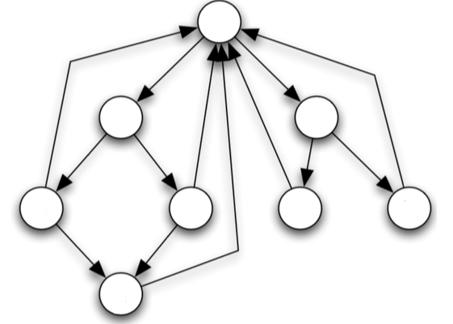

# PageRank Algorithm

Let’s continue using stochastic processes as a tool to model and solve real world problems.

One important application in today’s world is the search engine. When you want to search for information, you enter keywords in the search bar and hit enter. Then, how do the search engines like Google, Bing, etc. know what exactly you’re looking for?

What makes them “good” search engines is that they’re able to show you relevant information within the top few search results. If you search for “ice cream” but the first 5 results were about ice, you would probably stop using google 😲

This is also why “searching” is a superskill in today’s world → you need to be able to use the right keywords, i.e., you absolutely need to know how to find information related to what you’re looking for.

Of course, here, we discuss a (overly) simplified algorithm for ranking web pages but the main ideas still apply.

## Goal

To be able to rank the pages in a meaningful order, in anticipation of what a user really wants.

## Possible Methods

1. Page Content?

   Can we simply use the number of occurrences, i.e., frequency of the keyword in the website as a good meausure of how relevant/important that site is? Not really, it’s possible that other scam websites can “copy” the original website and so, they will have the same frequencies of keywords. But obviously, we want the original website to be on top (and google should be able to tell that the fake website is indeed not very relevant). Moreover, pages on wikipedia might have a lot more occurrences, but are not necessarily the best search results.

2. Number of clicks?

   Obviously, this can be “tricked” by writing scripts to “fake click” the website to confuse the algorithm.

3. Hyperlinks?

   Hmm, this is a much better idea. Consider the example of NUS. When you search “NUS”, you want the official NUS homepage to be the first result, not the wikipedia article about NUS. The key differentiating factor we can use is this: other webpages, like wikipedia, when using the term “NUS”, have a hyperlink to the NUS homepage (but the NUS homepage is not going to add a hyperlink to the wikipedia page LOL). This means that the wikipedia (and other webpages) are not the “finishing websites”, i.e., you can still follow the hyperlinks and see where they lead (in most cases, to the original intended webpage). And if we do this, we will indeed pick the NUS homepage as the top one.

   Of course, if I create 1M fake webpages and all of them hyperlink to a fake NUS website, then it will lead to problems _if we simply count the number of hyperlinks_. So, we have to be cleverer than that while deciding how to rank the pages.

## Random Walk on Webpages

Okay, so we now that hyperlinks give us very useful information about the usefulness of a webpage.

But how do we exploit the hyperlinks?

Suppose a random student - Bob - is browsing a network of webpages. First, Bob chooses a page at random. Then, Bob randomly picks a link and follows it to the next page with equal probability. And then, he repeats this procedure for $N$ steps.

Then, if we take $X_n$ to be the webpage that Bob is at, at the $n$th step, then $\{X_n\}$ is a stochastic process.

Mapping this to the terminology we’ve used so far for stochastic processes:

- Every webpage is a state, a node in the graph.
- Every hyperlink denotes a possible transition, an edge in the graph

More formally,

1. The state space $S$ is the set of all webpages
2. The index set $T = \{0,1,2,\cdots\}$
3. The transition probability matrix (for our simple case) is given by:

   $$
   P_{ij} =
   \begin{cases}
   \frac 1 {\text{\# of connected webpages}}, \quad \text{if there is an arrow from i to j} \\
   0, \quad \text{otherwise}
   \end{cases}
   $$

Clearly, it is a stationary markov chain.

It is possible that the markov chain induced has some absorbing states, since some web pages may not have hyperlinks to other web pages. It may also contain multiple classes - some pages with low visibility may not communicate with other web pages. We’ll deal with them later.

However, in any case, in the long run, since more hyperlinks _eventually lead to_ the official/important webpages, there is a larger probability to visit them. Pages with low visibility happen to be transient classes. Under such reasonable assumptions, the limiting probability can give us a ranking of importance.

Suppose the initial distribution is uniform on all pages, i.e., $X_0 \sim \pi_0$ such that:

$$
\pi_0 = \frac 1 {|S|} (1, 1, \cdots, 1)
$$

After $N$ steps, the distribution on the nodes is given by:

$$
\pi_N = \pi_0P^N
$$

Further, if the MC is irreducible, and positive recurrent, then we know that there is a limiting distribution when $N \to \infty$, where:

$$
\pi = \lim_{N \to \infty} \pi_0P^N
$$

Then, we can order the webpages so that:

$$
\pi_{(1)} \geq \pi_{(2)} \geq \cdots \geq \pi_{(|S|)}
$$

But the above approach only works for irreducible MCs.

What if the MC is reducible? We have to deal with the absorbing states and multiple classes.

In such a case, the network of webpages may contain many “clusters” of webpages. So, if you create a lot of fake websites that all link to each other, it will just form one cluster - it will be disconnected from the real, original network of webpages. And we assume that the number of webpages in the real network is far greater than in your small fake network of webpages (so the limiting probability in your fake webpage is still quite small compared to the real one). And note that $X_0$ is not a fixed webpage, but rather a uniform distribution (in our simple example) on all pages. So, if the official/important webpages are the ones with the largest probabiity in their own class, then our above approach still works.

The trickier case is the “absorbing pages”. In such a network, the limiting distribution is non-zero _only_ on the absorbing pages, and we cannot order any other webpages (since their limiting probability is zero). This is terrible, because the absorbing page may not be official page we’re looking for.

How can we handle such cases?

Add some perturbation to the system at every step!

For each step, set:

$$
\pi_{n+1} = (1- \lambda)\pi_n P + \lambda \pi_0
$$

where $0 < \lambda < 1$.

The parameter $\lambda$ can be used to control the degree of perturbation (”volatility”) at each step. Clearly, the higher the $\lambda$, the more we’re disturbing the MC from it’s “natural course” (by pulling it back towards the initial distribution) and so, more the perturbation. If $\lambda = 1$, we are essentially forcing the MC to never deviate from the initial distribution by holding it back completely. If $\lambda = 0$, we are introducing no perturbation at all.

We can also dynamically adjust $\lambda$ at every step → if we start of with a very high $\lambda$ and then slowly decrease $\lambda$, we’re essentially performing a kind of “simulated annealing” on the MC’s limiting distribution 😲

Similar to the previous case, we can run the MC with perturbation for $n$ steps and then, order the webpages so that:

$$
(\pi_N)_{(1)} \geq (\pi_N)_{(2)} \geq \cdots \geq (\pi_N)_{(|S|)}
$$

Apart from introducing a perturbation at every step, we can reasonably adjust the transition probabilities for a better result (there’s no reason why we have to pick a hyperlink on a webpage _uniformly at random_ → we can use all kinds of domain heuristics such as: the higher the hyperlink on the page, the more likely to be relevant (OR) if a hyperlink is in bold, it’s more likely to be clicked)

Of course, we can use similar ideas to analyze other problems too, not just ranking webpages in a search result. For example, we can order people in a social network by “clout” 😮 so that we can design a better targetted ad post.
