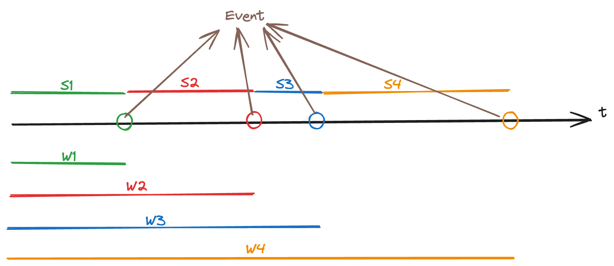

# Poisson Process

Until now, we have been considering only discrete-time markov chains. Here, we relax that assumption and talk about a continuous-time markov chain.

## Motivation

In the real world, we often have to count the frequency of occurences of an event in a given time interval. For example:

- Number of flight passengers arrived until time $t$
- Number of vehicles which passed a given location, until time $t$

We may also use this “counting” process to make decisions. For example, if we want to determine whether we need to build more ICU units in the hospital, we can ask the following questions:

- How many new patients will need ICU until every time point $t$?
- How long will every patient need an ICU for?

And using the above information, we can come to a conclusion.

In the above examples, the state space is $S= \{0,1,2, \cdots, \}$ (discrete).

Let $X(t)$ denote the quantity of interest until time $t$, then $t >0$ is continuous (time index).

We’re only going to look at a special case of the continuous-time, discrete-state process: the Poisson process.

## The Poisson Distribution

We begin with a fixed $t=t_0$. In the time interval $(0,t_0)$, we’re interested to know how many evens happen?

For such a problem, we know the poisson distribution if a good approximation. Why? We can explain it as follows:

- Because we can decompose $(0,t_0)$ into many many small disjoint intervals. Then, on each interval $(t_0*(i/n), t_0*(i+1)/n))$, the number of events follows $Bernoulli(p_n)$. Why? Because the intervals are so tiny that it’s _almost impossible_ for 2 events to happen in that time. It can either be 0/1, which is precisely what a $Bernoulli$ distribution can model. And we write “$p_n$” because it clearly depends on $n$ → if $n$ is large (so we have smaller intervals), then $p_n$ is (naturally) smaller and vice versa.
- We can sum together all the small intervals and then the number of events follows $Binomial(p_n)$ _(assuming that all intervals are independent, and $p_n$ is the same for every interval)_. When $n \to \infty$ and $p_n \to 0$ such that their product $np_n \to \lambda$, then $Poisson(\lambda)$ is a good approximation of $Binomial(n,p_n)$.

:::danger definition
By definition, a random variable $X$ is said to have a Poission distribution with parameter $\lambda >0$, denoted by $X \sim Poi(\lambda)$, if its probability mass function is defined by:

$$
p(x) = \frac{e^{-\lambda} \lambda^x}{x!},\ x=0,1,2, \cdots
$$

:::

We can show that the $X \sim Poi(np_n)$ is a good approximation of $Y \sim Binomial(n, p_n)$ as follows:

1. When $n \to \infty$, given $x$, using the definition of binomial distribution we have:

$$
P(Y=x) = \binom{n}{x} p_n^x(1-p_n)^{n-x} = \frac{n!}{(n-x)!x!}p_n^x(1-p_n)^{n-x}
$$

1. As $n \gg x$, both $n!$ and $(n-x)!$ are very large. We can use stirling’s approxiamation which says that for large values of $n$, we have: $n! \sim \sqrt{2\pi n} (n/e)^n$. The ratio $\sqrt{(n-x)}/\sqrt{n}$ is approximately $1$ for large enough $n$ (i.e., they cancel out). Hence,

   $$
   P(Y=x) \approx \frac{(\frac n e)^n}{x!(\frac{n-x}{e})^{n-x}}p_n^x(1-p_n)^{n-x}
   $$

2. Also, for large $n$, we can approximate $\frac{n^n}{(n-x)^{n-x}} \approx \frac{n^n}{n^{n-x}} = n^x$.
3. At the same time, we recall that the binomial expansion of $(1-x)^n$ is given by:

   $$
   (1-x)^n = 1-nx + \binom{n}{2}x^2 - \binom{n}{3}x^3 + \cdots
   $$

   In our equation, $p_n \to 0$ and so, all higher order terms of $p_n$ in the expansion will be even smaller (and we can ignore them).

4. Combining the above simplifications, and assuming that $np_n = \lambda$ _is a moderate constant_ we can write:

   $$
   P(Y=x) \approx e^{-\lambda}\frac{\lambda^x}{x!}
   $$

   which is the PMF for the poisson distribution.

## Some Remarks

1. For the poisson distribution, the mean is $\lambda$ and the variance is also $\lambda$ (wow!)
2. The probability generating function PGF for Poisson Distribution is $\phi_X(t)=\exp[\lambda(t-1)]$. We can use the PGF to prove the properties below as well.
3. If we have 2 independent poisson variables, $X \sim Poi(\lambda_1)$ and $Y \sim Poi(\lambda_2)$, then $(X+Y) \sim Poi(\lambda_1 + \lambda_2)$. Moreover this can be generalised to $n$ independent variables too.

   The above result can be understood quite intuitively. We can see view this from two perspectives:

   - Variables measuring _different_ events in the same time period → Let’s say we have two independent random Poisson variables for requests received at a web server in a day: $X$ = number of requests from humans/day, $X ∼ Poi(λ_1)$ and $Y$ = number of requests from
     bots/day, $Y ∼ Poi(λ_2)$. Since the convolution (aka sum) of Poisson random variables is also a Poisson we know that the total number of requests $(X + Y)$ is also a Poisson: $(X + Y) ∼ Poi(λ_1 + λ_2)$.
   - Variables measuring the same event in different time periods → If $X \sim Poi(\lambda)$ is the number of events in a time interval of length $t$, then $Y \sim Poi(nt)$ is the number of (the same) events in an interval of length $nt$.

4. If $X \sim Poi(\lambda)$ and $Z|X \sim Binomial(X, r)$ then $Z \sim Poi(\lambda r)$.

   Intuition: $X$ counts the frequency of events in the interval. $r$ adds another “thinning” factor to determine whether we should _really_ count it or not. It’s a two-stage process. Think of it as taking only $r$ fraction of the actual events $\iff$ for every event that occurs, it has probability $r$ of being counted by $Z$.

   Example: say we want to count the number of buses passing a given location, $\lambda$ is the average number of vehicles per hour, and $r$ is the probability of a vehicle being a bus, then we can count the total number of buses per hour by using $Z$ (as defined above using the two-stage process). Clearly, it is equivalent to defining a new variable $Y \sim Poi(\lambda r)$ where $\lambda r$ is the average number of buses crossing the location per hour.

   Read a [great explanation here](https://stats.stackexchange.com/questions/288807/distribution-of-successes-of-poisson-process-followed-by-a-binomial-distribution) 🎉

**Proof of (4) using PGF**

We will show that the $Z$ must be $Poi(\lambda p)$ by showing that its PGF is of that form.

1. The PGF for $Z$ is (by definition of PGF, _not using the fact that $Z$ is poisson_ since that is what we’re trying to prove):

   $$
   \phi_Z(t) = E[E[t^Z|X]]
   $$

   Also, recall that the PGF for binomial distribution $X \sim Bin(n,p)$ is $\phi_X(t)=(1-p+pt)^n$.

2. Given $X$, $Z$ is a binomial variable so we can write:

   $$
   \phi_Z(t) = E[(1-p+pt)^X]
   $$

   where the expectation is over $X$.

3. Moreover, $\phi_X(t)=E[t^X]$. So, the RHS of the above equation is just $\phi_X(1-p+pt)$.
4. Then,

   $$
   \phi_Z(t) = \phi_X(1-p+pt)
   $$

5. Now, we know that $X \sim Poi(\lambda)$ and so, $\phi_X(t) = \exp[\lambda(t-1)]$. Using this in the above equation, we get:

   $$
   \phi_Z(t)=\exp[\lambda(1-p+pt-1)] = \exp[\lambda p(t-1)]
   $$

6. It is clear that $\exp[\lambda p(t-1)]$ is the PGF of a $Poi(\lambda p)$ variable. Hence, $Z$ is a $Poi(\lambda p)$ variable. _QED_

## The Poisson Process

There are 3 ways we can choose to define the poisson process, and we discuss all of them (for the sake of understanding it better).

### Def 1: Defining from the Poisson Distribution

The poisson distribution gives us the number of events in a _fixed_ time interval $(0,t_0)$.

Now, we want to be able to find the number of events for _any_ time point $t_0>0$.

We hope that our process satisfies the following:

- At each time point, $X(t) =$ #events in $(0,t)$ follows a poisson distribution.
- On disjoint time points, the number of events is are independent (so that their sum is still poisson).
- On different time intervals, the parameters are somewhat related (so that they’re describing a “process”, and not just a collection of random variables)

This is precisely the definition of the poisson process.

:::danger definition
💡 A poisson process with rate, or intensity, $\lambda >0$ is an integer-valued stochastic process $\{X(t): t \geq 0 \}$ for which

1. For any time points $t_0=0<t_1<t_2<\cdots<t_n$, the process increments

   $$
   X(t_1)-X(t_0), X(t_2)-X(t_1), \cdots, X(t_n)-X(t_{n-1})
   $$

   are independent random variables.

2. For $s \geq 0$ and $t > 0$, the random variables $X(s+t)-X(s) \sim Poi(\lambda t)$
3. $X(0)=0$

:::

Basically, the distribution of the number of events on _any_ time interval $(t_1,t_2)$ follows a $Poi(\lambda (t_2-t_1))$ distribution. And this $\lambda$ is the same for _all_ time intervals. That is, $\lambda$ is the _common/shared_ rate/intensity parameter.

We define $\lambda$ to be the average number of events in one time unit (i.e., when $t=1$, we have that the interval of unit time follows $Poi(\lambda)$ → $\lambda$ events on average in unit time).

We can interpret the common $\lambda$ as such: the distribution of number of events in a given time interval does _not_ depend on the starting time, but only on the length of the interval itself! If we have two time intervals $[a,b]$ and $[c,d]$ such that $b-a=d-c = t$, then the dsitribution on both the intervals follows $Poi(\lambda t)$.

In particular, we also have $X(t) \sim Poi(\lambda t)$ distribution for _every_ fixed time point $t$ because we define $X(t) = X(t) - X(0)$ for all $t > 0$.

It’s actually quite intuitive → the number of events in $(t_1,t_2)$ will be independent of that in $(t_2, t_3)$ because they are disjoint.

Moreover, the average number of events in any time interval of length $t$ increases linearly with $t$, i.e., $E[X(t)] = \lambda t$ (and so is the variance).

Another corollary of the “common rate” property of a poisson process is that, the distribution remains unchanged when you shift the time point by any amount. For example, you start measuring the number of vehicles passing a given location at 8am, and they follow a poisson process (denoted by $PP$) with parameter $\lambda$. Suppose another observer also comes to the location at 10am and starts counting vehicles - of course, his “process” is going to be different, _but_ it will follow the same probabilistic structure of $PP(\lambda)$ because nothing has changed except the “starting time”, and the poisson process doesn’t depend on that (because of the common rate $\lambda$ throughout all eternity $t$).

This would not be true if the rate parameter changes over time → it’s more realistic that you see more cars from 8am - 10am since people are going to work and then, there are fewer cars from - 5pm, then more cars again from 5pm to 8pm since people are coming back from work. In such a scenario, $\lambda$ itself varies with $t$, and we _do not_ have a poisson process (and here, the starting time definitely matters). We may still have poisson distributions on separate intervals (e.g. 8-10am, 10am-5pm, 5pm-8pm) but every interval enjoys its own $\lambda_t$.

## Def 2: Building the process by small time intervals and the law of rare events

We now look at the poisson process from another viewpoint (to find another intuitive explanation).

Recall that we care about the poisson distribution mainly because it can be seen as an approximation of $Bin(n,p_n)$.

And, we like $Bin(n,p_n)$ because we can decompose $(0,t_0)$ (for a _fixed_ $t_0$) into $n$ disjoint time intervals and then, what happens in each time interval is independent with other intervals. In each time interval, the number of events $\sim Bernoulli(p_n)$. This $p_n$ is _very_ small (this is the assumption we make when we use the poisson approximation, $p_n \to 0, n \to \infty$) so small that we do not need to consider that there can be more than 1 event in that time interval. These events are called _rare events_.

The poisson process has a similar setup of rare events.

:::danger theorem
**Law of Rare Events**

Let $\epsilon_1, \epsilon_2, \cdots$ be independent Bernoulli random variables where $P(\epsilon_i=1)=p_i$, and let $S_n = \epsilon_1 + \epsilon_2 + \cdots + \epsilon_n$. The exact probability for $S_n$ and the poisson probability with $\lambda = p_1 + p_2 + \cdots + p_n$ differ by at most

$$
\left|P(S_n=k)- \frac{e^{-\lambda}\lambda^k}{k!}\right| \leq \sum_{i=1}^n p_i^2
$$

:::

### Remarks

- Notice that the $p_i$’s can be different → each bernoulli variable enjoys its own parameter $p_i$.
- The above theorem asssures us that our poisson approximation to the binomial is “good enough” when the $p_i$’s are _uniformly small enough_. For instance, when $p_1 = p_2 = \cdots = p_n=\lambda/n$, the right side reduces to $\lambda^2/n$, which is small when $n$ is large.
- Basically, the law of rare events states that if the process satisfies the rarity (small probability of event occuring on an interval), then its close to the poisson distribution.

We can then define a poisson process using the law of rare events as such:

Let $N((s,t])$ be a RV counting the number of events occurring in the interval $(s,t]$. Then, $N((s,t])$ is a **poisson point process** of intensity $\lambda >0$ if

1. For any time points $t_0=0 < t_1 < t_2 < \cdots < t_n$, the process increments

   $$
   N((t_0,t_1]), N((t_1,t_2]), \cdots, N((t_{n-1},t_n])
   $$

   are independent RVs.

2. There is a positive constant $\lambda$ for which the probability of _at least_ one event happening in a time interval of length $h$ is

   $$
   P(N((t,t+h]) \geq 1) = \lambda h+o(h), \quad h \to 0
   $$

   where $o(h)$ is any function that goes to zero faster than $h \to 0$, i.e., $\lim_{h \to 0} \frac{o(h)}{h}=0$ . For example, $o(h)=2h^2$ will always be smaller than $h$ as $h \to 0$.

   :::info note
   Recall this is essentially the same definition (but reversed 😲) as little-O notation covered in CS3230 (but there, we defined it to mean that $o(n)$ is a function that grows _slower_ than $n$ when $n \to \infty$)

   :::

3. The probability of 2 or more events occuring in an interval of length $h$ is $o(h)$ as $h \to 0$ (and this called a rare event)

Basically, we can write it as such: as $h \to 0$,

$$
P(N((t,t+h]) = k) =
\begin{cases}
1-\lambda h-o(h), \ k=0 \\
\lambda h, \ k =1 \\
o(h), \ k \geq 2
\end{cases}
$$

And under the limit $h \to 0$, we can see that majority of the probability is concentrated at $k=0$, i.e., it is very very unlikely for any event to occur in such a small time interval.

This definition is more useful in practice - given a set of data, we can easily check whether it satisifies the above properties of rare events. It’s much harder (and difficult to justify) why you think the data has a poisson distribution (so the first definition is quite hard to apply to real world data).

## Def 3: Relationship Between Poisson and Exponential Distribution

Now we have introduced 2 definitions of the poisson process.

But can we simulate a poisson process according to the current results? It’d be very difficult. How would we simulate “rare events” or “$Poi(\lambda t)$” for any $t > 0$? This is imposisble because $t$ is continuous! (how would you “record” the path of the poisson process for every value of $t$ in a computer when $t$ is continuous - that’s the difficulty).

We have to explore more properties of the process to propose a reasonable simulation algorithm.

Observe that for a poisson process, to record the entire path (even on continuous $t$), it suffices to only record the values of $t$ at which an event occurs! 😲 Knowing when the events occur is enough to completely describe a poisson process.

So, we only need the times at which the events occur in a poisson process. We’re now interested in how do we find these times. That is, how do we simulate _when_ an event ocurs? (note that this is a fundamentally different question than sampling the poisson process directly because previously, we would have to decompose “time” into many small intervals, simulate a bernoulli RV for each interval, and see whether an event occurs or not → now, instead of thinking from the perspective of every time interval, most of which do not have any event anyway, we think from the perspective of the events themselves, and try to simulate when they will occur!)

:::danger definition
Let $X(t)$ be a poisson process with rate $\lambda$. Let $W_n$ be the time of the occurrence of the $n$-th event, then it is called the **waiting time** of the $n$th event. We always set $W_0=0$.

The time between two occurrences $S_n=W_n-W_{n-1}$ are called **sojourn times**. $S_n$ measures the duration that poisson process sojourns (temporarily stays) in state $n$.

:::

Then, basically knowing the sojourn times (or equivalently, the waiting times) is enough to completely specify the poisson process.

It turns out that the waiting times follow a gamma distribution, and the sojourn times follow an exponential distribution!

:::danger theorem
💡 **Theorem: Waiting Time**

The waiting time $W_n$ has the gamma distribution whose PDF is:

$$
f_{W_n}(t) = e^{-\lambda t}\frac{\lambda^nt^{n-1}}{(n-1)!}, \ n=1,2, \cdots, \ t \geq 0
$$

In particular, $W_1$ the time to the first event is exponentially distributed with PDF:

$$
f_{W_1}(t) = \lambda e^{-\lambda t}, \ t \geq 0
$$

:::

The last equation should already give a hint: if the first waiting time follows an exponential distribution, then what happens if we “restart” the process (by simply “shifting” the time unit) every time an event occurs? Then, $S_2$ of the original becomes $W_1'$ of the new process and even this new process has the same probabilistic structure, so $W_1'$ also follows (the same!) exponential distribution. Hence, $S_2$ also follows the same exponential distribution And so on.

We can keep “restarting” the process at every event occurrence, and it’s clear that all the $S_i$’s are also exponentially distributed with the same PDF (and they are independent, because we’re literally “restarting” the process all over). Hence, $S \stackrel{i.i.d.}{\sim} Exp(\lambda)$ distribution.

Recall that $Exp_\lambda(t)=\lambda e^{-\lambda t}, \ t \geq 0$. The mean of the exponential distribution is $1/\lambda$ and the variance is $1/\lambda^2$.

It’s intuitive to interpret the mean: the average sojourn time (aka time between any two events) is equal to the reciprocal of the average number of events per unit time. Example: If we expect to see 10 cars every hour passing a location, then the average sojourn time will be 6 mins, i.e., we expect to see a car roughly every 6 mins (on average).

Before moving forward, let’s derive the PDF $f$ for the waiting time of $W_1$(that we’ve already stated above).

1. Our goal is to find a PDF $f$ that gives us the probability density $f(W_1=s)$ for every $s >0$ (recall that $s$ is continuous here)
2. Then, if the first event occurs exactly at time $s$, then $X(s-h)=0$ and $X(s+h)=1$, for any $h>0$ (specifically we can take the limit as $h\to 0^+$).
3. So, instead of considering the PDF directly, we can find $P(W_1 < s)$ instead, i.e., probability of the first event happening before time $s$. The event $W_1 <s$ is equivalent to $X(s) \geq 1$ (both cases mean that the first event has already happened before $s$) and hence, $P(W_1<s) = P(X(s)\geq1)$.
4. Since $X(t) \sim Poi(\lambda t)$, we can find $P(X(s) \leq 1)$ easily to be:

   $$
   P(X(s) \geq 1) = 1 - P(X(s)=0)= 1-\frac{e^{-\lambda s}(\lambda s)^0}{0!} = 1 - e^{-\lambda s}
   $$

   Hence, we have the cumulative denstiy function of $W_1$

5. By definition, the PDF is the derivative of the cumulative density function. So,

   $$
   f(s) = \frac{d}{ds}(1-e^{-\lambda s}) = \lambda e^{-\lambda s}
   $$

   and we get our desired result - the exponential distribution 🎉

We can do the same derivation for a general $W_n$ as well.

### Remarks

- Relationshp between $W_1$ and $X(t)$: $P(X(t) \geq 1) = P(W_1 \leq t)$
- The CDF of $X \sim Exp(\lambda)$ is given by:
  $$
  F(x) = \int_{-\infty}^x f(t)dt = \begin{cases}
  \begin{align*}
  &1-e^{-\lambda x},\  &x \geq 0 \\
  &0, &\text{otherwise}
  \end{align*}
  \end{cases}
  $$
- $W_1 \sim Exp(\lambda)$ and exponential random variables are _memoryless_. This is also why we can arbitrarily start the poisson process at any time. That is, we can start observing the process at any time, and $W_1$ always has the same distribution. This is NOT always intuitive:
  - Suppose the frequency of buses at a bus stop follows a poisson distribution with an average of 3 buses every hour. You come to the bus stop at 10am and no bus arrives even until 10:20am. Your friend then comes to the bus stop at 10:20am. The waiting time for him is still going to be the same exponential distribution (with mean = 20 mins), and since you will have to wait the same amount of time as him (you both board the first bus that arrives), you will have waited 20 mins longer than him 😢 This is because in a poisson process, disjoint time intervals are independent! (however, this assumption is rarely true in practice - people would get mad at SBS and SMRT if this assumption were true 😲)
  - Another example: if a lightbulb’s lifetime follows an exponential distribution $Exp(\lambda)$ and it has already been glowing fine for $100$ hours, what is the expected amount of time we expect it to continue for before it dies? Well, $100 +1/\lambda$. Starting at $t=100$ (or in fact, any $t$), the average number of _more_ hours we expect it to glow for is $1/\lambda$ → giving a total of $100+1/\lambda$ hours. Again, this kind of assumption is rarely true in practice with bulbs 😖
  - Formally, if $Y \sim Exp(\lambda)$, then $P(Y>s+t|Y>t) = P(Y>s)$ is called the memoryless property → the future of $Y$ is independent of the past.
  - In fact, the exponential RV is the _only(!)_ continuous RV possessing the memoryless property. So, memorylessness property _indicates_ (aka implies) the exponential distribution.
  - It’s good to model lifetimes/waiting times until occurrence of some specific event.
- Sum of exponential RVs follows a gamma distribution, so $W_k$ follows a gamma distribution when $k \geq 2$.

Hence, the above theorem and properties gives us another way to define the poisson process using sojourn times, as follows:

Suppose we start with a sequence $\{S_n: n \geq 0 \}$ of independent and identically distributed RVs, each with mean $1/\lambda$. Define a counting process by saying that the $n$th event occurs at time

$$
W_n=S_0+S_1+ \cdots + S_{n-1}
$$

then the resulting process will be a poisson process with rate $\lambda$.

Using this perspective, we can easily simulate a poisson process on the time interval $(0,T)$ as follows:

1. Set $t:=0$, $I:=0$, and $W$ to be a vector initialized to $[0]$.
2. Repeat
   1. Generate $S \sim Exp(\lambda)$
   2. Set $t=t+S$
   3. If $t > T$, then exit the algorithm
   4. Increment $I$
   5. Set $W_I=t$
3. Return $W$ (the vector of waiting times)

$W$ contains the time that every event happens. To draw the Poisson process, start with $X(0)=0$ and increase $X(t)$ by $1$ each time $t \in W$.

## Distributions Related to the Poisson Process

What can we infer if we know that $\{X(t):t \geq 0 \}$ is a Poisson process with parameter $\lambda$?

- At any time, we know that the distribution $X(t) \sim Poi(\lambda t)$?
- $W_1 \sim Exp(\lambda)$ and $\forall n \geq 2, W_n$ follows a Gamma distribution.

Now, if we put $X(t)$ and $W_n$ together

- What if we have already observed $X(t)=1$, and we’re interested in $W_1$?
- What if we have already observed $X(t)=n$, and we’re interested in the joint disribution of $W_1, \cdots, W_n$?

### Conditional Distribution

Suppose we are told that exactly one event of a Poisson process has occurred by time $t$, i.e., $X(t)=1$, and we’re asked to determine the distribution of the time at which the event occurred.

Intuitively, we know there is a “uniform” probability that the event occurred at any time in the interval $(0,t)$ because the interval has a constant rate $\lambda$. Let’s prove this intuition more rigorously.

Let $f_{W_1}$ be the PDf of $W_1$.

Since we’re given that $X(t)=1$, obviously $\forall s > t, \ f_{W_1}(s|X(t)=1) = 0$ → the first event must have happened in the interval $(0,t]$ and cannot have been after $t$.

:::info note
It’s generally easier to solve problems of the kind “what happens in the future, given that you know what happened in the past” → use bayes theorem, if necessary, to convert problems to this form and then solve using conditional probability.

:::

We can use (the mixed form of) Bayes theorem now, and only consider $s \leq t$:

$$
\begin{equation}
f_{W_1}(s|X(t)=1) = \frac{f_{W_1}(s)P(X(t)=1|W_1=s)}{P(X(t)=1)}
\end{equation}
$$

Now, we know that $f_{W_1} \sim Exp(\lambda)$. Then, $f_{W_1}(s) = \lambda e^{-\lambda s}$.

The term $P(X(t)=1|W_1=s)$ is equivalent to finding the probability that there are no events between $s$ and $t$ (which is the same as $P(X(t-s)=0)$ too! → using constant rate property to shift the time interval as necessary). And we know that $X(t-s) \sim Poi(\lambda (t-s))$. That is,

$$
P(X(t)|W_1=s) = \frac{e^{-\lambda(t-s)}(\lambda (t-s))^0}{0!} = e^{-\lambda (t-s)}
$$

And notice that in the denominator, $X(t)=1$ is possible if, and only if, the first event happened at $s$ for some $s \leq t$ and then no further events happened in $(s,t]$. Applying the law of total probability (continuous form):

$$
P(X(t)=1) = \int_0^t f_{W_1}(s)P(X(t)=1|W_1=s)ds
$$

Using the actual distributions, we get:

$$
P(X(t)=1) = \int_0^t (\lambda e^{-\lambda s}) e^{-\lambda (t-s)}ds= \lambda \int_0^t e^{-\lambda t}ds
$$

Solving the above, we get:

$$
P(X(t)=1) = \lambda te^{-\lambda t}
$$

Substituting everything we have so far into equation $(2)$, we get:

$$
f_{W_1}(s|X(t)=1)= \frac{(\lambda e^{-\lambda s})(e^{-\lambda(t-s)})}{\lambda te^{-t}} = \frac 1 t
$$

for $0 < s \leq t$, which is a **uniform distribution** over the interval $(0, t]$ (as intuitively expected).

It means that given $X(t)=1$, this one occurrence could’ve happened at any time point on $(0,t]$ with equal probability (density).

If we consider the generalized case that $X(t)=n$, and we want to know the joint distribution of $W_1, W_2, \cdots, W_n$, then we can use the same approach as before (exercise for the reader).

The final result is:

$$
f(w_1,w_2, \cdots, w_n|X(t)=n) = \frac{n!}{t^n}
$$

where $0 \leq w_1 \leq w_2 \leq \cdots \leq w_n \leq t$.

It is basically the joint distribution of $n$ independent $Unif(0,t)$ random variables (with an ordering restriction). Why? Because for $X(t)=n$ exactly, we can just generate $n$ uniform random variables (since each event is equally likely to happen at any time), without considering the ordering of the events yet. Once we have the realizations, we can order them in ascending order, and assign $w_1, w_2, \cdots, w_n$ to them accordingly.

Each of the Uniform RVs has density $1/t$ so the joint density (without “reordering”) is $1/t^n$. But there are $n!$ permutations of these orderings, and we consider all of them to be equivalent because we only consider the events in sorted order. That is, $n!$ permutations of the realizations of these uniform random variables all map to the same “event” $w_1, \cdots, w_n$ because we will order all of them the say way.

Hence, under the constraint $w_1 \leq w_2 \leq \cdots \leq w_n$, we have the density $n!/t^n$ at every point.

Notice that we can simply consider $n!$ permutations instead of considering what happens when two uniform random variables have exactly the same value. Why? Because that’s “impossible” - 2 different continuous random variables cannot have the (exact) same value _ever_! ([read a good explanation here](https://math.stackexchange.com/questions/3612854/prove-probability-of-two-continuous-random-variables-equal-is-0) 🎉)

Moreover, when our quantity of interest does not depend on the actual ordering, we can simply use the above result instead of the following one. Example: We’re interested in $E[\prod_i W_i]$ or $E[\sum_iW_i]$→ this clearly will not change if we reorder the variables. So, we can simply consider each $W_i$ to be a uniform random variable and solve it without relying on order statistics.

### Waiting Times

Now, we consider the waiting time to the $k$th event (in order!).

Note that the joint distribution is the same with $n$ independent uniform RV. Hence, the PDF of $W_k$ is the same with the one for the $k$th order statistic (taking the $k$th smallest value from the realizations of the $n$ RVs).

:::danger important
Given that $X(t)=n$, the $n$ arrival/waiting times $W_1, W_2, \cdots, W_n$ have the same distribution as the order statistics corresponding to $n$ independent random variables uniformly distributed on the interval $(0,t)$, which is

$$
f_k(x)=\frac{n!}{(n-k)!(k-1)!} \frac{1}{t} \left ( \frac x t \right )^{k-1} \left (\frac{t-x}{t} \right )^{n-k}
$$

:::

It’s important to remember that the waiting times $W_1, \cdots, W_n$ are NOT independent of each other! Clearly, knowing one gives you information (an upper/lower bound) on the other.

However, if we’re not concerned about the order of waiting times, i.e., we’re interested in a quantity that remains unchanged no matter what the order of $W_i$’s are, and we’re given $X(t)=n$, then instead of considering the $W_i$’s, we can consider INDEPENDENT uniform random variables on $(0,t]$ and find the quantity of interest on these uniform random variables instead. Why does this matter? Because now they are independent! So, we can even find out their variance easily (since the covariance terms vanish). We cannot directly do this for the $W_i$’s.

Why is the above true? Because the quantity derived from the independent uniform random variables has the same distribution as that derived from $W_i$’s. Each individual $U_i$ is obviously not going to be identically distributed with $W_i$ because the $W_i$’s are ordered, but $U_i$’s are not.
