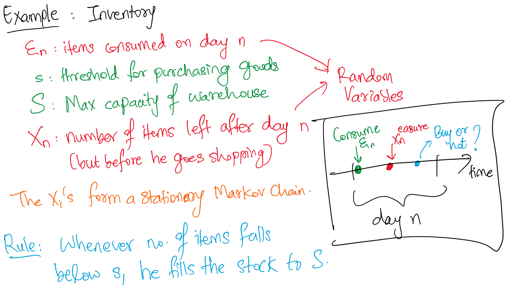

# First-Step Analysis

### Example

The above approach uses the law of total probability to find the distribution of $X_2$ (we just sum over all the values of $X_1$ and express the joint distribution as the product of the conditional distribution and the marginal distribution).

Alternatively, we can find the distriubtion of $X_2$ by finding the 2-step transition matrix $P^{(2)}$ which is equal to $P^2$. In particular, we can look at the row $2$ of the 2-step transition matrix (since we’re starting from initial state $X_0=2$) and each value of row 2, column $j$ gives the probability of $X_2=j$.

We generally use computers to calculate the matrix powers (and they’re surprisingly fast at this, since it can be parallelized).

Now what if $X_0$ follows some distribution (i.e., initial state is itself a random variable) and we’re interested in the distribution of $X_1$ and $X_2$?

:::info
Recall that a distribution of a discrete RV is completely specified by assigning probabilities to a fixed set of values that the RV can assume.

:::

We can decompose this as follows:

$$
\begin{equation*}
\begin{split}
P(X_1=-1|X_0 \sim \pi_0) &= \sum_{j\in S} P(X_1=-1,X_0=j) \\
&= \sum_{j \in S} P(X_0=j)P(X_1=-1|X_0=j) \\
&= \sum_{j \in S} \pi_0(j)P(j,-1)
\end{split}
\end{equation*}
$$

Note:

- $P(j,-1)$ is the one-step transition probability from $j$ to $-1$
- $\pi_0(j)$ is the probability that $X_0=j$

:::tip
It’s super useful to be able to put the above equation (and steps) in words: from step (1) to step (2), we’re decomposing the joint probability into the product of the marginal distribution (of $X_0$) and the conditional distribution (of $X_1$ given $X_0$)

:::

Observe that the equation $\sum_{j \in S} \pi_0(j)P(j,-1)$ can be seen as the product of $\pi_0$ and $P$ (and then looking at the entry corresponding to $-1$).

Looking at the product $\pi_0 \times P$ as a whole, we can see that it gives us the conditional probability of $X_1$ given that the initial state $X_0$ follows a $\pi_0$ distribution.

This also means that $X_1$ now follows some distribution, and we can repeat the procedure again. That is, suppose that $X_1 \sim \pi_1$, then $\pi_1 \times P$ gives the distribution of $X_2$. But we already know (from above) that $\pi_1 = \pi_0 \times P$. Therefore, $X_2 \sim (\pi_0\times P^2)$ distribution.

:::info
In general, the distribution of $X_n$ given the initial distribution $X_0 \sim \pi_0$, can be expressed as $X_n \sim (\pi_0 \times P^n)$

:::

Even more generally, if we know the distribution of $X_i \sim \pi_i$. Then the distribution for any $X_{i+j}$ can be written as $X_{i+j} \sim (\pi_i \times P^j)$.

Basically, we can multiply a distribution at time $t$ with a $k$-step transition probability matrix, $P^k$, to obtain a distribution for a later time $t+k$. (very intuitive!)

Now that we know how to obtain the distribution of $X_n$ given the distribution at some previous time using 2 ways - law of total probability (by considering all possible paths) AND computing higher powers of the transition matrix - we can also find out:

1. The expectation of $X_n$
2. In the long run, what is the expectation of $X$? Here, we can apply the limit $n \to \infty$ and calculate the expectation of $X_n$

Let’s come back to the Gambler’s Ruin problem and try to answer some of these short-term questions.

Suppose the gambler starts with $N=3$ dollars, has probability of winning each round $p=1/3$, and quits when he reaches $4$ dollars or goes broke.

Then, we want to know:

- What is the probability the gambler eventually goes broke?
- What is the probability the gambler eventually wins $4$ dollars?
- On average, how many games can he play before he quits or goes broke?

:::tip think
We’ll soon see that the sum of the first two probabilities (to the questions above) is one, which means that there is ZERO probability for the gambler to oscillate FOREVER and keep playing. Why? Although there is some non-zero probability for this to happen for some fixed time period, when we assume “time tends to infinity”, this probability tends to zero.

:::

Let $T$ denote the time that the gambler quits or goes broke. Then, we’re interested to find:

1. $P(X_T=0|X_0=3)$
2. $P(X_T=4|X_0=3)$
3. $E[T|X_0=3]$

How do we solve this? Can’t we just find $P^T$ ($T$-step transition matrix) and look at $P^T(3,0)$ to find out the probability of going broke at time $T$? (i.e., can we use the same method we used to answer short-term questions with a fixed time here?)

No! We don’t know what $T$ is so how can we find $P^T$?? More formally, $T$ itself is a random variable (we don’t know when he will go broke, and so calculating $P^T$ is not possible)

Okay, so what else can we do?

Earlier, we answered questions where the initial state followed some distribution and we were interested in the state at time $n$. Now, we have a fixed initial state and are interested in the distribution of $T$ (we can then try to use this to solve our main questions)

Since $T$ is itself a random variable, we can use law of total probability and condition on all possible values of $T$, as follows:

$$
P(X_T=0|X_0=3) = \sum_{k=1}^ \infty P(X_T=0|X_0=3,T=k)P(T=k|X_0=3)
$$

Though the above equation is mathematically true, the second term of the product is unknown, how would we find $P(T=k|X_0=3)$? No idea.

Okay, so we can’t answer strategy-related questions (like those above) with the techinques we’ve learnt so far.

By the strategy (i.e. the gambler’s own rule that he stops after he goes broke or wins $2N$), there is some “stopping time” of the process. (For a general process, there may not be such an explicit “strategy”, but they may still have some kind of stopping time)

Let’s define some terms that will help us to answer these strategy-related questions:

:::danger definition
**Absorbing state**: If a state $i$ satisfies $p_{ij}=0$ for all $j\neq i$, then it is called an absorbing state (i.e., once you reach state $i$, you cannot ever “escape” from it, and $p_{i,i}=1$)
:::

For the gambler’s ruin problem, $i=0$ and $i=4$ are both absorbing states (based on our definition of the quitting rules).

:::danger definition
**Stopping time**: Let $T=min\{n\geq 0 : X_n=i\}$ then $T$ is a stopping time. What this means is simply the first time that we reach any absorption state (i.e., the time we get absorbed). For the gambler’s ruin, the quitting time is a stopping time, where we set $i=\{0,4\}$
:::

Now, we perform first-step analysis.

While we cannot tell the exact distribution of $T$, we have some intuition:

- If the game is unfair in the way that the probability of winning a round $<$ $1/2$, then the probability of getting broke should be bigger
- If the gambler has more money at the beginning, the probability of going broke is smaller

We have such intuition because we understand what happens in one-step.

We can try to analyze what happens in a single step: we start from $X_0=3$. After one game, we can either reach $X_1=2$ or $X_1=4$.

$$
P(X_T=0|X_0=3) = p_{32}P(X_T=0|X_1=2)+p_{34}P(X_T=0|X_1=4)
$$

Recall that $X_T$ is the state at the stopping time. So, $P(X_T=0)$ gives us the probability of going broke.

The second term on the RHS vanishes because $P(X_T=0|X_1=4) = 0$ because we stop as soon as we reach $4$ dollars, so we cannot go broke.

Now, we’re interested in evaluating the first term. In particular, we don’t know what $P(X_T=0|X_1=2)$ should be.

:::tip
Intuitively, it should be pretty obvious that the probability of going broke only depends on the current state (and not on the “time” at all). And, $P(X_T=0|X_1=2)$ is basically the probability of going broke given that you have $2$ dollars at $t=1$. This should be equal to the probability of going broke if you simply started off with $2$ dollars. Mathematically, $P(X_T=0|X_1=2) = P(X_T=0|X_0=2)$. We will now prove this rigorously.

:::

Proof that $P(X_T=0|X_1=2) = P(X_T=0|X_0=2)$:

1. Define the process $\{Y_n,n=0,1,2,\dots\}$, where $Y_n=X_{n+1}$ (why? because we want to convert the condition on $X_1$ to a condition on $X_0$)
2. Then, we have: $P(X_T=0|X_1=2) = P(Y_{T-1}=0|Y_0=2)$
3. The specification parameters of $\{Y_n\}$ is exactly the same with that of $\{X_n\}$ and so, if we define $T_Y$ to be the stopping time for the $Y$-process, then $T_Y=T-1$ (basically $Y$ is just one step ahead of $X$ at every time, and so $Y$ will also terminate/get absorbed one step earlier). Also, the probability of $X_T=0$ and $Y_{T_Y}=0$ must be the same → they’re the same process (just shifted one time-unit apart)!
4. Then, we have: $P(Y_{T-1}=0|Y_0=2)=P(Y_{T_Y}=0|Y_0=2) = P(X_T=0|X_0=2)$
5. From step (2), we can rewrite the LHS of equation in step (4) to be: $P(X_T=0|X_1=2) = P(X_T=0|X_0=2)$. Hence, proved.

Phew. Okay. Now what?

Now, we have:

$$
P(X_T=0|X_0=3) = p_{32}P(X_T=0|X_0=2)+p_{34}P(X_T=0|X_0=4)
$$

Notice the only difference between this and the equation we wrote earlier is that we changed the condition to be on $X_0$ instead of $X_1$.

All the unknown terms are in the form $P(X_T=0|X_0=i)$. So, for notation’s sake, we define $u_i = P(X_T=0|X_0=i)$.

The interpretation is just that $u_i$ gives us the probability of going broke from state $i$ (we really don’t care about the time at which we reach state $i$, but in the definition, we use $X_0=i$).

So, we have:

$$
u_3 = \frac{2}{3}u_2 + \frac{1}{3}u_4
$$

We have one equation, and 3 unknowns ⇒ cannot solve this (yet).

But we can write the same equation for all values of $u_i$ (on the LHS).

$$
\begin{equation*}
\begin{split}
u_0 &= 1 \\
u_1 &= \frac{2}{3}u_0 + \frac{1}{3}u_2 \\
u_2 &= \frac{2}{3}u_1 + \frac{1}{3}u_3 \\
u_3 &= \frac{2}{3}u_2 + \frac{1}{3}u_4 \\
u_4 &= 0
\end{split}
\end{equation*}
$$

We have a linear system with 5 equaitons and 5 unknown parameters, we can solve this quite easily (programmatically at least). After solving, we get:

$$
u_0=1, u_1=\frac{14}{15},u_2=\frac{12}{15},u_3=\frac{8}{15},u_4=0
$$

Our required answer is: $u_3 = P(X_T=0|X_0=3)=\dfrac{8}{15}$

---

### Summary of FSA

Summary of what we did in first-step analysis:

1. We use the property that $\{X_n\}$ and $\{Y_n\}$ are “probabilistically” the same process (only differing in the times) and hence, the probabilities should be the same.
2. The stopping time $T$ is only related to the probabilistic structure.
3. We then set up a series of variables: $u_0,u_1,\dots, u_4$
4. According to the Markovian property, we consider the first-step from every possible state, and set up the equations.
5. We can then solve the linear system for the result.

:::tip think
This method works when we have numerical values but it is tedious if the number of states is very large. What if we start with $N=100$ dollars? So, we want to be able to come up with a way to solve a general “difference equation” (discrete-form of differential equation)

:::

Similarly, we’re also interested in finding the probability of being absorbed at state $4$. We can use 2 approaches (and verify that both give the same answer):

1. **First-step Analysis**: Similar to the previous question, we can set up $w_i=P(X_T=4|X_0=i)$, build the linear system and solve for $w_3$
2. **Based on results already obtained**: We already know that the probability of going broke when starting with $X_0=3$ is $8/15$. We claim (prove in next lecture) that the Markov Chain will be absorbed with probability $1$ (for sure, as time goes to infinity, the probability of getting absorbed tends to $1$). Since the only absorbing states are $\{0,4\}$, the probability of being absorbed at state $4$ (”winning” the game) is equal to $1-P(X_T=0|X_0=3) = 7/15$

Okay. We’ve answered the first two questions: what is the probability that the gambler goes broke and what is the probability that the gambler wins 4 dollars and quits.

### Expected Number of Games Played

We’re still left with the last question: what is the expected number of games the gambler plays before he goes quits? (Here, quits can be because he went broke or he got 4 dollars and quits)

In other words, we’re interested in finding: $E[T|X_0=3]$ where $T=$ stopping time of the Stationary Markov Chain.

Let $v_i = E[T|X_0=i]$

One key property that we’re going to use here is this: $E[T|X_0=i] + 1 = E[T|X_1=i]$. In other words, we expect the gambler to play the same _MORE_ rounds if he’s at a given state, regardless of the time at which he reached that state. But since he plays the same more rounds, the expected stopping time shifts by the difference in times at which he reached the same state.

$$
\begin{equation*}
\begin{split}
v_3 = E[T|X_0=3] = \sum_{t=0}^\infty t \times P(T=t|X_0=3)
\end{split}
\end{equation*}
$$

The above equation simply uses the definition of expectation. In words, it means that the expected number of rounds the gambler plays before going broke can be found by considering all the possible rounds at which the gambler can go broke and multiplying each of them by their respective probabilities, and finally, summing them all up.

We can now perform first-step analysis, i.e., see what happens after 1 game.

$$
\begin{equation*}
\begin{split}
v_3 &= E[T|X_0=3] = \sum_{t=0}^\infty t \times P(T=t|X_0=3) \\
&= \sum_{t=0}^\infty \sum_{i=0}^4 \left (t \times P(X_1=i|X_0=3)  P(T=t|X_1=i,X_0=3) \right ) \quad \text{(law of total probability)}\\
&= \sum_{i=0}^4  \sum_{t=0}^\infty t \times P(T=t|X_1=i,X_0=3) P(X_1=i|X_0=3) \quad \text{(rearranging)} \\
&= \sum_{i=0}^4 \left ( P(X_1=i|X_0=3) \left (\sum_{t=0}^\infty t \times P(T=t|X_1=i,X_0=3) \right) \right ) \\
&= \sum_{i=0}^4 P(X_1=i|X_0=3) E[T|X_1=i, X_0=3] \quad \text{(defn. of expectation)}
\end{split}
\end{equation*}
$$

Consider $E[T|X_1=i, X_0=3]$. According to the Markovian property, given $X_1=i$, what happened afterwards is independent with $X_0$. That is, $T \perp X_0$ _given $X_1$_.

Therefore, $E[T|X_1=i, X_0=3] = E[T|X_1=i]$

Now we need to relate $E[T|X_1=i]$ with $E[T|X_0=i]$. This is quite intuitive: since we arrive at the same state at a later time, we don’t expect the distribution of $T$ to change in terms of the probabilities → we only expect each value of $T$ to be shifted by a certain amount, in this case 1.

That is, $E[T|X_1=i] = E[T|X_0=i] + 1$

Think of defining a new process $Y_n = X_{n+1}$. Then $Y$ will stop 1 time unit before $X$ in all possible scenarios since $Y$ “leads” $X$. In the same way, the above equation simply means that if I expected the game to end at $T=10$ when you started off with $X_0= 3$ dollars, I will expect the game to end at $T=12$ if you still have 3 dollars at $T=2$. Why? Because I expect the game to follow the same trajectory as I had expected from $T=0$ to $T=10$, only now I think of it from $T=2$ to $T=12$

:::info intuition
It might be easier to think of it as this: If $w_i$ is the expected number of games that the gambler plays from state $i$ before he quits, $w_i$ is independent of the time. It only depends on $i$. So, if he has 3 dollars now and we expect him to play 4 more games before quitting, we should expect him to play 4 more games before quitting EVERY TIME he reaches a state where he has 3 dollars.

:::

:::caution
Here, $T$ is the stopping time of the overall process → NOT the “extra” time taken to reach absorption state from a given state (though it’s much easier to solve problems by using this method instead)

:::

:::tip key points

1. The probability of getting absorbed at a particular state $i$ given you’re a state $j$ ONLY depends on the state $j$ and not the time. (we’ve already proved this)
2. The expected _remaining_ time before you get absorbed at state $i$ given you’re currently at state $j$ again only depends on the state $j$ and not the time (to be proved)
3. As a consequence of (2), the expectation of the stopping time simply shifts by the amount of time passed since you last visited the state, i.e., $E[T|X_k=i] = E[T|X_0=i] + k$

:::

Let’s prove this intuition rigorously now. The proof is very similar to what we did earlier to show that the probabilities of absoroption is independent of the time, and only dependent on the state.

We use the same process we created eariler $\{Y_n\}$ that we defined to be $Y_n=X_{n+1}$, i.e., $Y$ leads $X$ by one time unit. Then, obviously the stopping time of $Y$ is $T_Y = T-1$

Then, we have:

$$
E[T|X_1=i] = E[T_Y+1|Y_0=i] = 1 + E[T_Y|Y_0=i] = 1 + v_1
$$

The last equivalence is a result of the stochastic equivalence (i.e., same probabilistic structure) between $\{X_n\}$ and $\{Y_n\}$

As a conclusion, we have:

$$
E[T|X_0=3,X_1=i] = 1 + v_i
$$

We can introduce this result into the original equation, nd we get:

$$
\begin{equation*}
\begin{split}
v_3 &= \sum_{i=0}^4 P(X_1=i|X_0=3) E[T|X_1=i, X_0=3] \\
&= \sum_{i=0}^4 P(X_1=i|X_0=3) (1 + v_i) \\
&= \frac{2}{3}(1 + v_2) + \frac{1}{3}(1 + v_4) \\
&= 1 + \frac{2}{3}v_2 + \frac{1}{3}v_4
\end{split}
\end{equation*}
$$

We can do this for all $v_i$ and set up a linear system of equations, and solve $v_i$ for all values of $i$.

$$
\begin{equation*}
\begin{split}
v_0 &= 0 \\
v_1 &= 1 +  \frac{2}{3}v_0 + \frac{1}{3}v_2 \\
v_2 &= 1 + \frac{2}{3}v_1 + \frac{1}{3}v_3 \\
v_3 &= 1 + \frac{2}{3}v_2 + \frac{1}{3}v_4 \\
v_4 &= 0
\end{split}
\end{equation*}
$$

(It’s nearly identical to the linear system consisting of $u_i$’s)

:::tip think
Observe the difference between the above equations, and the equations for finding the probability of going broke → it’s of the same form except for the extra “1” on the RHS → this is a result of counting every step that we take (since we're interested in the total number of games we played).
:::

:::tip note
Notice that $v_0 = 0 = v_4$. In particular, it is not equal to $1$. Handle the "edge cases" properly → the stopping time is defined as the the minimum time when we reach an absorbing state. So, if we start from an absorbing time, the stopping time is $0$, NOT $1$.
:::

We’ve succesfully answered all the 3 questions that we were interested in! But..

This was only a special case of the more general gambler’s ruin problem (where the initial conditions can be anything, the stopping rule can be different, the probability of winning need not equal the probability of losing for each round).

Let’s try to generalise the results we’ve obtained. This is done in the next page.
