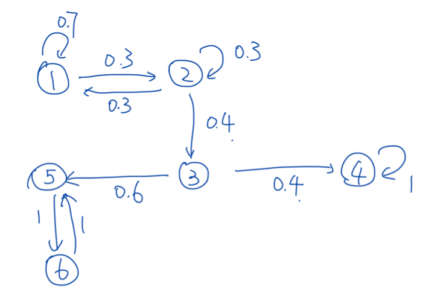
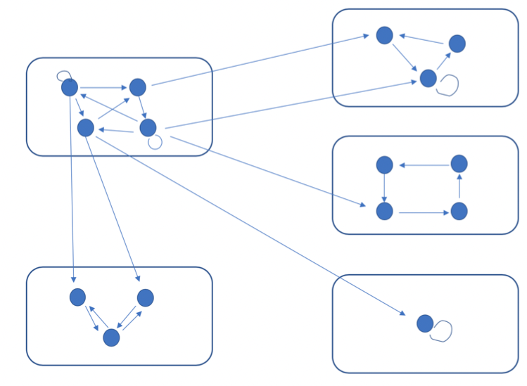
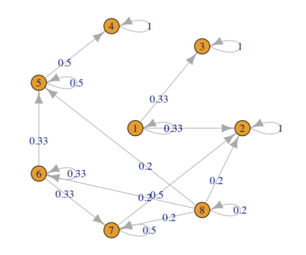
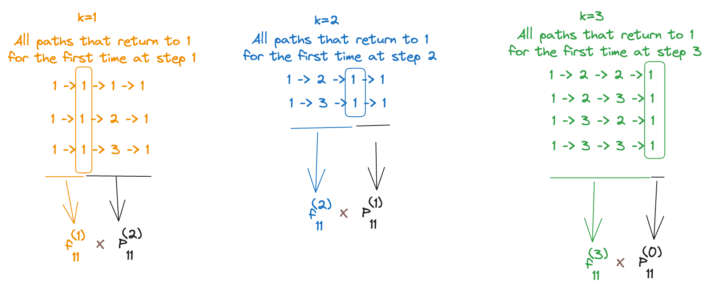

# Classification of States

Recall that in the beginning, we described 4 types of problems/questions that we’re interested in solving:

1. Short-term questions (e.g. distribution of $X_n$ for any fixed $n$) → can be solved using Chapman-Kolmogorov Equation
2. Strategy-related questions (e.g. probability of being absorbed at a given absorption state, expected time to absorption, expected number of visits through a state, etc.) → solved using first step analysis
3. Long-run performance (e.g. when $n \to \infty$, what can we claim about $X_n$?)
4. Extensions

Now, we’re focusing on long-run performance questions.

Consider the gambler’s ruin example. We know that there are 2 absorption states: $0$ and $N$ (once we reach either of these states, we never leave, i.e., the process (effectively) stops and we’re done).

We’re interested in knowing whether $X_n$ _always_ achieves $0$ or $N$? Or is there a probability that the gambler will continue playing for infinite time and never go broke or reach $N$ dollars? What about the case when there is only one absorbing state $0$ (i.e., “greedy” gambler scenario who does not set _any_ quitting rule for himself)?

More generally, we see that there are 2 “kinds” of states for the gambler’s ruin problem:

- Absorbing states → once reached, never escape
- “Non-Absorption” states → the process just “passes through” such states and does not “stop” when it reaches it.

Can we find “similar” kinds of states for other problems (so that our results are more generalizeable).

For example, in the stationary MC below, we see that states 5 and 6 are not absorbing states, but they form a “trap” for the walker (or the process)

---

## Definitions

### Accessibility

:::danger definition
For a stationary MC $\{X_n, n=0,1,2,\dots\}$ with transition probability matrix $P$, state $j$ is said to be **accessible** from state $i$, denoted by $i \to j$, if $P_{ij}^{(m)}>0$ for some $m \geq 0$.

:::

The meaning is quite simple: if there is a path of finite length with non-zero probability from $i \to j$, then we say that $j$ is accessible from $i$. When we say “path with non-zero probability” it means that all the edges along the path are “possible”.

Note that the requirement is not on the one-step transition probability, i.e., there does not have to be a “direct” edge (path of length $1$) from $i \to j$.

If $P_{ij}^{(m)} > 0$, it means that there is at least one path of length $m$ with non-zero probability from $i \to j$. For example, if $P_{ij}^{(2)}$, there is at least one path $i-k-j$ with non-zero probability (here, $-$ denotes one transition).

Equivalently, this means that starting with $i$, we can _access_ $j$ at some finite step $n$ with non-zero probability.

**Note**: Unlike “distance”, the accessibility only considers one direction. That is, just because $i \to j$, it does not impy $j \to i$. An easy example is when we set $i=1$ and $j=0$ in the gambler’s ruin - since $j=0$ is an absorbing state, it can never reach $i=1$. However, the gambler can reach $j=0$ from $i=1$ by simply losing the first round (which has non-zero probability $q$).

### Communication

:::danger definition
If two states $i$ and $j$ are accessible from each other, i.e., $i \to j$ and $j \to i$, then they are said to **communicate**, denoted by $i \longleftrightarrow j$.

:::

“Communicate” basically means that both the states can “send information to each other”. In such a case, we regard $i$ and $j$ to be in the same “**communication class”**.

Imagine you put some “information” in state $i$, then that information can “flow” to all states that are accessible from $i$. Similarly, if there is “information” in 2 states $i$ and $j$ and they’re in the same communication class, this information can be exchanged between the states over time, i.e., they can communicate with each other.

:::tip note
From a computer science (or graph theory) perspective, we can say that the two nodes are “strongly connected”.

:::

It is quite obvious that accessibility can be inherited - i.e., if $i \to j$ and $j \to k$, then $i \to k$ (there is definitely a path with non-zero probability from $i \to k$ via $j$ - there might be other paths too, but at least there is this path).

Also, every state belongs to one and only one “communication class” (group of all the nodes that can communicate with each other): there is no overlapping, and no “leftover”. (think of this as the strongly connected components in graphs)

Communication classes form a partition of all the states → they are mutually disjoint and the union of all the classes must be the set of all possible states. (this is a direct consequence of the fact that the communication relationship is an equivalence relation, explained below).

So far it seems okay, but it’s still not clear _why_ we care about communication classes. What’s the point of dividng the states by “communication”?

:::tip note
Communication is an equivalence relation, i.e.,

1. Reflexive: $i \longleftrightarrow j$ ($P_{ii}^{(0)} = 1 > 0$ for any $i$, given that you’re at $i$,in $0$ steps, you are sure to remain at $i$)
2. Symmetric: $i \longleftrightarrow j \implies j \longleftrightarrow i$ (by definition)
3. Transitivity: $i \longleftrightarrow j \land j \longleftrightarrow k \implies i \longleftrightarrow k$ (by Chapman-Kolmogorov equation)

:::

Any 2 states in a communication class can communicate with each other, i.e., ALL states of a communication class can communicate with (and ONLY with) ALL other states of the same communication class.

A typical “form” of a markov chain (without probabilities) looks something like this:

Here, each rectangle contains one class. No 2 classes cannot communicate with each other (otherwise they can be “merged” into a single class). And, we can see a “flow” between classes.

:::tip note
Intuitively, we can see that in the above diagram, all the “flow” will be pushed out (eventually) of the top-left class into all the other classes (because all the arrows point outward).
:::

Let’s define another term now:

:::danger definition
**Reducible Chain**: An MC is _irreducible_ if ALL the states communicate with one another (i.e., there is a single communication class). Otherwise, the chain is said to be _reducible_ (more than one communication class).

:::

Why “reducible”? Because instead of focusing on each state, we can “reduce” the MC to its communication classes and deal with the “flow” between classes first, and then look into each class (separately). In particular, we can _reduce_ the dimension of the transition probability matrix while we're performing FSA if we're only interested in finding out which classes the process enters. This is possible only because the communication classes (by defn.) are “isolated” from each other in some sense.

Note that an irrdeucible MC can have finite states, or infinitely many states. More generally, a communication class can have a finite or infinite number of states.

### Recurrent and Transient States

In the above example, we can (intuitively) make the following observations. In the long run,

- The flow will be trapped in states 4/3/2 finally
- If the flow starts from 1, then it will end in 2/3
- If the flow starts from 7, it may return to 7 for some turns but finally end in 2
- If the flow starts from 8, it may pass by 5/6/7 first but still end in 4/3/2 finally

In general, we see that the flow (or the process) will converge to some states (**recurrent**) finally. In the process, it may pass by some states (**transient**) but will leave them in the long run.

We want to describe this intuition more rigorously (and more quantitatively).

To do so, we need to define another term:

:::danger definition
**Return Probability**: For any state $i$, recall the probability that starting from state $i$ and returns at $i$ at the $n$th transition is that:

$$
P_{ii}^{(n)} = P(X_n=i|X_0=i)
$$

:::

According to the definition, $P_{ii}^{(0)}=1, P_{ii}^{(1)}=P_{ii}$

The return probabilty $P_{ii}^{(n)}$ only captures the performance of $X_n$, NOT related to the path: e.g. the walker can start from $i$ and stay there until the $n$th step, or leave $i$, passes by $i$ several times and comes back at $n$th step, or leaves $i$, visits other states and returns to $i$ at the $n$th step.

The probability of ALL these paths of length $n$ whose final state (and initial state) is $i$ are summed up to $P_{ii}^{(n)}$.

:::tip note
If $P_{ii}^{(n)} \to 0$ when $n \to \infty$, then the state $i$ is transient.

:::

What this means is that “in the long run”, it is unlikely that the system ever returns to state $i$.

We can calculate $P_{ii}^{(n)}$ quite simply by raising the transition matrix to the $n$th power (using Chapman-Kolmogorov equation). But the problem here is that we're more interested in finding out the distribution as $n \to \infty$ and whether or not the process ever returns back to the state. For this purpose, $P_{ii}^{(n)}$ is not very good because it cannot measure the probability that the process revisits $i$ in the long run (we can't just sum up all the $P_{ii}^{(n)}$'s under the limit $n \to \infty$ because they're not disjoint events).

So, we can further narrow this to define a term “_first_ return probability” → the probability that we return back to the state for the first time at $X_n$.

:::danger definition
**First Return Probability**: For any state $i$, define the probability that starting from state $i$, the first return to $i$ is at the $n$th transition.

$$
f_{ii}^{(n)} = P(X_1\neq i, X_2 \neq i, \dots, X_{n-1} \neq i, X_n = i|X_0=i)
$$

Note that we define (since it is difficult to claim what is the “first visit”, we simply set) $f_{ii}^{(0)} := 0$ (impossible to “return” to $i$ in 0 steps because we already start from $i$)

:::

Since it is the “first revisit”, $\sum_{n=1}^\infty f_{ii}^{(n)} \leq 1$ (all the paths that contribute to $f_{ii}^{(n)}$ for a given $n$ are unique to that $n$ → there is no overlapping, and so, the sum of all $f_{ii}^{(n)}$ over $n$ is simply the sum of the probabilities of the union of a disjoint set of paths (basically a subset of ALL possible paths) and so it must be $\leq 1$).

Naturally, $f_{ii}^{(n)} \leq P_{ii}^{(n)}$ (since $f_{ii}^{(n)}$ only includes a subset of the paths whose $n$th state is $i$ whereas $P_{ii}^{(n)}$ includes all such paths whose $n$th state is $i$). Intuitively, $f_{ii}^{(n)}$ imposes a stricter constraint on the path itself (so, the event for $f_{ii}^{(n)}$ is a subset of the event for $P_{ii}^{(n)}$) and so, the first return probability is of course, $\leq$ the return probability.

:::tip note
When does the equality hold? That is, when is $\sum_{n=1}^\infty f_{ii}^{(n)} = 1$?

Intuitively, this means that in the long run, the process always comes back to $1$, i.e., ALL paths eventually lead to $1$

:::

## Connection between $f_{ii}^{(n)}$ and $P_{ii}^{(n)}$

What is the connection between $f_{ii}^{(n)}$ and $P_{ii}^{(n)}$?

Again, based on our (deep 😲) understanding of the terms themselves, we can “decompose” all the paths that contribute to $P_{ii}^{(n)}$ into (disjoint) sets depending on when they “first” return back to $i$. That is, every path whose $n$th state is $i$, can be broken down to (path from $i$ to first return back to $i$) + (remaining path). For example, if we’re interested in finding $P_{11}^{(3)}$, i.e., the probability that we come back to state $1$ on step $3$ ( suppose that we have 3 states - 1, 2, 3 - none of them are absorbing, and we aren’t really interested in the actual probabilities but the paths that contribute to it instead):

Let’s now “derive” this intuition mathematically. According to the law of total probability,

$$
\begin{equation*}
\begin{split}
P_{ii}^{(n)} &= \sum_{k=1}^nP(\text{first arrives }i \text{ at step }k|X_0=i)\times P(X_n=i|X_k=i) \\
&= \sum_{k=1}^n f_{ii}^{(k)}P_{ii}^{(n-k)} \\
&= \sum_{k=0}^n f_{ii}^{(k)}P_{ii}^{(n-k)}
\end{split}
\end{equation*}
$$

The last equality comes from $f_{ii}^{(0)} = 0$ (so adding an extra term doesn’t matter because it evaluates to $0$ anyway).

:::danger theorem
Theorem: Return Probability and First Return Probability

$$
P_{ii}^{(n)} = \sum_{k=0}^n f_{ii}^{(k)}P_{ii}^{(n-k)}
$$

:::

Remarks:

- Such type of formula is called a “**convolution**”
- We can find $P_{ii}^{(k)}$ for all values of $k$ between $1$ and $n$ by raising the transiiton probability matrix to the respective power (using Chapman-Kolmogorov’s equation), i.e., $P_{ii}^{(k)} = P_{ii}^k$

Note: Recurrency **$\;\not\!\!\implies P_{ii}^{(n)} \to 1$.**

For example, consider the following markov chain:

Then, all of $1,2,3$ are recurrent states. $P_{ii}^{(n)} = \begin{cases}
1, n = 3k \\
0, n \neq 3k
\end{cases}$

In other words, there is no (convergent) “limit” as to what happens when $n \to \infty$ and so, it’s not always possible to conclude that “recurrent” necessarily implies that $P_{ii}^{(n)} = 1$ as $n \to \infty$.

Let’s also define

$$
f_{ii}=  \sum_{n=0}^\infty f_{ii}^{(n)} = \lim_{N \to \infty} \sum_{n=0}^N f_{ii}^{(n)}
$$

In words, $f_{ii}$ denotes the probability of revisiting $i$ in the future (we cannot directly use $P_{ii}^{(n)}$ to denote such a thing because the $P_{ii}$’s would not be disjoint, i.e., we would end up overcounting a lot of the paths).

Obviously, $f_{ii} \leq 1$ since it is a probability. (we’re making use of the fact that all of the $f_{ii}$’s are disjoint events, i.e., for any $j \neq k$, the event of $f_{ii}^{(j)}$ is disjoint from $f_{ii}^{(k)}$ → it cannot be that the “first visit” of state $i$ on the same path occurs at both $j$ and $k$ → by definition, we’re only concerned with the _first_ visit. So, each path that contains state $i$ contributes to exactly 1 $f_{ii}^ {(n)}$ term depending on when state $i$ was first revisited).

With all this information in mind, we can (finally!) define what recurrent and transient states actually are.

:::danger definition
A state $i$ is said to be **recurrent** if $f_{ii}=1$, and **transient** if $f_{ii}<1$

:::

If we can _guarantee_ that the process (or the “walker” 🤣) will revisit state $i$ (in finite steps!) for sure, then state $i$ is recurrent. Otherwise, the flow/process will eventually leave state $i$.

In the MC shown above (with 3 states), all of $1,2,3$ are recurrent states since we can guarantee that in exactly 3 steps, the process will come back to the current state, i.e., $f_{ii}^{(3)} = 1$ for all $i=1,2,3$ and that is in fact, the only non-zero term in the summation. So, $\sum_{n=0}^\infty f_{ii}^{(n)} = f_{ii}^{(3)}=1$, and hence they’re all recurrent.

We can also think of recurrent states as those states which will contain the “flow” (process) in the long run.

To reiterate, recurrent state $\iff f_{ii}=1$. The intuition is that the flow will come back on and on (again and again) and it seems to be trapped.

We cannot use $P_{ii}^{(n)} \to 1$ as $n \to \infty$ as being “recurrent” because of the counter-example we saw earlier (3 states forming a cycle with all probabilities of transition being $1$).

:::tip note
$f_{ii}$ is the total probability of revisiting the state $i$ in the long run. $P_{ii}^{(n)}$ as $n \to \infty$ would be the probability of visiting the state $i$ at a time very very far into the future. They’re not the same. In fact, $P_{ii}^{(n)} \to1$ intuitively feels like an “absorbing” state (we are guaranteed that the process will be at state $i$ after a very long time - stable system). But recurrent $\neq$ absorption. An absorption state is always recurrent (since $f_{ii}^{(1)}=1$, the sum evaluates to $1$) but a recurrent state need not be an absorption state (consider the simplest case where we have $1 \longleftrightarrow 2$ with probability $1$ and the process flips-flops between the 2 states, never being absorbed but is still guaranteed to visit the current state in exactly 2 steps)

:::

## Number of Revisits

Intuitively, we “feel” that since we know that probabilistically, the system will always visit a recurrent state in a finite number of steps, as time goes to infinity, the recurrent state is visited an infinite number of times.

We can write it mathematically as such: Let $N_i$ be the number of times that the MC revisits state $i$:

$$
N_i = \sum_{i=0}^\infty I(X_n=i)
$$

Then “recurrent” means $N_i= \infty$ (think what happens for an absorption state: once we visit an absorption state, we will always be trapped there, and so, we will count it infinite number of times (with each increment of (discretized time) $n$)).

On the contrary, transient means that there may be revisits, but limited number of them, i.e., $N_i < \infty$ (i.e, it should be a finite number).

In conclusion, to show that this new definition of recurrent and transient is meaningful, we need to prove that it’s the same as the previous one. That is,

$$
E[N_i|X_0=i] =
\begin{cases}
= \infty, \quad f_{ii}=1 \\
< \infty, \quad f_{ii} < 1
\end{cases}
$$

:::danger theorem
**Theorem: Number of Revisits**

For a state $i$, consider the expected number of visits to $i$, $E[N_i|X_0=i]$, then:

1. If $f_{ii} < 1$ (i.e., $i$ is transient), there is $E[N_i|X_0=i] = \dfrac{f_{ii}}{1-f_{ii}}$
2. If $f_{ii} = 1$ (i.e., $i$ is transient), there is $E[N_i|X_0=i] = \infty$

:::

If we can prove the above theorem, we can conclude that both definitions of “recurrent”/”transient” (using $f_{ii}$ and using $N_i$) are equivalent.

So, what are we waiting for? Let’s go ahead and prove this theorem.

### Proof

$N_i \geq 1$ means that when we start from state $i$, there is at least one revisit. By our definition of $f_{ii}$, we can write it as:

$$
P(N_i \geq 1|X_0=i) = \sum_{k=1}^\infty f_{ii}^{(k)} = f_{ii}
$$

Both the LHS and RHS are equivalent ways of saying “probability that we will revisit state $i$ at least once in the future”.

Now, consider the event $N_i \geq 2$ → there are at least 2 revisits to state $i$. Then, using law of total probability, we can write it as:

$$
\begin{equation*}
\begin{split}
P(N_i \geq 2 | X_0 = i) &= \sum_{k=1}^\infty P(N_i\geq 2|\text{first revisit happens at step }k)P(\text{first revisit happens at step }k) \\
&= \sum_{k=1}^\infty P(N_i\geq 2|X_k=i)f_{ii}^{(k)} \\
&= \sum_{k=1}^\infty P(N_i\geq 1|X_0=i)f_{ii}^{(k)} \quad \text{since we already revisited it once at step }k \\
&= P(N_i \geq 1|X_0=i)\sum_{k=1}^\infty f_{ii}^{(k)} = f_{ii}^2
\end{split}
\end{equation*}
$$

In general, we have: $P(N_i \geq m | X_0=i) = f_{ii}^m$ (we can easily show this by induction just as we’ve shown it for $m=2$ using $m=1$)

:::tip note
In the third step of the derviation above, we “shifted” the MC by $k$ time units back since the probabilistic structure remains unchanged. In particular, the probability of visiting state $i$ twice given that you’ve already revisited it once is the same as the probability of revisting state $i$ one more time (having already revisited it once in the past doesn’t change the probability of revisiting it again in the future). So, we “reset” the counter (after visiting it at step $k$) and pretend as if we have to start over. It’s a neat trick to convert the $X_k$ to $X_0$ so that we can pull it out of the summation (since it does not depend on $k$) and then only calculate the $f_{ii}$’s.

:::

Now that we have the probabilities, we can calculate the expectation:

$$
\begin{equation*}
\begin{split}
E[N_i|X_0=i] &= \sum_{k=1}^\infty kP(N_i =k|X_0=i) \\
&= \sum_{k=1}^\infty \sum_{j=1}^k P(N_i=k|X_0=i) \\
&= \sum_{j=1}^\infty \sum_{k=j}^\infty P(N_i=k|X_0=i) \text{ Reorder} \\
&= \sum_{j=1}^\infty P(N_i \geq j|X_0=i)
\end{split}
\end{equation*}
$$

Here’s a simple illustration on how we “regroup” the terms in the expectation to fit the form that we need (it’s just a new way of thinking about the terms). Suppose we only had 3 values of $X$ - 1, 2, 3 - and we had to calculate $E[X]$. Then,

Okay, now we have: $E[N_i|X_0=i] = \sum_{j=1}^\infty P(N\geq j|X_0=i)$. But we already know that $P(N_i \geq j|X_0=i)=f_{ii}^j$.

$$
E[N_i|X_0=i] = \sum_{j=1}^\infty f_{ii}^j = \frac{f_{ii}}{1 - f_{ii}}
$$

The last equality holds only when $f_{ii} < 1$ (because only under that assumption, we can apply the sum of geometric series formula here).

Consdider the recurrent case where $f_{ii}=1$. All the previous analysis holds except the last equality: so we have $P(N_i \geq m|X_0=i) = f_{ii}^m = 1$ for all values of $m$. (obviously, the series will not converge if all the terms are $1$ and we’re summing an infinite number of terms). Then, $E[N_i|X_0=i] = \sum_{k=1}^\infty f_{ii}^k \to \infty$

Hence, we’ve proved both cases (transient + recurrent) of the theorem. 🪦

**Remarks on the theorem**:

1. This theorem sets the theoretical evidence for the definition of recurrent/transient states.
2. For transient states, the expected number of revisits increases when $f_{ii}$ increases. However, eventually, we will leave $i$ never to return, i.e., we will never revisit $i$ again in the long run.
3. For recurrent states, the expected number of revisits is infinite, which means that the process revisits it again and again (forever) in the long run (there is no possibility of never visiting it in the future)

---

### Coming Full Circle

Recall that we had begun our discussion with $P_{ii}^{(n)}$. Now, we wonder where it fits in the picture and how it relates to our result. That is, we want to relate $P_{ii}^{(n)}$ to our definitions of transient and recurrent states.

Consider the definition of $N_i$. We can express $N_i = \sum_{n=1}^\infty I(X_n=i)$ → number of times we revisit state $i$ (and each time we visit $i$, it is captured by the indicator function turning “on”).

Then,

$$
\begin{equation*}
\begin{split}
E[N_i|X_0=i] &= E \left [\sum_{n=1}^\infty I(X_n=i) | X_0=i \right] \\
&= \sum_{n=1}^\infty E[I(X_n=i)|X_0=i] \text{ linearity of expectation} \\
&= \sum_{n=1}^\infty P(X_n=i|X_0=i) \text{ property of indicator function} \\
&= \sum_{n=1}^\infty P_{ii}^{(n)}
\end{split}
\end{equation*}
$$

From the previous theorem, we know that $E[N_i|X_0=i]$ is finite for transient states and infinite for recurrent states. Then, we have:

1. $\sum_{n=1}^\infty P_{ii}^{(n)}$ is finite for transient states
2. $\sum_{n=1}^\infty P_{ii}^{(n)}$ is infinite for recurrent states

So, we can define recurrent and transient states using this definition too, as such:

:::tip note
State $i$ is recurrent if, and only if, $\sum_{n=1}^\infty P_{ii}^{(n)} = \infty$

:::

What does the above theorem really mean?

1. For recurrent states, starting from any $m > 0$, we have $\sum_{n=m}^\infty P_{ii}^{(n)} = \infty$, which means there is always a significant probability to return back to $i$ even after a very long time.
2. For transient states, the revisitng probability $\sum_{n=m}^\infty P_{ii}^{(n)} \to 0$ when $m \to \infty$. This means that in the long run, the probability of coming back vanishes (and we can say that “all the flow eventually moves out of the state, never to return”).

Phew. To help recap, here’s a quick summary of everything we’ve discussed so far (all the equivalent ways of saying “transient” or “recurrent”):

$$
\text{Recurrent} \iff f_{ii} =1 \iff \sum_{n=1}^\infty P_{ii}^{(n)}=\infty \iff E[N_i|X_0=i] = \infty
$$

$$
\text{Transient} \iff f_{ii} <1 \iff \sum_{n=1}^\infty P_{ii}^{(n)}<\infty \iff E[N_i|X_0=i] < \infty
$$

---

## States in the Same Class

Until now, we’ve discussed what transient and recurrent states are. But how does it relate to the notion of communication classes we had talked about at the beginning?

It turns out that there’s a pretty neat theorem for this.

:::tip note

1. If a state $i$ is recurrent and $i \longleftrightarrow j$, then state $j$ is recurrent.

2. If a state $i$ is transient and $i \longleftrightarrow j$, then state $j$ is transient.

:::

Basically, it means that the recurrent/transient status can be seen as a status for one communication class (and not just one state in that class).

So, it makes sense to say that “a communication class is recurrent (or transient)”. This means that all the states in this class are recurrent (or transient).

Side Note: **An MC with finite states must have at least one recurrent class**. Why? Since there are only finitely many states, as time goes to infinity, at least one state would be visited infinite time (if all of them have $E[N_i|X-0=i]$ being a finite value then the sum of all of them would be a finite value, but given infinite time, we cannot be visiting ALL finitely many states only finite times). Think, if all of them are transient where would the flow go after a very long time? It has to go to some state (which means that even in the long run, that state is still being revisited, i.e., it is recurrent)

### Proof

Let’s prove claims (1) and (2) above.

Since $i$ and $j$ can communicate, there must exist some integers $n$ and $m$ such that:

$$
P_{ij}^{(n)} > 0, \quad P_{ji}^{(m)} > 0
$$

where $P_{ij}^{(n)}$ denotes the $n$-step transition probability from $i$ to $j$. This can be visualized using the diagram below:

Consider any $v \geq 0$. Then,

$$
P_{jj}^{(m+v+n)} \geq P_{ji}^{(m)}P_{ii}^{(v)}P_{ij}^{(n)}
$$

The above equation (RHS) is basically saying that we can go from $j$ to $i$ (in $m$ steps), move around from $i$ to any other states until we return to $i$ in $v$ steps, and then finally, we take the path from $i$ to $j$ in $n$ steps. The LHS is “total probability of returning to $j$ in $m+n+v$ steps. Clearly, the RHS has a stricter constraint that the first $m$ steps and last $n$ steps lead to (and come from) state $i$. So, the event described by the RHS is a subset of the RHS (i.e., the RHS has more such paths (e.g. even if we stay at $j$ for $m+n+v$ steps, that is a valid path for LHS, but NOT RHS). Hence, it’s an inequality ($\geq$), not an equality.

We can sum the above equation over $v=0,1,1,2 \cdots$ on both sides (since it must hold for all $v \geq 0$). Then,

$$
\sum_{v=0}^\infty P_{jj}^{(m+v+n)} \geq \sum_{v=0}^\infty P_{ji}^{(m)}P_{ii}^{(v)}P_{ij}^{(n)} = P_{ji}^{(m)}\left(\sum_{v=0}^\infty P_{ii}^{(v)}\right)P_{ij}^{(n)}
$$

Also,

$$
\sum_{w=0}^\infty P_{jj}^{(w)} \geq \sum_{v=0}^\infty P_{jj}^{(m+v+n)}
$$

since the RHS is a subset of LHS (and it’s possible for there to be other paths from $j$ to $j$ with length $< m+n$.

So, combining the 2 equations, we have:

$$
\sum_{w=0}^\infty P_{jj}^{(w)} \geq P_{ji}^{(m)}\left(\sum_{v=0}^\infty P_{ii}^{(v)}\right)P_{ij}^{(n)}
$$

When state $i$ is recurrent, $\sum_{v=0}^\infty P_{ii}^{(v)} = \infty$ (by definition). Then, since $P_{ji}^{(m)}$ and $P_{ij}^{(n)}$ are non-zero probabilities, we have: $\sum_{w=0}^\infty P_{jj}^{(w)} = \infty$, which means that even $j$ is recurrent.

With a similar analysis, we can show that if $j$ is transient, then $i$ is transient too (and vice versa too).

---

## Reducible Chains

For reducible chains, there are multiple classes:

- For a transient class, in the long run, the probability that the flow/process stays in this class (or ever returns back to this class after a very long time) is zero.
- For a recurrent class, when there are finite states, there must be a least one recurrent class (otherwise, where will the process go after a long time?). If $C_k$ is a recurrent class, then $P_{ij}=0$ for any $i \in C_k$ and $j \notin C_k$ (there are NO outgoing edges from a recurrent class. why? because $f_{ii} \leq 1-P(X_1=j|X_0=i)$ which would mean that $f_{ii} < 1$ and so $i$ would be transient, contradicting our assumption that $C_k$ is recurrent). So, $C_k$ is kind of like an absorbing class (but within the class itself, the process can move from one state to another, without ever leaving this class).

We can figure out the probability of “entering” the recurrent class (using first-step analysis) and since the process cannot leave this class ever again, it makes our calculations simlper. Think of this as “collapsing” all the “similar” states into one “group’ and then dealing with the probability that the process moves from one group to another (instead of one state to another). For most cases, we’ll have much fewer communication classes than states so it makes our calculations in FSA easier.

Hence, given $X_0=i$, we can find the probability that the process stays in each class.

### Example

Let’s work through an example to understand this better.

Suppose, we’re interested in calculating the long-run performance of the following markov chain (note that we’ll have to consider multiple initial states)

Clearly, we have the following communication classes:

- $\{1, 2\}$ → recurrent class (no outgoing edges)
- $\{3\}$ → recurrent class (since $f_{33}^{(1)}=1$)
- $\{4, 5\}$ → transient class (since $f_{44} \leq 1-P(X_1=3|X_0=4) = 0.6 < 1$ → this works because once we go from $4$ to $3$, we can never return back to $4$ even with infinite time)

Obviously, if we start from a recurrent class, the process will never leave the class. And that’s not very interesting.

What we’re more interested in finding out is the probaility of being absorbed in class $\{1,2\}$ and the probability of being absorbed in class $\{3\}$ if we start from a transient state (either $4$ or $5$).

To solve this, we can create a “new” markov chain with the states in the same absorption class collapsed together to form a single “state”. We can’t collapse $4$ and $5$ together because they are the initial states we’re interested in (and the choice of initial state affects which recurrent class the process ends up in, in the long run) and so, they’re not “equivalent”.

Let’s call the class with states $1$ and $2$ to be class $A$. Then, we know that (since there are only 2 absorbing classes in this example), probability of being absorbed in class $A$ = $1-$ probability of being absorbed at state $3$. That is, finding one is equivalent to finding the other too.

We’re only concerned with which class the process ends up going to (once it enters $A$ or $3$, it cannot escape). So, we can treat the time when the process enters an absorbing class to be the stopping time (for now, we’re not concerned with what happens inside the absorbing class itself).

In other words, let $T= min\{n: X_n \in \{A,3\}\}$ be the stopping time.

Now, we can apply first step analysis on this “new markov chain”.

Let us define $u_i = P(X_T = A|X_0=i)$ for $i=4,5$. According to FSA, we have:

$$
\begin{equation*}
\begin{split}
u_A&=1 \\
u_3 &= 0 \\
u_4 &= 0.4u_3 + 0.4u_4 + 0.2u_5 \\
u_5 &= 0.2u_A + 0.2u_4 + 0.6u_5
\end{split}
\end{equation*}
$$

Solving it, we get: $u_4=0.2, u_5=0.6$.

This means that if we start from state $4$, there is a $0.2$ probability that we end up in class $A$ (and a $0.8$ probability that we end up in state $3$) in the long run, and similarly if we start from state $5$.

Intuitively, this should make sense because if we’re at $4$, we’re more likely to go to state $3$ than to state $5$ and the only way to reach class $A$ from state $4$ is through state $5$. So, probability of being absorbed at state $3$ is greater than probbaility of being absorbed at class $A$ (and also higher than probability of going from $4 \to 5$ itself 😲).

We can summarize all this as such: when $n \to \infty$, we have:

$$
P(X_n \in C_A|X_0=4) \to 0.2, \quad  P_{43}^{(n)} \to 0.8, \quad P_{44}^{(n)} \to 0, \quad P_{45}^{(n)} \to 0
$$

and,

$$
P(X_n \in C_A|X_0=5) \to 0.6, \quad  P_{53}^{(n)} \to 0.4, \quad P_{54}^{(n)} \to 0, \quad P_{55}^{(n)} \to 0
$$

:::tip note
Even when considering states in the same transient class as being the initial states, the long-run probabilities for entering the different absorbing classes will be different, so we cannot “merge” them (i.e., we cannot treat them to be the “same”). In other words, the probabilities for entering the different absorbing classes will be different depending on which transient state we start from, _even if the initial states from the same communication (transient) class_. Hence, the probability of entering the different absorption classes is a function of the _initial state_, NOT the _initial class_.

:::

### Gambler's Ruin with No Quitting

Imagine a greedy gambler who doesn't set any quitting time for himself, i.e., he only stops playing when he goes broke. Then, we're interested to know the expected number of games he plays before going broke (or does he play "forever" with non-zero probability?). (More formally, we're interested in the limit as $N \to \infty$)

Consider the symmetric case where $p = q = \frac{1}{2}$.

Clearly, the communication classes are: $\{0\}$ and $\{1,2, \cdots\}$.

Since 0 is an absorbing state, it must have $E[N_i] = \infty$ and it is recurrent (consider that there is a non-zero probability of getting absorbed starting from _any_ finite state).

Now, consider $f_{11}$. Clearly, $f_{11} \leq q < 1$ (because once we go broke, we can never recover and hence, we can never revisit 1). This means that the communication class $\{1,2, \cdots\}$ is transient. Hence, $E[N_i] < \infty$ for all $i \geq 1$.

But does this mean that the gambler is _certain_ to go broke? Can we argue that "since all other states are transient, they can only be visited a finite number of times (in expectation) and so, for a large enough $n$, the process has to leave these transient states and eventually the gambler will go broke?"

The answer is no. Why? Although we have finite $E[N_i]$ for all $i \geq 1$, we have an _inifnite number of states_. So, the time the process can spend in this "transient" class can be infinity (we're summing an infinite series where each term itself is finite). Intuitively, the process can stay at every state for a short time and it will still have enough (inifnitely many!) remaining states it can visit in the transient class.

Hence, although only $0$ has $E[N_0] = \infty$, it is possible that $E[T] = \infty$.

Furthermore, when $p > q$, we have: $P(\text{going broke}) < 1$ (since the process "diverges" away from zero and wanders towards infinity in the long run). In other words, if the gambler is lucky (or is cheating), and he doesn't set any quitting rule for himself, then in the long run, we can expect him to have more and more money.

Note that when $p \leq q$, the probabiilty of the gambler going broke (i.e., being ruined) is $1$ (you are guaranteed to go broke eventually). When $p > q$, the probability of the gambler going broke is $\frac{q}{p}$. A proof can be be found [here](https://math.stackexchange.com/questions/4775601/gamblers-ruin-in-the-limit-only-stopping-rule-ruin).

**Summary of Gambler's Ruin with No Quitting Rule**

The following results hold for _any_ finite initial state:

1. If $p = q$,
   - $P(\text{ruin}) = 1$
   - $E[T] = \infty$
2. If $p > q$,
   - $P(\text{ruin}) = \frac{q}{p}$
   - $E[T] = \infty$
3. If $p < q$,
   - $P(\text{ruin}) = 1$
   - $E[T] < \infty$

In words, we can express the above results as such:

- If you're playing a fair game, you're guaranteed to go broke eventually (_and_ in expectation you'll have to play forever to go broke). These two results may feel "contradictory" and "counter-intuitive" but are nevertheless both true.
- If you're playing a game where the odds are in your favor, you'll be playing an infinite number of games. Why? Because on average, you gain $p - (1-p) = 2p -1 > 0$ dollars on every bet. So, in the long-run, you're moving in the positive direction (away from the "broke" state, and towards "infinite money") and there's no absorbing state on that "end" (i.e., there is no end). Given infinite time, you'll be playing an infinite number of games (and you'll be making an infinite amount of money).
- If the odds are against you, the expected loss per bet is $(1-p) - p = 1 - 2p$ and so, in expectation, you'll go broke within a finite number of steps (you have a finite amount of money and you lose a finite amount of money on average per bet, then obviously you're moving towards "broke" state in every round). More precisely, if you start with $k$ dollars, you're expected to go broke in $\frac{k}{1-2p}$ steps. And the probability of going broke is $1$.

:::info
For a more rigorous treatment, you can refer to [this](https://web.mit.edu/neboat/Public/6.042/randomwalks.pdf).
:::
