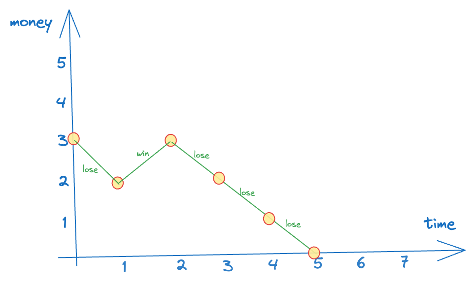
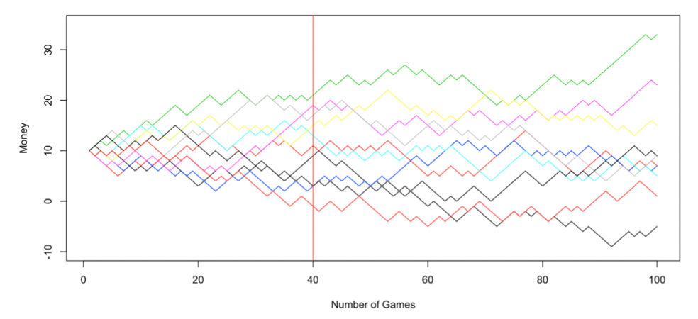
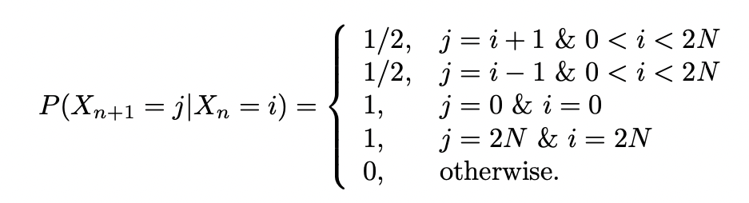
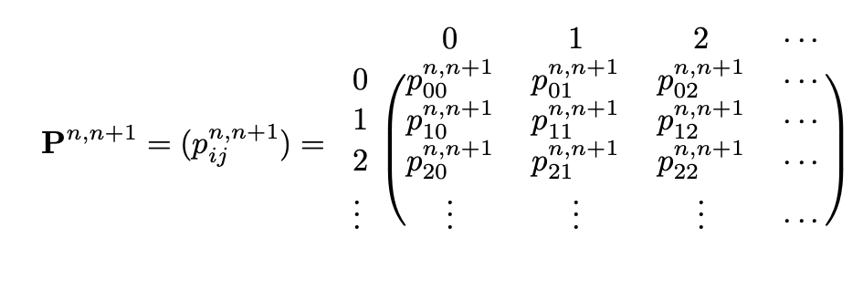

# Markov Chain (Definition and Properties)

Let’s understand stochastic processes with the help of some examples.

### Examples

**Gambler’s Ruin**

Suppose that Alice has $\$N$ and she wants to gambles. Every time, she bets $\$1$. If she wins, she receives $\$1$ extra. If she loses, she loses the $\$1$. She stops when she loses all $N$ dollars or achieves $2N$ dollars.

Here, the time is “discrete” → we only care about the change in state when alice makes a gamble. Also, the amount of money Alice has at any time is also discrete (integral).

One possible outcome of Alice’s gambling can be as follows (say she starts with $3):

**Poisson Process**

The department of transportation is interested in the busy level of a specific location. They count the number of cars passing this location from time to time. This process is called a Poission process.

Here, the time is continuous, but the number of cars is a discrete (integral) value.

**Stock Price**

From time to time, the price changes, and the change can be any real number. It may not be an integer. Here, time is continuous and the stock price is also continuous.

## Stochastic Processes

The processes in the above examples are similar but not identical:

- All processes have an index $t$
- For every time point, the process has a value
- The range of $t$ and the possible values a process can have (at any time $t$) are different - they can be discrete or continuous.

Define the stochastic process as:

1. Let $T$ be the **index set**. It can be time or space.
2. Let $S$ be the **state space**, the set of possible values of the process.

:::tip
A stochastic process $\{X_t : t \in T\}$ is a collection of random variables where $t$ is the time index.
:::

### Classification of Stochastic Processes

Depending on the index set $T$, we say the process is:

1. A **discrete-time** stochastic process, if $T$ is countable
2. A **continuous-time** stochastic process, if $T$ is a continuum.

Depending on the state set $S$, we say the process is:

1. A **discrete-state** stochastic process, if $S$ is countable. (more specifically, we call it a finite-state stochastic process when $S$ is finite)
2. A **real-state** stochastic process, if $S$ is continuous.

Then,

- Gambler’s ruin → discrete-time, discrete-state
- Poisson process → continuous time, discrete-state
- Stock price → continuous-time, real-state

(In this module, we focus mostly on discrete-time, discrete-state processes - and so, the gambler’s ruin example is an important one)

Let’s come back to the gambler’s ruin problem.

Here are 10 possible paths for Alice without stopping, given $N=10$ and $t=100$:

Each possible outcome $\omega \in \Omega$ is a path here. $X_{40}(\omega)$ is the mapping from $\Omega \to R$ where we take the value of this path at $t=40$ (in the above graph, $X_{40}(any\ path) =$ the value at the intersection with the red line)

:::tip
The state space $S$ is usually constrained depending on which random variable we’re dealing with. If we’re looking at $X_n$ then $S$ is the same as the sample space of $X_n$
:::

Let $X_n(\omega) = X(n)(\omega)$ denote the state (value) of the path $\omega$ at time $n$. Hence, $X_n$ is a random variable.

$X_0$ is called the initial state

$P(X_n = i)$ is the probability of any of the paths whose value at time $n$ is $i$, i.e., $P(\{\omega : X_n(w)=i \})$

Naturally, for $i \neq j$, $X_i$ and $X_j$ can be independent/dependent (depending on the actual process).

How do we specify a stochastic process? We need to:

1. Define $S$ and $T$ (easy)
2. Give the probability of each possible path. But there are infinitely many paths, so for each individual path, the probability is zero (this doesn’t seem right! if the path has finitely many steps, the prob. is definitely non-zero → but even then, it’s not that easy to calculate). As an alternative, we identify the probability of each event, i.e., for any finite number of time points $t_1, t_2, \dots, t_k$, we need the joint distribution of $(X_{t_1}, X_{t_2}, \dots, X_{t_k})$. Hence we need $f_{t_1, t_2, \dots, t_k}(i_1, i_2, \dots, i_k)$ for any $k$ → but this is too difficult to specify if we consider such a general case.

But for the gambling example, the results of each game are independent so it’s much easier to write down the joint distributions.

Suppose that $t_1, \leq t_2 \leq \dots \leq t_k$. Then:

$$
p_{t_1, t_2, \dots, t_k}(i_1, i_2, \dots, i_k) = p_{t_1}(i_1) \times p_{t_2|t_1}(i_2|i_1) \times \dots \times p_{t_k|t_{k-1}}(i_k|i_{k-1})
$$

In particular, the future of the path only depends on the current state, NOT the past history of the path. So, we can say that the future is conditionally independent of the past, given the present.

We hope that other processes also have this independence.

:::danger definition
**Markovian property**: Given $X_n$, what happens afterwards ($t > n$) is independent with what happened before ($t < n$)

:::

Mathematically, for any set of state $i_0, i_1, \dots, i_{n-1}, i, j \in S$ and $n \geq 0$, we have:

$$
P(X_{n+1}=j|X_n=i, X_{n-1}= i_{n-1}, \dots, X_0=i_0) = P(X_{n+1}=j | X_n=i)
$$

Let $\{X_t : t ∈ T\}$ be a stochastic process with discrete-state space $S$ and discrete-time set $T$ satisfying the Markovian property, then $\{X_t : t ∈ T\}$ is called a **Markov Chain (MC)**.

:::tip
This should be quite intuitive → for a markov process, when trying to predict the future, we care about the latest known state (any of the given states) and we can safely ignore everything in the past.

:::

As a concrete example, at time $n$ say that Alice has money $i$ then:

Our goal now is to find $P(X_{t_2}=j|X_{t_1}=i)$ for any $t_1 < t_2$.

We begin with the simplest case: $t_2 - t_1 = 1$. Hence, we can rewrite our goal as $P(X_{n+1}=j|X_{n}=i)$.

It is a function of $i,j,n$ and we need the specification for it.

:::tip definition
**One-Step Transition Probability:** $p_{ij}^{n,n+1} = P(X_{n+1}=j|X_{n}=i)$
:::

Now we consider the general case: $t_2 - t_1 = m$. Hence, we can rewrite our goal as $P(X_{n+m}=j|X_n=i) = p_{ij}^{n,n+m}$.

Given $p_{ij}^{n,n+1}$, it can be calculated:

$$
\begin{equation*}
\begin{split}
P(X_{n+1}=j|X_{n}=i) &= \sum_{k \in S}P(X_{n+m} =j | X_{n+1}=k)P(X_{n+1}=k|X_n=i) \\
&= \sum_{k\in S} p_{kj}^{n+1,n+m} p_{ik}^{n,n+1} \\
&= \sum_{k_1, k_2, \dots, k_{m-1} \in S} (p_{ik_1}^{n,n+1}\times p_{k_1k_2}^{n+1,n+2}\times \dots \times p_{k_{m-1},j}^{n+m-1,n+m}
\end{split}
\end{equation*}
$$

Basically we want to consider all possible paths that take us from $X_n=i$ to $X_{n+m}=j$ and sum all their probabilities.

:::tip
When computing this using an algorithm, we can use dynamic programming to optimize this. Here, the state is defined by (time, value). So, we can define `dp[time][value]` to be the probability of reaching the goal `(n+m,j)` (goal state) from `(time,value)`. Obviously, many paths overlap → overlapping subproblems are where DP is useful.

:::

### Specification of Markov Chain

Recall that for a general process, to completely describe it, we need:

1. Index set $T$
2. State space $S$
3. Joint distribution of $(X_{t_1}, \dots, X_{t_k})$

But for a Markov Chain, instead of knowing the full joint distribution, we can simplify it to be the one-step transition probability function (using which we can completely reconstruct the joint distribution): $p_{ij}^{n,n+1}$ for ALL $i,j \in S$ and $n \in T$.

Also, for a discrete-case, we can express the combinations of all possible transitions from time $t=n$ to $t=n+1$ in the form of a matrix, called the **one-step transition probability matrix**.

:::note
Bolded characters refer to matrices. But markdown cannot bold math symbols :(

:::

In the above matrix, the $(i,j)$-th entry of **$P^{n,n+1}$** is equal to $P(X_{n+1}=j|X_n=i)$

:::tip
💡 Think of a neural network with the weights on edges being the probability joining 2 nodes. (it’s also similar to a bayesian network in some sense):

So, for example, the probability of reaching state 6 at time = 2 given initial state = 3 is just the probability of the path $3 \to 5 \to 6$, and the probability of the path is just the product of the individual probabilities on the edges (by construction → weight of an edge joining node $i$ to node $j$ , from layer $l$ to layer $l+1$ is given by $w_{ij}^{l,l+1} = p_{ij}^{l,l+1}$)

Another example: the probability of reaching state = 4 at time = 2 is the sum of all the incoming _paths_ to the node 4. (this is where dynamic programming can come useful to speed up the computation).

:::

### Properties of a Transition Matrix

1. Every entry is a probability, and so, must be non-negative.
2. Fixed row sum: the sum of entries of any row is always $1$ because each row (say $i$) gives the distribution of $P(X_{n+1}=j|X_n=i)$ and since it is a probability distribution, the sum must be 1.

   Note: this does NOT hold for columns.

3. $m$-step transition functions (**Chapman-Kolmogorov Equations**):

   $$
   P^{n,n+m+1} = P^{n,n+1} * P^{(n+1,n+m+1)}
   $$

   Any transition from time $n$ to $n+m+1$ must have gone through time $n+1$ so we can “split” all paths into 2 parts → time $n$ to $n+1$, and time $n+1$ to $n+m+1$. Then, the prob. of going from any value $i$ at time $n$ to any value $j$ at time $n+m+1$ is equal to the sum of prob. of all paths that go from value $i$ at time $n$ to value $k$ at time $n+1$ to value $j$ at time $n+m+1$, FOR ALL values of $k$. (again, it helps to picture a neural-network structure to visualize the different paths, and the fact that any path going through $(n+m+1,j)$ must have gone through $(n+1,k)$ for _some_ value of $k$ (since time moves in one direction and to reach $n+m+1$, it must have passed $n+1$).

   In fact, in general:

   $$
   P^{n,n+m+1} = P^{n,k} * P^{k,n+m+1} \quad \forall n < k < n + m + 1
   $$

   :::tip think
   What does the Chapman-Kolmoorov equation really actually mean?
   It’s really intuitive → it basically says that you can multiply transition matrixes to get higher-step transition matrices. As an example,

   

   The proof is quite simple (basic conditional probability) and can be [found here](https://proofwiki.org/wiki/Chapman-Kolmogorov_Equation).

   :::
