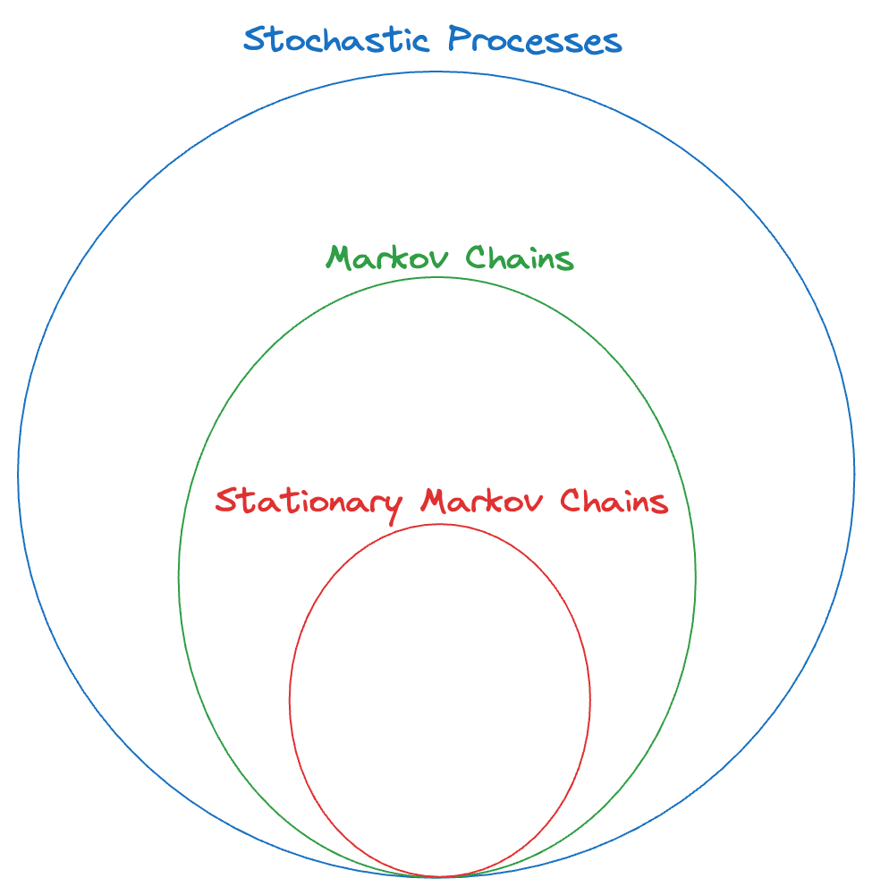
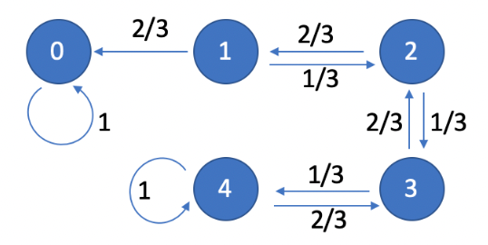

# Stationary Markov Chains

Note that for the gambler’s ruin problem, $p_{i,j}^{n,n+1} = p_{i, j}$. This is an example of a case where the one-step transition function is the same for any value of $n$.

Recall that for a general markov chain, we would have to know the transition matrix $P^{n,n+1}$ _for every value of $n$_. But what if the transition matrix were to be independent of $n$? That would simplify our specification too.

:::danger definition
**Stationary Transition Probability**: A Markov Chain $\{X_n: n = 0,1,2,\dots \}$ with the state space $S$ is said to have stationary transition probability if:

$$
p_{i,j}^{n,n+1} = p_{i,j} \quad i,j\in S, \ n =0,1,2,\dots
$$

It means that the one-step transition probability does not change with $n$.

:::

With each additonal constraint on the “general stochastic process”, we are trying to simplify the process (i.e., reduce the complexity) so it is easier to understand and analyze the process.

In the case of stationary markov chains, we only need $S,T$ and $P$ (a single one-step transition matrix that is valid for all times) to completely specify the MC.

Notation: For a stationary MC, we can drop the superscripts on the transtion probabilty matrix since it is stationary (i.e., the "same").

What about the $m$-step transition probability matrix? We have (and this is the Chapman-Komlogorov Equation for stationary MC) :

$$
P^{n,n+m}= P^{(m)} = P\times P \times \dots (m \ times) = P^m
$$

In other words, we denote the $m$-step transition probability matrix by $P^{(m)}$ (and is valid for the transition $n \to n+m$ for any value of $n$, for a fixed $m$). And that matrix is equal to $P^m$ (the original one-step transition matrix raised to the power of $m$). This follows from the definition of the transition matrix and should be quite intuitive.

When we only have a finite number of states, we can also use a diagram (think: directed graph) to represent the stationary markov chain. Here, the nodes are the states themselves and the "weight" of each edge is the probability associated with the transition between the states. We omit those edges where the probability of the transition is zero.

Example: Consider the gambler’s ruin problem. Suppose Alice starts with $N=2$ dollars, and the probability of winning each round is $1/3$, then we can draw the following state-transition diagram:

Notice that we only draw the one-step transitions, NOT all of them. This is sufficient to completely specify the stationary MC.

Why can’t we use such a diagram for a general MC (not necessarily stationary)? Because the probabilities of transitions between the states could change, depending on the value of $n$. So, we would need to draw such a state diagram _for every value of $n$_ (possibly infinite).

:::tip note
For a state diagram, the sum of the weights of all outgoing edges MUST be $1$ (since it represents a probability distribution → all possible transitions from that state). The condition does not have to hold for all incoming edges of a node (since that doesn’t really mean much).

:::

Of course, there is a one-to-one mapping between the one-step transition matrix and the state diagram. One can be derived from the other.

Tip: drawing the diagram is a good way to visualize the process + identify the “absorption” states and whether the system is “stable” or not, i.e., will the process ever terminate or not. (for e.g. in case of the gambler’s ruin, is there a non-zero probability that the game never ends and the money keeps oscillating between $0$ and $2N$ → the answer is NO - because we have the probability of winning and losing from every state between $0$ and $2N$ and when we sum all of them up, we get $1$, which means there’s no “probability left over” for the infinite oscillation case).

Also, note that from now onwards, we’ll only be dealing with stationary markov chains.
