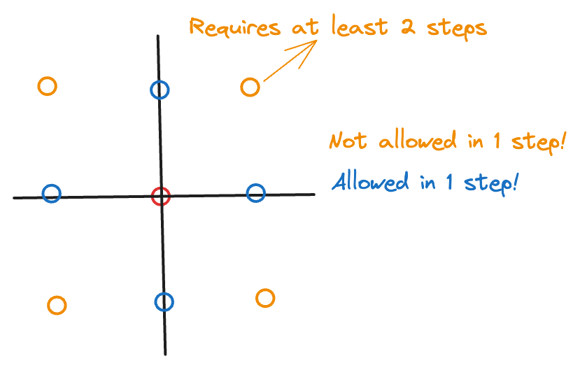

# Random Walk

In the previous page, we’ve derived the results for the general case of the gambler’s ruin problem. But we can go even further.

Mathematically, all that matters are the transition probabilities, the states, and the stopping conditions. In particular, the interpretation of each of these depends on the context. So, we can abstract it further away by keeping the underlying mathematics intact. That is, instead of thinking of $X_n$ as being the amount of money that a gambler has at time $t=n$, we can think of $X_n$ as being a location. Then, $p$ can be the probability of going left/right (for the simple 1-dimensional case), $N$ can be the destination that the person wishes to reach. We can have the location $0$ being the “end” (maybe a cliff?) → some kind of absorption state.

Obviously, we haven’t changed the probabilistic structue or “randomness” of the process in any way → the two “processes” (general gambler’s ruin and random walk) are mathematically equivalent.

More formally, consider a stochastic process of a drunk man who takes a random step right with probability $p$ and left with probability $q=1-p$. Note that we don’t have any stopping rule yet. Then, we can write a random walk $\{X_n\}_{n=0}^\infty$ as a summation of multiple steps.

In particular, $p_{n,n+1} = p$ (probability of taking a step forward and going from $X_n$ to $X_n+1$) and $p_{n,n-1}=q$ (probability of taking a step backward from $X_n$ to $X_n-1$)

Each step $\xi_i$ can be modelled as a bernoulli random variable (but in this case, we “code” failure to be $-1$ instead of $0$ so we need to change it slightly). With some cleverness, we can write it as:

$$
\frac{(\xi_i+1)}{2} \mathop{\sim}\limits^{i.i.d.} Bernoulli(p)
$$

Interpretating the above equation: with probabilty $p$, we have $\xi_i = 2\times 1 -1=1$, and with probability $q=1-p$, we have: $\xi_i = 2\times0-1 = -1$ (which is exactly what we want).

Then, we have:

$$
X_n = X_0 + \sum_{i=1}^n \xi_i, \quad n = 1,2,\cdots,
$$

Here, $X_0$ is the starting location.

Observe that even $n$ is a random variable, i.e, we don’t know when we will stop the random walk. So, it can also be considered to be a “random sum” in this sense.

A special case of this is when $X_0 = 0$, then we have:

$$
\frac{X_n+n}{2} \sim Binomial(n,p)
$$

This follows from the fact that $\sum_{i=1}^n Bernoulli(p) = Binomial(n,p)$ random variable (assuming that all the bernoulil variables are independent and identically distributed).

This version of the random wak is NOT the same as gambler’s ruin because we don’t have any stopping rule yet. But if we go ahead and set a stopping rule such that if $X_n$ arrives at $N$ or $0$, then it will stay at the corresponding state forever.

With first step analysis, we have the formulae (same as gambler’s ruin):

$$
P(X_n=0|X_0=k) =
\begin{cases}
\begin{split}
1 - k/N,\quad p&=1/2 \\
1 - \frac{1-(q/p)^k}{1 - (q/p)^N}, \quad p &\neq 1/2
\end{split}
\end{cases}
$$

$$
E[T|X_0=k] =
\begin{cases}
\begin{split}
k(N-k),\quad p&=1/2 \\
\frac{1}{p-q} \left( N\frac{1-(q/p)^k}{1 - (q/p)^N} -k\right),\quad p &\neq 1/2
\end{split}
\end{cases}
$$

When $p=1/2$, we call it a “symmetric” random walk.

The above definition is for a 1-dimenstional random walk (the person can only go forward/backward or left/right). Can we extend this to multiple dimensions?

:::info
Note that we’re still dealing with “discrete” space. It’s not continuous (i.e, you cannot move an arbitrary distance in any dimension, you need to move an integral distance). This is called “discretizing” space.
:::

Yes, it’s not very different. There is nothing “mathematical” about the directions themselves. So, to extend it to $d$-dimensions, we can consider the nearest $2d$ neighbors (think: “top/bottom” in each of the 2 dimensions → it’s like making a binary decision for exactly one of the of the $d$ dimensions). Note that in this case, we’re only allowed to move in one direction in any step. So, we can pick a direction in $d$ possible ways and then pick either +/- along that direction in $2$ ways → hence, there are $2d$ neighbours. It is NOT $2^d$ → this would be the case when we move along one direction in _every dimension_ in a single step.

In case of $d=2$, the diagram below illustrates which steps are allowed by our definition of random walk:

So, for the 2D random walk, any step $\xi_i \in \{(0, 1), (1, 0), (0, -1), (-1, 0) \}$.

For a $d$-dimension random walk, consider $N^d = \{(x_1,\dots, x_d): x_j \in N \}$. It forms a lattice. In the symmetric random walk case, each of the $2d$ nearest neighbors has probability $1/2d$. We can denote this step as $\xi_i$. (You can think of each step as being a “delta” tuple with $d-1$ zeroes and exactly $1$ non-zero value which can be $\pm1$. Example: In 3-dimensions, $\xi_1 =(1, 0,0)$ means that you move right along the $x$-axis. $\xi_1 = (0,0,1)$ means you move up along the $z$-axis. Note that $(1,0,1)$ is NOT allowed in a single step → this explains why you have $2d$ instead of $2^d$ neighbours.)

Then we have (in the same way as for a single-dimension random walk):

$$
X_n = X_0 + \sum_{i=1}^n \xi_n, \quad n =1,2,\cdots
$$

In fact, the probabilities need not be $1/2d$ → they can be anything, as long as they sum to $1$.

For such a random walk, we can also find:

- Stopping time: when $X_n$ arrives at a point $S=(s_1, \dots, s_d)$, the walker will stop there.
- the probability that $X_n$ can arrive at $S$

using first step analysis.

A famous result is:

> _A drunk man will find his home, but a drunk bird may get lost forever._

It comes from the result that

- For 2-dimension symmetric random walk, the probability that the walker can arrive at $S$ (maybe his home?) is $1$ (assuming an infnite 2D plane, the walker almost surely reaches his home → read [this](https://en.wikipedia.org/wiki/Almost_surely) for a more mathematical definition of “almost surely” → it’s super interesting 🎊)
- For any dimension > 2, the probability that the walker arrives at $S$ is < 1.

It’s a good exercise to try and prove the above result.

We can generalize the random walk in another way, by relaxing the “discrete” constraint, to the continuous case (can be 1D, 2D, or $d$-dimensions too).

For each step, the walker moves $\triangle x$ in $\triangle t$ time. When $\triangle x \to 0$ and $\triangle t \to 0$, then it can describe a continuous path (we’re considering smaller and smaller intervals of time, and we expect the particle to move a very small amount in that small interval of time).

Actually when $\triangle t = c \triangle x^2$ (according to statistical mechanics), the resulting process is called Brownian motion. But this is outside the scope of the class.
