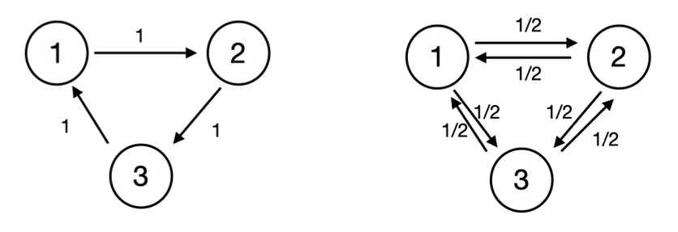
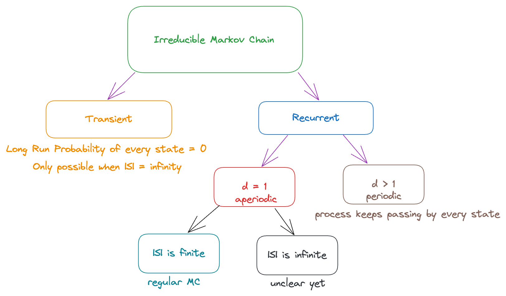

# Long Run Performance

## Introduction

Last week, we talked about the long-run performance of a reducible chain. The reducible chain can be decomposed into different classes. Then,

- in the long-run, the transient classes have probability 0
- in the long run, the probability of entering any recurrent class can be found by first-step analysis

Now, we’re interested to know the long-run performance of the states in the recurrent class itself. How will the process work? Is it possible to figure out the probability at each state?

Consider only one recurrent class. Restricted on this recurrent class, we can build a new MC (consisting of states only within this class). This new MC is irreducible (it has only one communication class). Hence, it suffices to discuss the long-run performance of an irreducible chain (because every recurrent class in the original MC consists of only one communication class, by definition, and so, the new MC will always be irreducible).

:::tip intuition
_Reducible_ → We can “reduce” the size of the transition matrix by “reducing” the number of “states” (by clustering those in the same recurrent class together)

_Irreducible_ → cannot be reduced further, i.e., like an “atom” of the MC

:::

## Period

Both the above MCs are recurrent and irreducible. Also, the average number of revisits to any state is the same (infinity) in the long run. However, the pattern for both is very different and we should discuss them separately. (we want some way to quantify how the _pattern_ is actually different).

:::danger definition
**Period**: For a state $i$, let $d(i)$ be the greatest common divisor of $\{n : n \geq 1, P_{ii}^{(n)} > 0 \}$. If $\{n : n \geq 1, P_{ii}^{(n)} > 0 \}$ is empty (starting from $i$, the chain will never revisit $i$), then we define $d(i) = 0$.

We call $d(i)$ the period of state $i.$

:::

Let’s try to understand this definition better:

- $P_{ii}^{(n)} > 0$ refers to the fact that the probability that $P(X_n=i|X_0=i)$ is non-zero
- $\{n : n \geq 1, P_{ii}^{(n)} > 0 \}$ is the set of lengths of all possible paths that we can arrive at $i$ (starting from $i$)
- Common divisor: taking the common factor of the length of these paths

In the figure above (on the left), $P_{11}^{(n)} > 0$ only for $n=3,6,9,\cdots$ Hence, the common divisor (and period) of state $1$ is $3$. (Observe that all the states - $1,2,3$ - have the same period. Coincidence? 😲)

Another example is the gambler’s ruin problem. $P_{11}^{(n)} > 0$ only for $n=2,4,6, \dots$ Hence, the common divisor is $2$ (it takes a “multiple of 2” steps to ever get back to the same state as the one we started from).

:::danger definition
If $d(i) = 1$, we call the state $i$ to be **aperiodic**.

:::

Aperiodic intuitively means that there is no good pattern we can observe for when the process can visit a certain state.

### Period of States in the same class

It’s natural (and quite intuitive) for the period of all states in the same class to be the same. Why?

Consider the previous example (above, on the left) Suppose that state 3 has a period of 2. Then, $P_{33}^{(5)} \geq P_{33}^{(2)}P_{31}^{(1)}P_{13}^{(2)} > 0$. Hence, $P_{33}^{(n)} > 0$ for $n=3,5,6, \cdots$ but that would mean that the greatest common divisor is $1$ (which contradicts the fact that the period is 2).

We can generalize this using a theorem.

:::danger definition
**Periodicity**

For a MC, let $d(i)$ be the period of state $i$, then:

1. If $i$ and $j$ can communicate, $d(i)=d(j)$ (read the proof [here](https://math.stackexchange.com/questions/112057/show-that-two-states-in-the-same-communicating-class-of-a-markov-chain-must-have))
2. There is an $N$ such that $P_{ii}^{(N *d(i))} > 0$, and for any $n \geq N$, $P_{ii}^{(n *d(i))} > 0$
3. There is $m > 0$ such that $P_{ji}^{(m)} > 0$, and when $n$ is sufficiently large, we have $P_{ji}^{(m + nd(i))} > 0$

:::

How can we interpret the above statements?

1. The period of all the states in the same communication class is the same. So, we can think of “period” as being associated with a class (and not just a state, since it is common across all members of the class)
2. Beyond a certain threshold $N$ (the “first” value of $n$ such that there is a path of length $n\times d(i)$ from $i \to i$), we can always find a path of length $n\times d(i)$ from $i\to i$ for any $n \geq N$. Why is this true? Because of the definition of period, it must be “periodic” and the (minimum) duration between 2 revisits to $i$ is given by $d(i)$
3. If I can go from $j \to i$ in $m$ steps (and I know that the period of $i$ is $d(i)$, which means that there must be some threshold of $n$ for which there is path of length $n\times d(i)$ from $i\to i$), I can go from $j \to i$ ($m$ steps) and then $i \to i$ ($n \times d(i)$ steps). Meaning, there is a path of length $m+nd(i)$ from $j \to i$.

### Aperiodic MC

**Note**: Consider an irreducible MC (only one class $\implies$all states have same period, $d$). Then, we can say that _$d$ is the period of this MC_. If $d=1$, then all states are aperiodic, and we say that _this MC is aperiodic_.

Let’s apply the theorem on periodicity to an aperiodic MC, i.e., $d=1$.

Consider the state $i$. There must be some $N > 0$ such that $P_{ii}^{(N)} > 0$.

Then, by the theorem, we have that for any $n \geq N$, $P_{ii}^{(n)} > 0$.

But hmm.. how do we know that there even exists such an $N$ so that $P_{ii}^{(N)} > 0$? 🤔 This can be quite easily proven as follows:

- If the MC contains only one state $i$, $P_{ii} = 1 > 0$ for all values of $n > 0$
- If the MC contains another state $j$, then $i \longleftrightarrow j$ (because the chain is irreducible). So, there must be $N_1, N_2$ so that $P_{ij}^{(N_1)} > 0$ and $P_{ji}^{(N_2)} > 0$. Therefore, we can set $N=N_1 + N_2$ and there is a path $i \to j \to i$ of length $N$ with non-zero probability

Let $S$ denote the set of all states in the aperiodic irreducible MC. Then, for every state $i \in S$, there is such as $N_i$ for each state $i$. When the number of states is finite, i.e., $|S| < \infty$, we can define $N = \max_{i} N_i$. Then, for any $n \geq N$, we have:

$$
P_{ii}^{(n)} > 0, \quad i \in S
$$

In words, it means that for a finite aperiodic MC, there is a certain threshold $N$ (which is the maximum of all the individual thresholds $N_i$) such that beyond this, for any value of $n \geq N$, there is path of length $n$ from $i \to i$ _for all_ states $i$.

Consider two states $i$ and $j$. Let $N_{1, i,j}$ be such that $P_{ij}^{(N_{1,i,j})} > 0$.

Recall that we have $P_{ii}^{(n)} > 0$ for $n \geq N$. Hence, for any $m \geq N$, we can go from $i \to i$ ($m$ steps) and then $i \to j$ ($(N_{1,i,j})$ steps) and so,

$$
P_{ij}^{(N_{1,i,j} + m)} \geq P_{ii}^{(m)}P_{ij}^{(N_{1,i,j})} > 0
$$

Let $n = m + N_{1,i,j}$. Then, for any $n \geq N + N_{1,i,j}$, we have $P_{ij}^{(n)} > 0$. (Beyond a certain threshold $n$, we can always find a path of length $k \geq n$ from $i \to j$).

But the above is only for a single pair of states - we can use the same argument on all pairs $i,j \in S$. For every pair $i,j$, we have a $N_{1,i,j}$. We can define $N_{i,j} = N + N_{1,i,j}$ (recall that $N = \max_i N_i$).

Then,

$$
P_{ij}^{(n)} > 0, \quad n \geq N_{ij}
$$

Let $n \geq \max_{ij} N_{ij}$. Then, we have, $P_{ij}^{(n)} > 0$ for any $i, j \in S$.

In other words, all the entires of the transition matrix $P^n$ are non-zero. This can be interpreted to mean that after this value of $n$, it is possible to travel from any state $i$ to any other state $j$ (including $i=j$) _in a single step._

The above result is quite powerful (so much so that we define a new term for such an MC 😆).

:::danger definition
**Regular Markov Chain**

A Markov Chain with transition probbaility matrix $P$ is called **regular** if there exists an integer $k > 0$ such that all the elements $P^k$ are strictly positive (non-zero).

:::

In such a case, we call $P$ to be the _regular transition probability matrix_. It means that $P(X_k=j|X_0=i) > 0$ for any $i,j$. That is, using $k$ steps, we can walk from any state to any other steps.

:::tip intuition
Example: We know that thetra maximum degree of separation between any 2 people on Earth (under the “friendship” relation) is about 6. This means that in 6 hops, any person can reach any other person. So, if we model this entire graph using a transition probability matrix, $P^6$ will have all entries being strictly positive. (it’s not clear what the probabilities here would represent but this is just to give an intuition as to what “regular” mens)

:::

**Note**: Obviously if all entires of $P^k$ are strictly positive, then for any $m \geq k$, all entires of $P^m$ are also strictly positive.

Okay, so now we know that a “regular” MC is (in theory) but what’s an easy way to identify whether a given MC is regular or not.

:::danger definition
If a Markov Chain is **irreducible, aperiodic, with finite states**, then it is a reguar MC.

:::

Note that it only applies to MCs with finite states because in the derivation, we used the fact that $\max_{ij}N_{ij}$ is a finite number, but given infinite states, we can’t be certain what the maximum value of $N_{ij}$ over all $i,j$ is (it’s possible for it to be infinity too, and so the derivation does not work).

🤔 Is the converse of the above statement true, i.e., are ALL regular MCs irreducible, aperiodic and have finite states?

Pro tip: If $P_{ii}^{(1)} > 0$ (there is a self-loop), $d(i) = 1$ (aperiodic instantly since the greatest common divisor of any set of numbers containing $1$ must be $1$)

**Lazy Chain**: $P_{ii}^{(1)} > 0$ for all $i$ (the process is “lazy” and so, there’s a non-zero probability of it not moving away from $i$ at all)

### Summary So Far

## Regular Markov Chain

:::danger definition
A regular MC must be irreducible. Why? Because by definition of “regular MC”, there is a number $k$ such that there is a path of length $k$ between any pair of states. So, all states communicate with each other. Hence, irreducible.

:::

Q. Is the Gambler’s ruin problem with no upper limit stopping rule a regular MC?

Ans: No. Because the odd and even states alternate, the period of each state (and hence, the MC) is 2. E.g. if you start at $X_0=2$, then $P_{23}^{(2n)} = 0$ (impossible to go from an even state to an odd state in an even number of steps $2n$) and $P_{22}^{(2n+1)} = 0$ (impossible to go from an even state to an even state in an odd number of steps $2n+1$). So, there is no value of $k$ for which all entries of the transition probability matrix $P^k$ are strictly positive (if $k$ is even, then all $P_{i,i+1}^k$ values (minimally) are zero, and if $k$ is odd, then all $P_{ii}^{(k)}$ values are zero).

### Limiting Distribution

:::danger definition
**Main Theorem**

Suppose $P$ is a regular transition probability matrix with states $S = \{1, 2, \dots, N\}$. Then:

1. The limit $\lim_{n \to \infty}p_{ij}^{(n)}$ exists. Meaning, as $n \to \infty$, the marginal probability of $P(X_n=j|X_0=i)$ will converge to a finite value
2. The limit does not depend on $i$ (initial state). Hence, we can denote it by:

   $$
   \pi_j = \lim_{n \to \infty} P_{ij}^{(n)}
   $$

3. The distribution of all of the $\pi_k$ is a probability distribution, i.e., $\sum_{k=1}^N \pi_k = 1$, and we call this to be the **limiting distribution** (it tells us how likely it is for the process to end up in any particular state in the long run).
4. The limits $\pi = (\pi_1, \pi_2, \dots, \pi_n)$ are the solution of the system of equations

   $$
   \begin{equation*}
   \begin{split}
   \pi_j &= \sum_{k=1}^N \pi_kP_{kj}, \quad j = 1,2, \dots, N \\
   \sum_{k = 1}^N \pi_k &= 1 \\
   \end{split}
   \end{equation*}
   $$

   Equivalently, in the matrix form, it is to solve:

   $$
   \pi P = \pi, \quad \sum_{k=1}^N \pi_k = 1
   $$

5. The limiting distribution $\pi$ is unique (since it represents the long-term distribution of the process, there is only one right answer).

:::

Recall that $p_{ij}^{(n)} = P(X_n = j|X_0=i)$.

The second statement is true because under the limit $n \to \infty$, the initial state doesn’t matter (this is only true for an irreducible, aperiodic MC with finite states, i.e., regular MC) because all states can eventually reach other and we’re interested in the eventual distribution (called the limiting distribution) of the process.

Since each of the $\pi_k$ represents the probability of the process being at a state $k$ after a very long time, the sum of all the $\pi_k$’s must be 1 (since the states are “disjoint” and the process must be at any one of the states at any time).

Understanding this deeply is very important: in the long run, $P(X_n=j)$ will converge to $\pi_j$, no matter what the initial state is and no matter what $n$ is (even, or odd or whatever).

It should be evident that $\pi$ is a (probability) distribution on $S$. Consider $S$ as the outcome space, and define the probability measure on $S$ in the way that $P(\{j\}) = \pi_j$ and the additivity. Note that this probability measure satisfies the “probability distribution requirements” → each of the $\pi_i$’s are non-negative and they sum to $1$ because $\sum_{i \in S} P(\{i\}) = P(S) = 1$

Note:

1. Also, $\pi P = \pi$ should ring a bell 🔔 Recall from linear algebra that this means that $\pi$ is an eigervector of $P$ with eigenvalue = 1.
2. $\pi P = \pi$ also means that this limiting distribution is _invariant_ → running the MC for 1 more iteration (i.e,. one more step) doesn’t change the distribution at all (this is also why we can claim that the distribution converges). e.g. if $\pi_1 = 0.5$ then even after one more iteration, there is a 50% chance that the MC is at state 1. Intuition: if infinite iterations have converged to this value, what’s one more iteration going to change 🙄 (infinity + 1 is still is infinity and the distribution should remain the same)

### Interpretations of $\pi$

Okay, but how do we _really_ interpret $\pi_j$? There are many different (and all correct) interpretations of $\pi$ (depending on what we’re considering).

$**\pi_j$ is the (marginal) probability that the MC is in state $j$ for the long run. We say “marginal” because it is not conditioned on the original/initial state and also not conditioned on the time (exact value of $n$). It simply means that if we leave the MC alone for a long time, and then come back to observe it, there is a $\pi_j$ probability that the MC is in state $j$ when we observe it, regardless of how it was when we left, and regardless of the exact number of steps the MC took in the time we were gone.

:::tip intuition
An intuitive way to look at this is to see if there is any “difference” in times even in the long run. For example, for the simple random walk problem: If we start from an even state, the probability that the process is at an odd state is $0$ at even time points, and the probability that the process is at an even state is at odd time points (_even in the long run_). So, the long-run distribution depends on the time point we’re considering. Hence, it’s not a regular MC because there’s no “limiting distribution”.

:::

Proof (of the above claim that $\pi_j$ is the marginal probability): the marginal probability can be calculated by the following formula (simply using law of total probability):

$$
\begin{equation*}
\begin{split}
P(X_n = j) &= \sum_{i=1}^N P(X_0=i) P(X_n=j|X_0=i) \\
\end{split}
\end{equation*}

$$

For a large enough $n$, we have defined $P(X_n=j|X_0=i) = \pi_j$. Then,

$$
P(X_n=j) = \sum_{i=1}^N \pi_j P(X_0=i) = \pi_j \sum_{i=1}^N P(X_0=i) = \pi_j
$$

Moreover, $\pi$ gives the limit of $P^n$ (simply based on our definitions and understanding). Since $\pi_k$ is the probability that the process ends up in state $k$ in the long run, we expect all the entries of the $k$th column of $P^n$ (as $n \to \infty$) to be equal to $\pi_k$ (why? because every entry ($i, j$) in $P^n$ represents precisely the probability of landing at state $j$ if we start at state $i$, after $n$ steps).

We can write this as:

$$
\lim_{n \to \infty} P^n =
\begin{pmatrix}
\pi_1 & \pi_2 & \pi_3 & \cdots & \pi_N \\
\pi_1 & \pi_2 & \pi_3 & \cdots & \pi_N \\
\pi_1 & \pi_2 & \pi_3 & \cdots & \pi_N \\
& & . \\
& & . \\
& & . \\
\pi_1 & \pi_2 & \pi_3 & \cdots & \pi_N \\
\end{pmatrix}
$$

Every row is the same, as $\pi$. Interpretation? The $i$th row of $P^n$ is the distribution of $X_n$ given $X_0=i$. If the distribution of $X_n$ converges to the same distribution $\pi$ regardless of $X_0$, then every row must converge to $\pi$.

$\pi$ can be seen as the long run proportion of time in every state. But what do we even mean by “long run proportion of time”. Let’s define it formally.

Define the indicator function of $X_k$ to be:

$$
I(X_k = j) =
\begin{cases}
1, \quad \text{if } X_k = j \\
0, \quad \text{if } X_k \neq j
\end{cases}
$$

Clearly, it can be used to check whether the chain is at state $j$ or not at time $k$. (And it is a random variable because $X_k$ is a random variable).

The (expected) fraction of visits at state $j$ is:

$$
\begin{equation*}
\begin{split}
E \left [ \frac 1 m \sum_{k = 0}^{m-1}I(X_k=j)|X_0=i \right ] &= \frac 1 m \sum_{k=0}^{m-1} E[I(X_k=j)|X_0=i] \\
&= \frac 1 m \sum_{k=0}^{m-1}  P(X_k=j|X_0=i) \\
& \to \pi_j \text{ as }m \to \infty
\end{split}
\end{equation*}

$$

The above steps use the following properties:

- The expectations of the usm sum of random variables is equal to the sum of their respective expectations
- The expectation of an indicator function is equal to the probability that the indicator function evaluates to 1
- As $m \to \infty$, $P(X_m=j|X_0=i) \approx P(X_m=j) = \pi_j$. So, as $m$ increases, the “effect” of the first few iterations of the markov chain (where it’s not really “long-run” yet) become less relevant (as there are many many more terms that dominate the effect of the first few terms), and the average tends to converge to $\pi_j$.

In simple words, the above formula means that if we count the number of visits to state $j$ and divide it by the current time, then the proportion converges to $\pi_j$ (for larger values of “current time”).

Until time $m$, the chain visits state $j$ around $m \times \pi_j$ times.

:::caution
The above statement is only “true” (i.e., a good approximation) for large values of $m$, as the impact of the initial states fades away gradually. You cannot expect this to be true for values like $m=3$ because obvoiusly it is possible for the chain to be impacted heavily by the starting conditions in the beginning.

:::

Okay, we’ve shown that the regular MC will converge to a limiting distribution. And we have also shown that this limiting distribution is unique and very meaningful to us. But… how do even find this limiting distribution?

There are 2 approaches we can use:

1. Calculate $P^n$ and let $n \to \infty$. When all the rows are identical, then $\pi$ is a row of $P^n$ (we can use computers to compute this quite efficiently using eigenvector decomposition, i.e,. decompose $P= QJQ^{-1}$ such that $J$ is a diagonal matrix and then $P^n = QJ^nQ^{-1}$ and computing the power of a diagonal matrix is easy because we can just raise each diagonal entry to the respective power).
2. Sovle the system of equations as mentioned in statement 4 of the main theorem.

:::tip example
Example: think of the limiting distribution as being similar to the distribution of coffee molecules in a cup of milk+water. Even if you add the coffee powder on the left/right side of the cup (or even if you stir it), eventually it “settles” into a distribution (generally, uniform) and stays at that distribution from that time onwards (invariant property → once the limiting distribution is reached, it never varies).

:::

---

## Irregular Markov Chain

Now that we know how to understand the long-run peformance for a regular MC, we’re curious to know what happens if the MC is not regular.

Note:

- We have $|S| + 1$ equations in total, where $|S|$ equations come from $\pi = \pi P$ and the 1 equation that $\pi$’s sum to 1.
- We have $|S|$ unknown parameters: $\pi_1, \dots, \pi_{|S|}$
- The rank of $I - P$ is $< |S|$ since all the rows sum up to 1 (since it needs to form a valid probability distribution, the sum of all the probabilities of outgoing edges/steps needs to be 1) → recall that rank is the number of linearly independent columns but in this case, if we know the first $|S|-1$ columns (worst case), we can find the last column by simply subtracting 1 from the partial sum of each row. Moreover, it’s possible that the rank of the matrix be even lower than $|S|-1$ (consider the extreme case where all values in the first column are 1, then everything else is forced to be 0, and so, there is only 1 linearly independent column).

We know (from linear algebra) that for such a linear system (where the “coefficient” matrix is non-invertible - because the rank is not equal to the number of rows), there can be no solution (inconsistent) or infinitely many solutions (consistent but dependent).

When the MC is not regular, it’s possible that $|S| = \infty$ and $\pi_i = 0$ for all $i$ (which means that all the states are transient).

When the MC is not regular, it’s also possible that we _can_ find a solution $\pi$. How do we interpret this? it means that if the initial states have a distribution $\pi$, then after _any_ steps, the chain also has a distribution $\pi$ on the states. Hence, it is called the stationary distribution (since it does not move/change).

Note that periodic chains may have a stationary distribution.

:::danger definition
**Stationary Distribution**

Consider a MC with state space $S= \{1, 2, \dots \}$ and the transition probability matrix $P$. A distribution $(p_1, p_2, \dots)$ on $S$ is called a **stationary distribution**, if it satisfies for all $i=1,2,\dots$ that:

$$
P(X_n=i) = p_i \implies P(X_{n+1} = i) = p_i
$$

**Note that if the initial distribution of $X_0$ is not $\pi$, we cannot claim any results.**

:::

Though limiting distribution and stationary distribution are “similar” in some sense, they don’t refer to the same thing mathematically (or even conceptually):

|                      | Limiting Distribution                                                              | Stationary Distribution                                                            |
| -------------------- | ---------------------------------------------------------------------------------- | ---------------------------------------------------------------------------------- |
| Initial Distribution | Arbitrary                                                                          | $X_0 \sim \pi$ (important requirement!)                                            |
| Next step            | Unknown                                                                            | $X_1 \sim \pi$                                                                     |
| $n \to \infty$       | $X_n \sim \pi$                                                                     | $X_n \sim \pi$                                                                     |
| Calculation?         | $\pi = \pi P$ (OR) $\lim_{n \to \infty} P^n$                                       | $\pi = \pi P$                                                                      |
| Uniqueness           | Yes, if there are 2 limiting distributions $\pi_1$ and $\pi_2$, they are identical | No, it’s possible to have 2 different stationary distributions, $\pi_1 \neq \pi_2$ |
| Constraint on MC     | MC must be regular                                                                 | No assumption on the regularlity or periodicity of the MC                          |

We observe that the limiting distribution is one of the special cases of a stationary distribution, i.e,. the limiting distribution _must be_ a stationary distribution (because once we reach the limiting distribution, it is also invariant, i.e., stationary/unchanging).

For a regular MC, the stationary distribution is also a limiting distribution. Hence, in many textbooks about regular MCs, stationary distribution and limiting distribution are used interchangeably.

**Example of a stationary distribution**: Consider a gambler’s ruin problem. Then, if the initial state is $X_0=0$ or $X_0=N$, then the distribution of the chain never changes. So, we have two (distinct) stationary distributions: $(1, 0, 0, \dots, 0)$ and $(0, 0, \dots, 0, 1)$ where the $i$th entry of the tuple refers to $\pi_i$ (the probability of being at state $i$ in the stationary distribution). It’s not a coincidence that all the other states have probability 0 here → they are transient, and we know that $\lim_{n \to \infty} P_{ij}^{(n)} = 0$ for $j = 1, 2, \dots, N-1$, i.e,. the chain will eventually leave these states so it cannot be “stationary” if there’s some probability/flow stored at any of these transient states. Does this mean we only have 2 stationary distributions? Nope. We have infinitely many such distributions. Any linear combination (with the “right” coefficients) of these stationary distributions will also be a stationary distribution (by the fact that a linear combination of eigenvectors is also an eigenvector). In particular, the set of all stationary distributions for this example can be written as: $\{\lambda p + (1-\lambda) q: 0 \leq \lambda  \leq 1 \}$ where $p = (1, 0, \dots, 0)$ and $q = (0, \dots, 0, 1)$. For example, $(0.5, 0, \dots, 0, 0.5)$ is also a stationary distribution (conceptually, if you start off broke 50% of the time, you’ll remain broke forever (stationary) for those 50% of the time, and similarly if you start of at $N$).

A key observation is that the stationary distribution must have $\pi_i = 0$ for all transient states $i$ (and so, even the initial distribution cannot have a non-zero probability of starting from any transient state).

:::info
Recall from linear algebra that a system of linear equations has either:

- No solution (inconsistent)
- One unique solution (consistent + linearly independent equations)
- Infinitely many solutions (consistent + dependent equations)

As a result, a MC always has zero, one or infinitely many stationary distributions. (In particular, it cannot have 2 or 3 or any $k > 1$ distributions for a finite value of $k$)

:::

Note: A process with “short-term memory” that doesn’t directly look like a MC (since the next state $X_{n+1}$ might depend on the past few states, instead of just the preceeding state) can be easily converted to a MC by including all the “memory” into the state itself. For example, if the weather can be either sunny $s$ or cloudy $c$, and suppose the weather today depends on the past 2 days, i.e., $X_{n+1}$ depends not only on $X_{n}$ but also on $X_{n-1}$ (and hence, not a MC), we can convert it to a MC by defining $Y_n = (X_{n-1}, X_n)$. Then, $Y_{n-1} = (X_{n-2}, X_{n-1})$ contains all the information needed for us to determine the value of $Y_n$ (hence, we transform the “multiple-step” dependency into a “single-step” dependency by storing all the information needed to make the next step in the current state - which makes it a MC since the next step becomes conditionally independent of the past given the current state).
